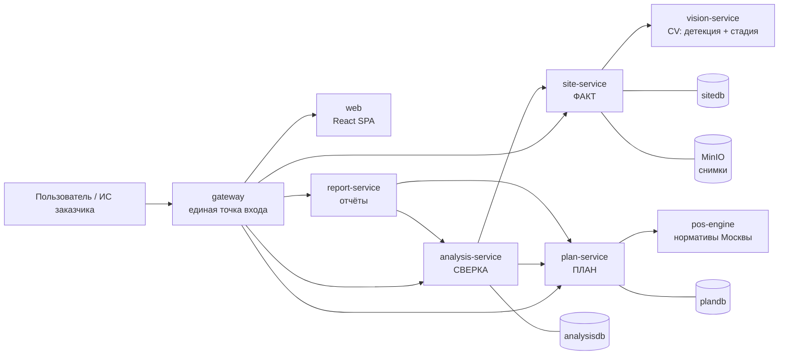

# СтройКонтроль — мониторинг строительной площадки по снимкам камер

> **ЛЦТ 2026, кейс 07.** Система определяет по снимкам камер, какие работы фактически ведутся
> на стройплощадке, сравнивает факт с календарным графиком и выдаёт объяснимые предупреждения
> об отставании, опережении и нарушениях, а также прогноз даты завершения этапов.
>
> Заказчик — Департамент градостроительной политики г. Москвы. Продукт проектируется как
> **модуль, встраиваемый в существующую ИС заказчика**: всё доступно по REST API, всё
> настраивается данными, всё запускается одной командой.

| | |
| :--- | :--- |
| **Вход** | Снимки с камер (JPEG/PNG), календарный график (CSV/XLSX), справочник работ (XLSX), либо только название объекта |
| **Выход** | Статус объекта «в графике / отставание N дней / опережение», лента объяснимых отклонений со снимками-доказательствами, Гант план-факт, прогноз завершения, PDF-отчёт |
| **Запуск** | `make up` → `make seed` → `http://localhost:8080` |
| **Интеграция** | Единая точка входа `http://localhost:8080/api/v1/...`, OpenAPI/Swagger по каждому сервису |

---

## 1. Документация

Начинать чтение здесь — в этом порядке:

| Документ | О чём |
| :--- | :--- |
| [AGENTS.md](AGENTS.md) | **Свод правил для всех, кто пишет код** (людей и агентов). Обязателен к прочтению перед первой строкой кода |
| [docs/architecture.md](docs/architecture.md) | Архитектура: сервисы, границы, потоки данных, сценарии, масштабирование |
| [docs/data-model.md](docs/data-model.md) | Модель данных каждого сервиса, таблицы, поля, индексы |
| [docs/api-guidelines.md](docs/api-guidelines.md) | Единые правила REST API: пути, ошибки, пагинация, версионирование |
| [docs/methodology.md](docs/methodology.md) | Методика план-факт: сигнатуры этапов, отклонения D1–D10, прогноз задержки, объяснимость |
| [docs/glossary.md](docs/glossary.md) | Словарь предметной области (веха, сессия, сигнатура, SPI, зона) |
| [docs/code-style.md](docs/code-style.md) | Правила написания кода, комментариев и документации |
| [docs/testing.md](docs/testing.md) | Что и как тестируем |
| [docs/runbook.md](docs/runbook.md) | Запуск, переменные окружения, диагностика, демо-сценарий |
| [docs/roadmap.md](docs/roadmap.md) | План работ до 29.09 с уровнями готовности и распределением по трекам |
| [docs/traceability.md](docs/traceability.md) | Матрица «требование ТЗ → сервис → модуль» |
| [docs/decisions/](docs/decisions/) | ADR — зафиксированные архитектурные решения и их обоснование |
| [docs/ТЗ ... кейс 07.md](<docs/ТЗ Мониторинг строительной площадки по снимкам камер (ЛЦТ 2026, кейс 07).md>) | Исходное ТЗ и разбор требований заказчика |

## 2. Из чего состоит система

Монорепозиторий, семь backend-сервисов и SPA. Каждый сервис — отдельный контейнер,
общаются **только по HTTP REST**, у каждого сервиса с состоянием — **своя база**.



| Сервис | Ответственность в одной фразе | Состояние |
| :--- | :--- | :--- |
| [`gateway`](services/gateway/README.md) | Единая точка входа, маршрутизация, отдача SPA, сводный Swagger | нет |
| [`plan-service`](services/plan-service/README.md) | **План:** объекты, справочник работ, календарный график, вехи, правила «веха → техника» | `plandb` |
| [`site-service`](services/site-service/README.md) | **Факт:** камеры, зоны, снимки, сессии наблюдения, детекции, статусы техники | `sitedb` + MinIO |
| [`analysis-service`](services/analysis-service/README.md) | **Сверка:** отклонения D1–D10, прогресс, SPI, прогноз задержки | `analysisdb` |
| [`vision-service`](services/vision-service/README.md) | Компьютерное зрение: детекция техники, стадия объекта, качество кадра | нет |
| [`pos-engine`](services/pos-engine/README.md) | Нормативный расчёт ПОС: название объекта → WBS, сроки, потребность в технике | нет |
| [`report-service`](services/report-service/README.md) | PDF/XLSX-отчёты и LLM-резюме строго по фактам | нет (MinIO) |
| [`apps/web`](apps/web/README.md) | Дашборд, Гант план-факт, лента предупреждений, просмотр камер, редакторы | нет |

Почему границы проведены именно так — [ADR-0002](docs/decisions/0002-service-boundaries.md).
Коротко: **план / факт / сверка** — три разные предметные области с разными владельцами данных
и разным темпом изменений, а `vision`, `pos` и `report` вынесены потому, что у них другой
профиль нагрузки и другие зависимости (GPU, нормативные справочники, LLM).

## 3. Быстрый старт

```bash
cp .env.example .env          # секреты и адреса сервисов
make models                   # скачать веса моделей в data/models (~200 МБ)
make up                       # поднять весь стек: docker compose up -d --build
make seed                     # демо-объект, график, камеры, зоны, снимки, анализ
make health                   # проверить, что все сервисы живы
```

Открыть:

- UI — <http://localhost:8080>
- Сводный Swagger по всем сервисам — <http://localhost:8080/docs>
- MinIO-консоль — <http://localhost:9001>

Полный список команд `make`, переменные окружения и разбор типовых проблем —
[docs/runbook.md](docs/runbook.md).

## 4. Карта репозитория

```text
lct/
├── AGENTS.md              # правила для разработчиков и агентов (читать первым)
├── README.md              # этот файл
├── Makefile               # все команды проекта
├── docker-compose.yml     # прод-подобный запуск всего стека
├── docker-compose.dev.yml # оверлей для разработки: hot-reload, проброс портов
├── .env.example           # шаблон конфигурации
│
├── services/              # backend-сервисы, по одному контейнеру на каталог
├── apps/web/              # React SPA
├── packages/              # общее между сервисами
│   ├── contracts/         #   канонические enum-ы, снапшоты OpenAPI, список событий
│   ├── py-common/         #   инфраструктурная python-библиотека (логи, ошибки, http)
│   └── ts-api-client/     #   TS-клиент, генерируется из OpenAPI
├── docs/                  # вся проектная документация и ADR
├── data/                  # справочники, демо-данные, веса моделей
├── ml/                    # офлайн-обучение моделей (не сервис, в проде не участвует)
├── scripts/               # bootstrap, seed, демо, генерация контрактов
└── tools/                 # конфигурация линтеров и CI
```

### Текущее состояние репозитория

Сейчас в репозитории лежит **архитектура и документация**: дерево каталогов, README каждого
сервиса с его контрактом, модель данных, методика, правила и ADR. Исходного кода, `Makefile`,
`docker-compose.yml`, `.env.example` и миграций ещё нет — они создаются по этой документации.

Порядок начала работ — [docs/roadmap.md](docs/roadmap.md), правила — [AGENTS.md](AGENTS.md).
Первым делом фиксируются пять межсервисных контрактов из
[roadmap.md, п. 4](docs/roadmap.md#4-контракты-которые-фиксируются-в-первую-очередь):
пока поставщик не готов, потребитель работает на фикстурах той же формы — так четыре трека
идут параллельно и не ждут друг друга.

## 5. Ключевые свойства продукта

1. **Объяснимость.** Каждое предупреждение содержит правило, числа, на которых оно построено,
   и снимки с рамками. `GET /api/v1/analysis/deviations/{id}/explain` возвращает полную
   выкладку — это ответ на главный критерий оценки.
2. **Настройка данными, а не кодом.** Новый класс техники, новая камера, новый тип объекта,
   новое правило «веха → техника» — это строки в БД и записи в справочниках, а не правки в коде.
   Подробно — [«Как система расширяется»](docs/architecture.md#9-как-система-расширяется-без-переделки-кода).
3. **Нормативная обоснованность.** Сроки и потребность в технике считаются по МРР-3.2.81,
   ТСН-2001, СП 48.13330 и учитывают московские регламенты (299-ПП, Закон № 42, АИС ОССиГ).
   Каждый расчёт в ответе API сопровождается ссылкой на норматив.
4. **Честность к неопределённости.** Зона, которую не видно, помечается «вне контроля ИИ —
   проверить вручную», а не додумывается. LLM пишет только текст поверх готовых чисел и
   не имеет права придумывать факты.
5. **Готовность к интеграции.** Никакого общего состояния между сервисами, синхронные вызовы
   изолированы клиентами с таймаутами, все переходы состояний названы как доменные события —
   перевод на брокер сообщений не требует переписывания логики.
