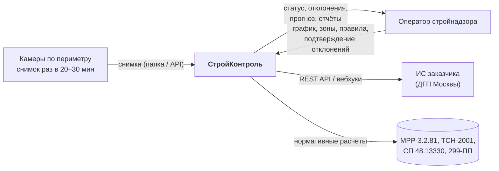
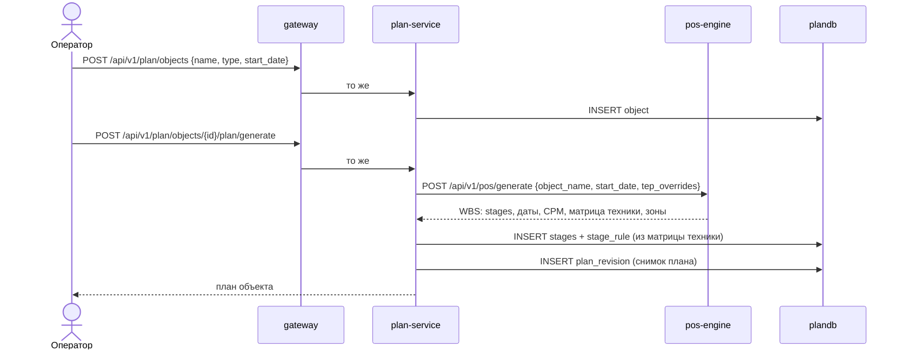
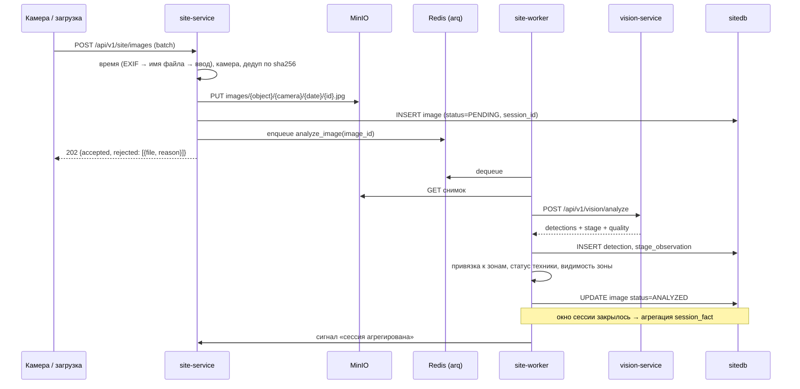
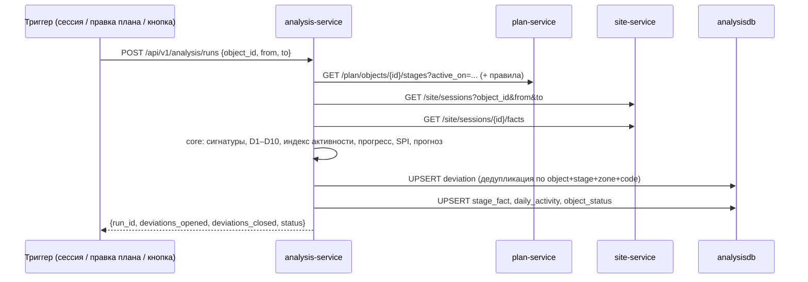
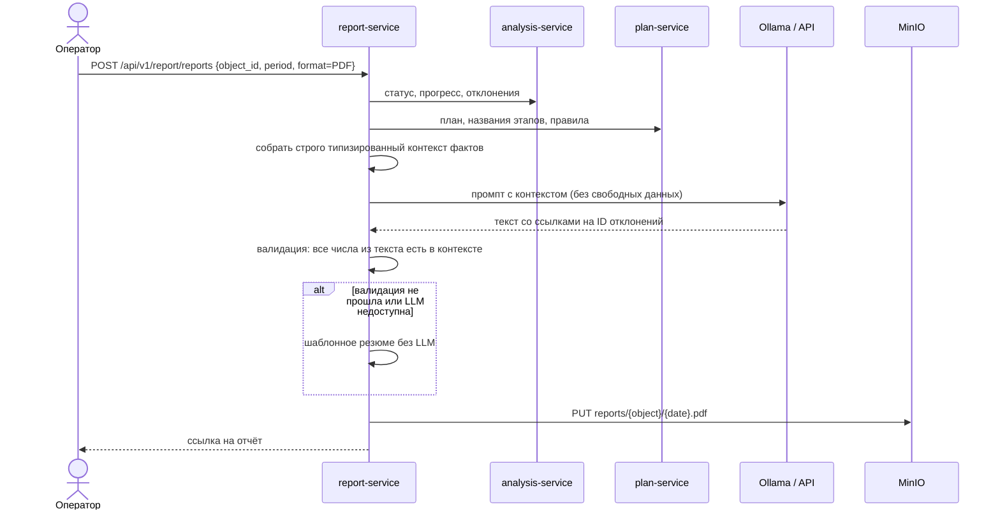

# Архитектура системы

Документ описывает, из чего состоит система, почему она разделена именно так, как части
взаимодействуют и как она расширяется. Модель данных вынесена в [data-model.md](data-model.md),
правила API — в [api-guidelines.md](api-guidelines.md), методика расчётов — в
[methodology.md](methodology.md).

---

## 1. Контекст

Система отвечает на один вопрос: **идёт ли объект по графику, и если нет — почему и насколько**.
Всё остальное — способ обосновать этот ответ.

## 2. Принципы

| Принцип | Как выражается в коде |
| :--- | :--- |
| **План, факт и сверка — разные области** | Три сервиса с тремя базами и тремя владельцами данных |
| **Настройка данными, а не кодом** | Классы техники, зоны, правила, пороги, промпты — в БД и справочниках |
| **Объяснимость важнее точности** | У каждого отклонения сохранены исходные факты и снимки-доказательства |
| **Тяжёлое отделено от быстрого** | CV, LLM и PDF — отдельные stateless-сервисы, масштабируются репликами |
| **Чистое ядро** | Правила и формулы — чистые функции в `core/`, тестируются без БД и сети |
| **Простота вместо запаса прочности** | Нет брокера, нет service mesh, нет Kubernetes: синхронный REST + очередь задач |
| **Честность к неизвестному** | Невидимая зона помечается «вне контроля ИИ», а не достраивается догадками |

## 3. Состав системы

### 3.1. Прикладные сервисы

| Сервис | Роль | Стек | Состояние | Масштабирование |
| :--- | :--- | :--- | :--- | :--- |
| `gateway` | Единая точка входа: маршрутизация по префиксу, отдача SPA, CORS, `X-Request-Id`, сводный Swagger | nginx | нет | реплики |
| `plan-service` | **План.** Объекты, справочник работ, календарный график, вехи, правила «веха → техника», классы техники, ревизии плана | FastAPI | `plandb` | реплики (stateless-обработка) |
| `site-service` | **Факт.** Камеры, зоны, снимки, сессии наблюдения, детекции, статусы техники, видимость зон. Оркеструет CV-конвейер | FastAPI + arq-воркер | `sitedb`, MinIO, Redis | реплики API + N воркеров |
| `analysis-service` | **Сверка.** Отклонения D1–D10, индекс активности, прогресс, SPI, прогноз завершения, статус объекта | FastAPI | `analysisdb` | реплики |
| `vision-service` | Детекция техники (open-vocabulary YOLO), стадия объекта (CLIP), качество кадра | FastAPI + Ultralytics + OpenCLIP | нет | реплики; на демо-стенде — GPU |
| `pos-engine` | Нормативный ПОС: название объекта → WBS, сроки, CPM, потребность в технике | FastAPI | нет (JSON-справочники) | реплики |
| `report-service` | PDF/XLSX-отчёты, LLM-резюме строго по фактам | FastAPI + Jinja2 + WeasyPrint + внешний LLM-API | нет (MinIO) | реплики |
| `web` | SPA: дашборд, Гант план-факт, предупреждения, камеры, редакторы | React + Vite | нет | статика через gateway |

### 3.2. Инфраструктура

| Компонент | Назначение | Замена в проде заказчика |
| :--- | :--- | :--- |
| PostgreSQL 16 | Три независимые базы: `plandb`, `sitedb`, `analysisdb` | Три инстанса / управляемый кластер |
| MinIO | S3-совместимое хранилище снимков, превью, отчётов | Любой S3 |
| Redis 7 | Очередь задач CV-конвейера (arq) | Redis / брокер заказчика |
| Ollama (профиль `llm`) | Локальная LLM для закрытого контура; по умолчанию не поднимается | Остаётся как есть |

**LLM внешняя.** По умолчанию `report-service` обращается к внешнему API
(`LLM_PROVIDER=openai_compatible`), поэтому видеопамять демо-стенда целиком отдана
распознаванию. Наружу уходят только структурированные факты: названия вех, даты, числа,
коды отклонений — ни снимков, ни персональных данных. Профиль `llm` с локальной моделью
сохранён и включается одной переменной окружения: для заказчика, которому нельзя
за периметр, это ответ без переписывания кода ([ADR-0008](decisions/0008-llm-narrative-only.md)).

**Целевой стенд:** ноутбук Ryzen 5 5600H, 32 ГБ, RTX 3060 Laptop 6 ГБ. Карта занята
только `vision-service`: детектор 1.2–2 ГБ видеопамяти, классификатор стадии ~0.6 ГБ.

### 3.3. Порты

Внутри сети Docker **все FastAPI-сервисы слушают порт 8000**. Наружу пробрасываются
только для отладки; продуктовый трафик идёт через `gateway`.

| Сервис | Порт на хосте | Внутренний адрес |
| :--- | :--- | :--- |
| gateway | 8080 | `http://gateway:80` |
| pos-engine | 8000 | `http://pos-engine:8000` |
| plan-service | 8001 | `http://plan-service:8000` |
| site-service | 8002 | `http://site-service:8000` |
| analysis-service | 8003 | `http://analysis-service:8000` |
| vision-service | 8004 | `http://vision-service:8000` |
| report-service | 8005 | `http://report-service:8000` |
| web (dev, Vite) | 5173 | — |
| postgres | 5432 | `postgres:5432` |
| minio | 9000 / 9001 | `minio:9000` |
| redis | 6379 | `redis:6379` |
| ollama | 11434 | `ollama:11434` |

## 4. Почему именно такие границы

Разделение проведено по **владению данными и темпу изменений**, а не по техническим слоям.

- **`plan-service` — «как должно быть».** Данные редактируются человеком, меняются редко,
  требуют истории изменений (ревизии плана) и аудита: это бюджетный городской объект.
- **`site-service` — «что видно на самом деле».** Данные поступают потоком, никогда не правятся
  вручную, объём растёт линейно от числа камер. Здесь живёт вся работа с изображениями.
- **`analysis-service` — «совпадает ли одно с другим».** Не владеет первичными данными вообще:
  читает план и факт по API, производит выводы. Полностью пересчитываем из ничего — это
  делает его безопасным для экспериментов с методикой прямо во время демо.
- **`vision-service`, `pos-engine`, `report-service` — «знания, а не данные».** Stateless-функции
  с тяжёлыми зависимостями (torch, нормативы, LLM). Выносятся, чтобы их можно было заменить,
  масштабировать и отлаживать отдельно — и чтобы падение LLM не роняло анализ.

Главное следствие: **методика (то, за что нас оценивают) сосредоточена в `analysis-service`
и в `core/` сервисов, а не размазана по системе.** Её можно показать, объяснить и протестировать
без единого снимка. Подробное обоснование и рассмотренные альтернативы —
[ADR-0002](decisions/0002-service-boundaries.md).

## 5. Потоки данных

### 5.1. Создание объекта и генерация плана

Ключевое: **`pos-engine` даёт нормативный черновик, `plan-service` хранит редактируемую истину.**
После генерации оператор правит даты и правила в UI — `pos-engine` об этом уже ничего не знает.
Повторная генерация создаёт новую ревизию и не затирает ручные правки без явного `force`.

### 5.2. Приём снимков и CV-конвейер

Снимок без распознанного времени **не участвует в план-факте** — он сохраняется со статусом
`NEEDS_TIME` и ждёт, пока пользователь укажет время. Это осознанное требование ТЗ, а не ошибка.

### 5.3. Сверка план-факт

Прогон **идемпотентен**: повторный запуск на тех же данных не создаёт дублей, а обновляет
`last_seen_at` и `occurrences`. Отклонение, условие которого перестало выполняться,
переводится в `RESOLVED`, а не удаляется — лента должна быть историей, а не срезом.

### 5.4. Отчёт и LLM-резюме

### 5.5. Правка настроек и пересчёт (F11)

Правка **дат плана** (`PATCH /plan/stages/{id}`), **правил** (`PATCH /plan/rules/{id}`) или
**зон** (`PATCH /site/zones/{id}`) не требует перезапуска и не требует повторного CV:

| Что изменилось | Что пересчитывается | Стоимость |
| :--- | :--- | :--- |
| Даты плана, правила «веха → техника» | Только `analysis-service`: `POST /analysis/runs` | секунды |
| Полигоны зон | `site-service`: `POST /site/zones/reapply` — привязка существующих детекций к зонам, статусы, `session_fact`; затем прогон анализа | секунды–минуты |
| Пороги отклонений | Только `analysis-service` | секунды |
| Модель CV или её порог уверенности | `site-service`: `POST /site/images/reanalyze` — полный повторный прогон CV | минуты |

Это ровно тот сценарий, который показывается жюри: «меняем правило в UI — вывод меняется
у нас на глазах».

## 6. Правила взаимодействия сервисов

1. **Только HTTP, только синхронно, только через объявленный контракт.** Никаких общих БД,
   файлов и очередей между сервисами. Очередь Redis — внутренняя деталь `site-service`.
2. **Направление вызовов строго сверху вниз** (нет циклов):
   `web → gateway → {plan, site, analysis, report}`, `plan → pos`, `site → vision`,
   `analysis → {plan, site}`, `report → {plan, analysis}`.
   Обратные вызовы запрещены: `analysis` никогда не вызывает `report`, `vision` не знает
   ни о ком. Единственное исключение — «сигнал пересчёта», который `site-service` может
   послать в `analysis-service` (`POST /analysis/runs`) после агрегации сессии; он
   не возвращает данных и его потеря не ломает состояние.
3. **Межсервисные ссылки — только по ID.** `sitedb.image.object_id` — это UUID из `plandb`,
   без внешнего ключа. Источник истины — сервис-владелец; потребитель при необходимости
   кэширует денормализованное имя и помечает его как кэш.
4. **Клиенты изолированы.** Все вызовы наружу — через `src/clients/*_client.py`:
   один класс на сервис, таймауты, ретраи, перевод чужих ошибок в свои доменные.
5. **Таймауты и ретраи:**

   | Вызов | Таймаут | Ретраи |
   | :--- | :--- | :--- |
   | `site-worker → vision-service` | 30 с | 2, экспоненциальная пауза (задача идемпотентна) |
   | `plan-service → pos-engine` | 20 с | 1 |
   | `analysis-service → plan/site` | 10 с | 2, только GET |
   | `report-service → LLM` | 60 с | 0, сразу фолбэк на шаблон |

   Ретраи допустимы **только для идемпотентных операций**. Недоступность зависимости — это
   `503` с понятным `code`, а не тихая заглушка с пустыми данными.
6. **Деградация вместо падения.** LLM недоступна → шаблонный текст. `vision-service` недоступен →
   снимки копятся в статусе `PENDING`, воркер разбирает очередь позже. `pos-engine` недоступен →
   план можно импортировать из CSV/XLSX.
7. **Доменные события именованы уже сейчас** (`packages/contracts/events.md`), хотя реализованы
   прямыми вызовами. Переход на брокер = замена реализации `clients/`, без правки логики.

## 7. Хранилища данных

### 7.1. PostgreSQL: база на сервис

Один контейнер PostgreSQL, **три базы и три роли**: `plandb/plan_user`, `sitedb/site_user`,
`analysisdb/analysis_user`. Роль имеет права только на свою базу. Так граница защищена
не соглашением, а СУБД, при этом контейнер один — [ADR-0003](decisions/0003-database-per-service.md).

Миграции — Alembic, у каждого сервиса свои, применяются на старте контейнера
при `RUN_MIGRATIONS=true`. Полное описание таблиц — [data-model.md](data-model.md).

**PostGIS не используется.** Зоны — это полигоны в системе координат кадра (нормированные
0…1), а не географические объекты; хранятся в `jsonb`, проверка «точка в полигоне» —
`shapely` в памяти. См. [ADR-0006](decisions/0006-zones-in-image-space.md).

### 7.2. MinIO: объектное хранилище

| Бакет | Что | Жизненный цикл |
| :--- | :--- | :--- |
| `images` | Оригиналы снимков: `{object_id}/{camera_id}/{YYYY-MM-DD}/{image_id}.jpg` | хранить |
| `previews` | Превью (`thumb`) и кадры с нарисованными рамками (`annotated`), генерируются по запросу | можно чистить |
| `reference` | Эталонные кадры камер для разметки зон | хранить |
| `reports` | Сформированные PDF/XLSX: `{object_id}/{YYYY-MM-DD}-{type}.pdf` | хранить |

Снимки наружу отдаются **presigned-ссылками** с TTL: ни один сервис не проксирует байты
изображений через себя.

### 7.3. Redis

Только очередь задач `arq` для `site-service`: `analyze_image`, `aggregate_session`,
`reapply_zones`, `reanalyze_object`. Состояние очереди не является источником истины —
им является `image.status` в `sitedb`, поэтому потеря Redis не теряет данные, а лишь требует
перезапуска обработки.

## 8. Сквозные механизмы

| Механизм | Решение |
| :--- | :--- |
| **Аутентификация** | Статический `X-API-Key` на всех `/api/v1/**`, кроме `/health` и `/docs`. Точка расширения — OIDC/SSO ([ADR-0010](decisions/0010-auth.md)) |
| **Трассировка** | `X-Request-Id` создаётся в gateway, пробрасывается во все вызовы, попадает в каждую строку лога и в тело ошибки |
| **Логи** | JSON в stdout: `ts, level, service, request_id, event, duration_ms, …`. Никаких `print` |
| **Конфигурация** | 12-factor: только переменные окружения, один `.env` на весь compose, `Settings` на pydantic-settings в каждом сервисе |
| **Здоровье** | `/health` — процесс жив; `/health/ready` — БД, MinIO, зависимые сервисы отвечают. Compose использует `/health/ready` в `depends_on: condition: service_healthy` |
| **Время** | Хранение и обмен — UTC (`timestamptz`), отображение — `Europe/Moscow`. Рабочий календарь (выходные, праздники) — таблица в `plandb` |
| **Ошибки** | Единый конверт `{"error": {...}}`, стабильные коды, русские сообщения |
| **Документация API** | Swagger каждого сервиса на `/docs`, сводная страница с выбором сервиса — `gateway:/docs` |

## 9. Как система расширяется без переделки кода

Это прямой ответ на критерий оценки «архитектура: новые типы техники, камер и планов без
переделки кода».

| Что добавляем | Что делаем | Нужен ли код |
| :--- | :--- | :--- |
| **Новый класс техники** | Строка в `equipment_class` (код, название, алиасы датасетов) + алиас в `class_map.yaml` CV-сервиса + при необходимости дообучение весов | **Нет** |
| **Новая камера** | Строка в `camera`, загрузка эталонного кадра, разметка зон в UI | **Нет** |
| **Новая зона или тип зоны** | Строка в `zone`; тип зоны — значение из справочника `zone_type` | **Нет** |
| **Новый объект и план** | `POST /plan/objects` + генерация через `pos-engine` или импорт CSV/XLSX | **Нет** |
| **Новый тип объекта** (школа, дорога, мост) | Шаблон WBS в `pos-engine/data/wbs_templates.json` + нормы в `mrr_norms.json` | **Нет** |
| **Новое правило «веха → техника»** | Строка в `stage_rule` через UI | **Нет** |
| **Новый порог отклонения** | Поле `params` в `deviation_rule` | **Нет** |
| **Новый тип отклонения из готовых предикатов** | Строка в `deviation_rule` + шаблон сообщения в `messages.ru.yaml` | **Нет** |
| **Новый тип отклонения с новой логикой** | Функция-предикат в `analysis-service/src/core/predicates.py` + регистрация | ~30 строк |
| **Другая CV-модель** | Переменные окружения `vision-service` (веса, порог, устройство) | **Нет** |
| **Рост нагрузки** | Реплики `vision-service` и `site-worker`; базы — на отдельные инстансы | **Нет** |
| **Второй источник снимков** (поток, FTP, API камеры) | Новый адаптер, пишущий в `POST /site/images` | Вне системы |

**Что из этого нужно делать руками в MVP: ничего.** Камера заводится автоматически при
импорте папки со снимками (подпапка = код камеры), эталонным кадром становится первый
снимок этой камеры, зоны приходят из `data/seed/cameras.json`. Таблица выше описывает,
как продукт расширяется **в эксплуатации**, а не объём ручной работы на хакатоне.

Мы не утверждаем «никогда не потребуется код» — мы утверждаем, что **всё, что заказчик
меняет в эксплуатации, меняется данными**, а код нужен только для принципиально новой
логики, и для неё есть заранее определённая точка расширения.

## 10. Нефункциональные требования и как они обеспечиваются

| Требование ТЗ | Как обеспечивается |
| :--- | :--- |
| ≤ 100 мс на GPU | Целевой режим: YOLO `s` на RTX 3060 даёт 8–15 мс при входе 1280 — требование перевыполняется |
| Обработка снимка ≤ 1–2 с на CPU | Запасной режим той же сборки: `VISION_DEVICE=cpu`, вход 960, модель размера `n/s` |
| Предупреждение не позднее одной сессии (30 мин) | Агрегация запускается по закрытию окна сессии, анализ — сразу за ней |
| Запуск одной командой | `docker compose up`; образы multi-stage, веса монтируются томом |
| Конфигурация классов, правил и зон — в данных | Раздел 9 |
| Масштабируемость | Stateless-сервисы + реплики; состояние только в БД и S3 |

## 11. Что осознанно не делается

Чтобы архитектура оставалась простой, зафиксированы отказы:

- **Нет брокера сообщений** (Kafka/RabbitMQ): один продюсер и один потребитель на поток,
  синхронный REST + очередь задач покрывают задачу. События уже названы — [ADR-0004](decisions/0004-sync-rest-and-queue.md).
- **Нет Kubernetes и service mesh**: сдача — `docker compose`, заказчику отдаётся набор
  образов и манифест.
- **Нет отдельного сервиса аутентификации**: API-ключ, точка расширения описана.
- **Нет трекинга конкретных машин и видео**: ТЗ прямо выводит это за границы.
- **Нет микро-фронтендов, GraphQL, CQRS, event sourcing**: задача этого не требует,
  а сложность стоит дороже, чем даёт.
- **Нет общей доменной библиотеки**: `packages/py-common` содержит только инфраструктуру
  (логи, ошибки, health, http-клиент). Доменная логика в общей библиотеке превратила бы
  систему в распределённый монолит.

## 12. Дальнейшее развитие (для питча)

Порядок, в котором продукт достраивается после хакатона, без переделки архитектуры:

1. **Поток вместо пакетов:** адаптер RTSP → кадры → `POST /site/images`. Ядро не меняется.
2. **Брокер:** замена прямых вызовов на публикацию событий из `contracts/events.md`.
3. **Мультиарендность:** `tenant_id` в трёх базах и в API-ключе; изоляция на уровне строк.
4. **SSO Москвы:** замена проверки API-ключа на OIDC в gateway.
5. **Обучение на обратной связи:** отметки «подтверждено / ложное» в ленте копятся
   в `deviation_feedback` и становятся выборкой для калибровки порогов и дообучения модели.
6. **Обмен с ИСУП:** экспорт план-факта в форматы заказчика — отдельный адаптер поверх API.
