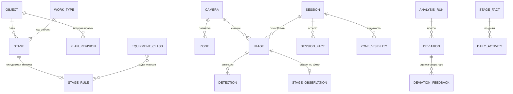

# Модель данных

Три независимые базы PostgreSQL 16 — по одной на сервис с состоянием. Между базами
**нет внешних ключей и нет запросов**: связь только по UUID через API сервиса-владельца.

Общие соглашения для всех таблиц:

- первичный ключ — `id uuid` (`gen_random_uuid()`), кроме справочников с естественным кодом;
- `created_at timestamptz not null default now()`, `updated_at timestamptz` — везде, где строка
  может меняться;
- все моменты времени — `timestamptz` в UTC; даты плана — `date` (без времени, это календарь);
- перечисления хранятся как `text` + `CHECK`, а не как postgres enum: добавление значения
  не должно требовать миграции (см. [AGENTS.md](../AGENTS.md), правило «конфигурация — данные»);
- слабоструктурированное — `jsonb` (полигоны, наборы техники, факты отклонений);
- поля `*_id`, указывающие на другой сервис, имеют суффикс комментария `-- внешняя ссылка`.

---

## 1. `plandb` — сервис плана

### 1.1. `object` — объект строительства

| Поле | Тип | Описание |
| :--- | :--- | :--- |
| `id` | uuid PK | |
| `name` | text | Полное наименование, как в АИП («Строительство монолитного жилого дома 17 этажей…») |
| `object_type` | text | `RESIDENTIAL_MONOLITH` / `RESIDENTIAL_PANEL` / `PUBLIC_BUILDING` / `ROAD` |
| `address` | text | Адрес площадки |
| `tep` | jsonb | ТЭП: этажность, площадь, секции, сваи, сменность, стеснённость (структура — ответ `pos-engine`) |
| `plan_start` | date | Плановая дата начала СМР |
| `calendar_id` | uuid FK | Рабочий календарь |
| `status` | text | `DRAFT` / `ACTIVE` / `ARCHIVED` |
| `current_revision` | int | Номер текущей ревизии плана |

Индексы: `(status)`, `(object_type)`.

### 1.2. `work_type` — справочник строительных работ

Загружается парсером XLSX («Сводный перечень строительных работ ЛТЦ»).
Парсер восстанавливает коды, испорченные Excel (`45667` → `10.1`, `45698` → `10.2`,
`45728` → `12.3`, `45759` → `12.4`, `45789` → `12.5`, `45820` → `12.6`, `45850` → `12.7`),
строки без кода относит к 4-му уровню ближайшего кода сверху и достраивает отсутствующий
последний столбец «Дороги».

| Поле | Тип | Описание |
| :--- | :--- | :--- |
| `code` | text PK | `10.1`, `12.3.5`, `12.4.28` |
| `name` | text | Наименование работы |
| `level` | int | 1…4 |
| `parent_code` | text | Код родителя |
| `applicable` | jsonb | Флаги обязательности по типам объектов: `{"RESIDENTIAL": true, "ROAD": false, …}` |
| `source` | text | Источник строки (файл, лист, номер строки) — для проверяемости |

### 1.3. `equipment_class` — классы техники

12 базовых классов + расширяемо. Добавление класса — строка здесь, без правки кода.

| Поле | Тип | Описание |
| :--- | :--- | :--- |
| `code` | text PK | `excavator`, `dump_truck`, `tower_crane`, `concrete_pump`, `concrete_mixer`, `bulldozer`, `roller`, `truck`, `truck_crane`, `manipulator_crane`, `pile_driver`, `loader`, `asphalt_paver`, `grader`, `person` |
| `name_ru` | text | «Экскаватор», «Самосвал» |
| `group` | text | `EARTHWORKS` / `LIFTING` / `CONCRETE` / `TRANSPORT` / `ROAD` / `OTHER` |
| `aliases` | jsonb | Маппинг меток внешних датасетов: `["excavator", "digger", "backhoe"]` |
| `is_active` | bool | Выключение класса без удаления истории |
| `icon` | text | Имя иконки в UI |

### 1.4. `stage` — веха календарного графика

Веха = укрупнённый этап работ. Соответствует `stages[]` в ответе `pos-engine`.

| Поле | Тип | Описание |
| :--- | :--- | :--- |
| `id` | uuid PK | |
| `object_id` | uuid FK | |
| `code` | text | Код по справочнику (`12.3.1`) или диапазон (`10.4-10.8`) |
| `work_codes` | jsonb | Полный список кодов работ, свёрнутых в веху |
| `name` | text | «Разработка котлована» |
| `phase` | text | `PREPARATORY` / `SUBSTRUCTURE` / `SUPERSTRUCTURE` / `ENVELOPE_ROOF` / `NETWORKS` / `LANDSCAPING` |
| `seq` | int | Порядок в графике |
| `zone_type` | text | Ожидаемая зона работ: `PIT` / `BUILDING_FOOTPRINT` / `PERIMETER` / `ENTRY_GATE` / `STORAGE` / `ROAD` |
| `plan_start`, `plan_end` | date | Плановые даты (правятся в UI) |
| `norm_duration_days` | int | Нормативная продолжительность (МРР) |
| `predecessors` | jsonb | `[{"stage_id": "...", "type": "FS", "lag_days": 0}]` |
| `is_critical` | bool | Лежит на критическом пути |
| `total_float_days`, `free_float_days` | int | Резервы времени (CPM) |
| `shifts_per_day` | int | Сменность (влияет на нормативы) |
| `source` | text | `POS_ENGINE` / `IMPORT` / `MANUAL` |
| `regulatory_basis` | jsonb | Ссылки на нормативы, по которым посчитана длительность |

Индексы: `(object_id, plan_start)`, `(object_id, seq)`.
Ограничение: `plan_end >= plan_start`.

### 1.5. `stage_rule` — правило «веха → техника»

Главная настраиваемая сущность методики. Создаётся из матрицы техники `pos-engine`,
дальше редактируется оператором.

| Поле | Тип | Описание |
| :--- | :--- | :--- |
| `id` | uuid PK | |
| `stage_id` | uuid FK | Веха, к которой относится правило |
| `zone_type` | text | Где ожидается техника |
| `required` | jsonb | `{"excavator": 1, "dump_truck": 2}` — обязательный комплект с минимумом |
| `allowed` | jsonb | `["bulldozer", "loader"]` — допустимая техника, не вызывает отклонений |
| `signature` | jsonb | `["excavator", "dump_truck"]` — сочетание, фиксирующее фактический старт вехи |
| `min_sessions` | int | Сколько сессий подряд должна держаться сигнатура |
| `version` | int | Растёт при каждой правке — попадает в `analysis_run` для воспроизводимости |
| `is_active` | bool | |

### 1.6. `plan_revision` — история плана

Бюджетный объект требует аудита: кто, когда и почему подвинул срок.

| Поле | Тип | Описание |
| :--- | :--- | :--- |
| `id` | uuid PK | |
| `object_id` | uuid FK | |
| `number` | int | Порядковый номер ревизии |
| `author` | text | Кто изменил |
| `reason` | text | Комментарий |
| `snapshot` | jsonb | Полный слепок вех и правил на момент ревизии |

### 1.7. `work_calendar` — рабочий календарь

| Поле | Тип | Описание |
| :--- | :--- | :--- |
| `id` | uuid PK | |
| `name` | text | «Москва, 2026, 6-дневка» |
| `weekend_days` | jsonb | `[6, 7]` |
| `holidays` | jsonb | Список дат |
| `work_hours` | jsonb | `{"start": "07:00", "end": "23:00"}` — рабочее время, влияет на D1 и D4 |

---

## 2. `sitedb` — сервис площадки (факт)

### 2.1. `camera`

| Поле | Тип | Описание |
| :--- | :--- | :--- |
| `id` | uuid PK | |
| `object_id` | uuid | внешняя ссылка на `plandb.object` |
| `code` | text | Короткий код, он же имя папки при пакетной загрузке (`cam-north`) |
| `name` | text | «Северная обзорная» |
| `reference_frame_key` | text | Ключ эталонного кадра в MinIO (`reference/...`) |
| `install_meta` | jsonb | Высота подвеса, азимут, наличие ИК-подсветки — для рекомендаций по камерам |
| `is_active` | bool | |

Уникальность: `(object_id, code)`.

### 2.2. `zone` — рабочая зона на кадре камеры

| Поле | Тип | Описание |
| :--- | :--- | :--- |
| `id` | uuid PK | |
| `object_id` | uuid | внешняя ссылка |
| `camera_id` | uuid FK | Зона размечена на кадре конкретной камеры |
| `zone_type` | text | `PIT` / `BUILDING_FOOTPRINT` / `PERIMETER` / `ENTRY_GATE` / `STORAGE` / `DANGER` / `ROAD` |
| `name` | text | «Котлован», «Въезд» |
| `polygon` | jsonb | `[[x, y], …]`, координаты **нормированы 0…1** от размера кадра — не зависят от разрешения |
| `overlaps_with` | jsonb | ID зон других камер, перекрывающих ту же физическую область (для дедупликации) |
| `version` | int | Растёт при правке — попадает в `analysis_run` |
| `is_active` | bool | |

### 2.3. `image` — снимок

| Поле | Тип | Описание |
| :--- | :--- | :--- |
| `id` | uuid PK | |
| `object_id`, `camera_id` | uuid | |
| `captured_at` | timestamptz | Время съёмки. Источник — `captured_at_source` |
| `captured_at_source` | text | `EXIF` / `FILENAME` / `MANUAL` / `UNKNOWN` |
| `received_at` | timestamptz | Когда снимок попал в систему |
| `session_id` | uuid FK | Сессия наблюдения (может быть null до определения времени) |
| `storage_key` | text | Ключ в бакете `images` |
| `thumb_key` | text | Ключ превью |
| `width`, `height` | int | |
| `checksum` | text | sha256, уникален в паре с `object_id` — защита от повторной загрузки |
| `source` | text | `UPLOAD` / `API` / `FOLDER_IMPORT` |
| `exif` | jsonb | Сырые метаданные |
| `quality` | jsonb | `{"brightness": 0.31, "blur": 0.08, "occlusion": 0.12}` от `vision-service` |
| `status` | text | `NEEDS_TIME` / `PENDING` / `PROCESSING` / `ANALYZED` / `FAILED` |
| `error` | text | Причина `FAILED` |

Индексы: `(object_id, captured_at)`, `(session_id)`, `(status)`, уникальный `(object_id, checksum)`.

### 2.4. `session` — сессия наблюдения

Сессия — окно 30 минут по объекту; состав техники считается **по сессии, а не по кадру**,
чтобы одна и та же машина, попавшая в две камеры, не считалась дважды.

| Поле | Тип | Описание |
| :--- | :--- | :--- |
| `id` | uuid PK | |
| `object_id` | uuid | |
| `window_start`, `window_end` | timestamptz | Границы окна |
| `is_working_time` | bool | Попадает ли окно в рабочее время календаря объекта |
| `image_count`, `camera_count` | int | |
| `status` | text | `OPEN` / `CLOSED` / `AGGREGATED` |

Уникальность: `(object_id, window_start)`.

### 2.5. `detection` — детекция единицы техники

| Поле | Тип | Описание |
| :--- | :--- | :--- |
| `id` | uuid PK | |
| `image_id`, `session_id` | uuid FK | |
| `equipment_class` | text | Код класса (совпадает с `plandb.equipment_class.code`) |
| `bbox` | jsonb | `[x1, y1, x2, y2]`, нормировано 0…1 |
| `conf` | real | Уверенность модели |
| `anchor` | jsonb | `[x, y]` — нижняя середина рамки, точка контакта с землёй (по ней идёт привязка к зоне) |
| `zone_id` | uuid FK | Зона, в которую попал `anchor`; null — вне зон |
| `state` | text | `WORKING` / `IDLE` / `OUT_OF_ZONE` / `UNKNOWN` |
| `state_reason` | text | Человекочитаемое обоснование статуса — идёт в объяснение отклонения |
| `model_version` | text | Какая модель дала детекцию — для воспроизводимости |

Индексы: `(session_id, equipment_class)`, `(image_id)`, `(zone_id)`.

### 2.6. `stage_observation` — стадия объекта по снимку

| Поле | Тип | Описание |
| :--- | :--- | :--- |
| `id` | uuid PK | |
| `image_id`, `session_id` | uuid FK | |
| `stage_label` | text | `PIT` / `PILES` / `FOUNDATION` / `FRAME` / `FACADE` / `LANDSCAPING` |
| `conf` | real | |
| `floors_estimate` | int | Оценка числа этажей (для % готовности) |
| `scores` | jsonb | Все вероятности по меткам — нужны для объяснения |

### 2.7. `zone_visibility` — видимость зоны в сессии

| Поле | Тип | Описание |
| :--- | :--- | :--- |
| `session_id`, `zone_id` | uuid FK | |
| `coverage` | real | Доля площади зоны, попавшая в пригодные кадры |
| `status` | text | `OK` / `PARTIAL` / `BLIND` |
| `reason` | text | `NO_IMAGES` / `DARK` / `OCCLUDED` / `BLURRED` |

Основание для отклонения D10 «зона вне контроля ИИ».

### 2.8. `session_fact` — агрегат сессии

Материализованный результат, который читает `analysis-service`. Считается один раз при
закрытии сессии, пересчитывается при правке зон.

| Поле | Тип | Описание |
| :--- | :--- | :--- |
| `session_id`, `zone_id` | uuid | |
| `equipment_class` | text | |
| `count` | int | Число единиц после дедупликации между камерами (максимум по камере, не сумма) |
| `working_count`, `idle_count` | int | |
| `evidence` | jsonb | `[{"image_id": "...", "detection_id": "...", "conf": 0.91}]` — снимки-доказательства |

Первичный ключ: `(session_id, zone_id, equipment_class)`.

---

## 3. `analysisdb` — сервис сверки

### 3.1. `analysis_run` — прогон анализа

| Поле | Тип | Описание |
| :--- | :--- | :--- |
| `id` | uuid PK | |
| `object_id` | uuid | |
| `triggered_by` | text | `SESSION_CLOSED` / `PLAN_CHANGED` / `RULES_CHANGED` / `MANUAL` |
| `period_from`, `period_to` | date | |
| `plan_revision`, `rules_version`, `zones_version` | int | Версии входных данных — прогон воспроизводим |
| `status` | text | `RUNNING` / `DONE` / `FAILED` |
| `stats` | jsonb | Сколько сессий обработано, сколько отклонений открыто/закрыто |

### 3.2. `deviation` — отклонение

Центральная сущность продукта: то, что видит пользователь и за что нас оценивают.

| Поле | Тип | Описание |
| :--- | :--- | :--- |
| `id` | uuid PK | |
| `object_id`, `stage_id`, `zone_id`, `session_id` | uuid | Внешние ссылки |
| `code` | text | `D1`…`D10` (см. [methodology.md](methodology.md)) |
| `severity` | text | `INFO` / `LOW` / `MEDIUM` / `HIGH` |
| `title` | text | Короткий заголовок карточки |
| `message` | text | Готовый русский текст, собранный из шаблона и `facts` |
| `facts` | jsonb | **Все числа, на которых построен вывод** — основа объяснимости |
| `rule_ref` | jsonb | `{"deviation_rule_id": "...", "stage_rule_id": "...", "stage_rule_version": 2}` |
| `evidence` | jsonb | `[{"image_id": "...", "detection_ids": ["..."]}]` |
| `status` | text | `NEW` / `CONFIRMED` / `REJECTED` / `RESOLVED` |
| `first_seen_at`, `last_seen_at` | timestamptz | |
| `occurrences` | int | Сколько сессий подряд условие выполнялось |

Уникальность открытого отклонения: `(object_id, stage_id, zone_id, code)` при
`status IN ('NEW','CONFIRMED')` — повторный прогон обновляет строку, а не плодит дубли.

### 3.3. `deviation_rule` — настройка правил отклонений

| Поле | Тип | Описание |
| :--- | :--- | :--- |
| `code` | text PK | `D1`…`D10` |
| `predicate` | text | Имя предиката из реестра `core/predicates.py` |
| `enabled` | bool | |
| `severity` | text | Базовая серьёзность (может повышаться по `escalation`) |
| `params` | jsonb | Пороги: `{"min_sessions": 2, "escalate_after_days": 1}` |
| `message_template` | text | Шаблон текста с подстановкой из `facts` |

### 3.4. `stage_fact` — факт по вехе

| Поле | Тип | Описание |
| :--- | :--- | :--- |
| `object_id`, `stage_id` | uuid | |
| `actual_start` | date | Первая сессия с сигнатурой вехи |
| `last_activity_at` | timestamptz | |
| `effective_days` | real | Сумма индексов активности |
| `progress` | real | 0…1 |
| `planned_progress` | real | 0…1 на сегодня |
| `spi` | real | `progress / planned_progress` |
| `forecast_end` | date | Прогнозная дата окончания |
| `delay_days` | int | `forecast_end − plan_end` |
| `status` | text | `NOT_STARTED` / `IN_PROGRESS` / `DONE` / `LATE` / `AHEAD` |
| `confidence` | text | `LOW` / `MEDIUM` / `HIGH` — зависит от числа сессий и видимости зон |

### 3.5. `daily_activity` — активность по дням

| Поле | Тип | Описание |
| :--- | :--- | :--- |
| `stage_id`, `date` | — | Составной ключ |
| `sessions_total`, `sessions_working` | int | Сессии рабочего времени и из них — с полным комплектом |
| `activity_index` | real | `sessions_working / sessions_total`, 0…1 |
| `blind_sessions` | int | Сессии, где зона была не видна (не штрафуют индекс, а снижают `confidence`) |

### 3.6. `object_status` — сводный статус объекта

| Поле | Тип | Описание |
| :--- | :--- | :--- |
| `object_id` | uuid PK | |
| `computed_at` | timestamptz | |
| `status` | text | `ON_TRACK` / `DELAY` / `AHEAD` / `UNKNOWN` |
| `delay_days` | int | По критическому пути |
| `spi` | real | Взвешенный по объекту |
| `counters` | jsonb | Отклонения по серьёзности, слепые зоны, этапы в работе |
| `milestones_at_risk` | jsonb | Вехи с риском срыва и их прогнозные даты |

### 3.7. `deviation_feedback` — оценка оператора

| Поле | Тип | Описание |
| :--- | :--- | :--- |
| `id` | uuid PK | |
| `deviation_id` | uuid FK | |
| `verdict` | text | `CONFIRMED` / `FALSE_POSITIVE` |
| `comment` | text | |
| `author` | text | |

Помимо UX это выборка для калибровки порогов и дообучения — см. раздел «Дальнейшее развитие»
в [architecture.md](architecture.md).

---

## 4. Соответствие модели данных требованиям ТЗ

| Таблица из ТЗ (п.6) | Где реализована |
| :--- | :--- |
| `object` | `plandb.object` |
| `camera`, `zone` | `sitedb.camera`, `sitedb.zone` |
| `work_type` | `plandb.work_type` |
| `schedule_item` | `plandb.stage` (+ `plan_revision` для истории) |
| `equipment_class` | `plandb.equipment_class` |
| `stage_rule` | `plandb.stage_rule` |
| `image`, `session`, `detection`, `stage_observation` | `sitedb` одноимённые (+ `session_fact`, `zone_visibility`) |
| `deviation` | `analysisdb.deviation` (+ `deviation_rule`, `deviation_feedback`) |
| `progress_snapshot` | `analysisdb.stage_fact` + `daily_activity` + `object_status` |
