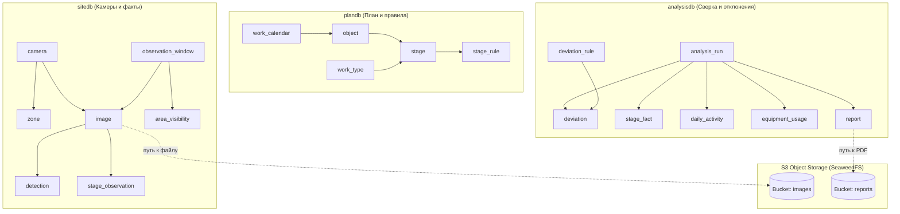

# Сопроводительная документация проекта «СтройКонтроль»

> **Проект:** Автоматизированный сервис поиска нарушений на строительных площадках Москвы  
> **Конкурс:** «Лидеры цифровой трансформации» (ЛЦТ) 2026, кейс 07  
> **Заказчик:** Департамент градостроительной политики города Москвы  
> **Соответствие:** Раздел 5 Технического задания («Требования к сопроводительной документации»)  
> **Целевая ветка репозитория:** `main`

---

## 1. Модель данных

Хранение данных организовано по принципу **Database-per-Service** (ADR-0003): каждый сервис с состоянием владеет собственной изолированной базой данных в СУБД PostgreSQL 16. Прямые запросы между базами и внешние ключи (Foreign Keys) отсутствуют; связь между сущностями осуществляется исключительно по идентификаторам UUID через HTTP REST API.



### 1.1. Хранение информации о технике
1. **Справочник классов техники (`packages/contracts/equipment_classes.yaml`):**
   Единый источник классификатора для всех сервисов (ADR-0014). Содержит 16 классов техники (8 базовых классов ТЗ + 8 дополнительных), текстовые промпты для open-vocabulary детектора, признак транзитности (`transient`), признак стационарной работы без перемещения (`works_in_place`), а также маппинг меток внешних датасетов.
2. **Сырые детекции (`sitedb.detection`):**
   Каждая найденная машина сохраняется с привязкой к снимку: `image_id`, `equipment_class` (текстовый код класса), нормализованные координаты рамки `bbox` ($[y_{min}, x_{min}, y_{max}, x_{max}]$), точка контакта с землей `bottom_center` ($[x, y]$), идентификатор полигона `zone_id`, степень уверенности `confidence` и версия модели `model_version`.
3. **Учет работы и простоев (`analysisdb.equipment_usage`, `sitedb.observation_window`):**
   Агрегированные показатели присутствия техники по участкам, типам и статусам работы (`WORKING`, `IDLE`, `OUT_OF_ZONE`) в 30-минутных окнах сессий.

### 1.2. Хранение информации об этапах работ
1. **График СМР (`plandb.stage`):**
   Каждый этап содержит плановые даты начала и окончания (`plan_start`, `plan_end`), нормативную продолжительность в днях (`norm_duration_days`), массив зависимостей (`predecessors`), признак нахождения на критическом пути (`is_critical_path`), физический участок площадки (`area_name`) и статус выполнения (`PLANNED`, `IN_PROGRESS`, `COMPLETED`, `CANCELLED`).
2. **Правила сопоставления «этап → техника» (`plandb.stage_rule`):**
   Требования к составу техники: словарь обязательных классов с минимальным количеством машин (`required`), список допустимой вспомогательной техники (`allowed`), сигнатура фактического начала этапа (`signature`), минимальное число рабочих сессий подтверждения (`min_sessions`).
3. **Справочник видов работ (`plandb.work_type`):**
   Иерархическое дерево классификатора строительных работ (4 уровня) с отметками обязательности для различных типов объектов (жилые дома, дороги, общественные здания).

### 1.3. Хранение информации об отклонениях и нарушениях
1. **Настройки правил отклонений (`analysisdb.deviation_rule`):**
   Предикаты D1–D10, базовая критичность (`LOW`, `MEDIUM`, `HIGH`, `CRITICAL`, `INFO`), числовые пороги срабатывания (`params`), правила временной эскалации и параметрические шаблоны сообщений.
2. **Журнал отклонений (`analysisdb.deviation`):**
   Зафиксированные инциденты: код нарушения (`code`), уровень критичности (`severity`), заголовок (`title`), детальное сообщение (`message`), структурированные факты нарушения (`facts` в формате JSONB), ссылки на подтверждающие снимки с рамками детекций (`evidence_image_ids`), жизненный цикл (`status`: `ACTIVE`, `RESOLVED`) и вердикт оператора (`verdict`: `NEW`, `CONFIRMED`, `REJECTED`).
3. **Фактические показатели и прогноз (`analysisdb.stage_fact`):**
   Фактическая дата старта, число эффективных рабочих дней (`effective_days`), достигнутый прогресс (`progress`), индекс соблюдения расписания (`spi`), прогнозная дата окончания этапа (`forecast_end`) и расчетная задержка в днях (`delay_days`).

### 1.4. Хранение медиафайлов и отчетов
Оригиналы изображений с камер и сформированные PDF-отчеты размещаются в S3-хранилище SeaweedFS в бакетах `images` и `reports`. В базах данных хранятся относительные пути ключей хранилища, что обеспечивает независимость от сетевых адресов и протоколов доступа.

---

## 2. Структура кода и комментарии

### 2.1. Организация монорепозитория
Проект спроектирован как модульный монорепозиторий со строгим разделением ответственности:

```text
├── apps/
│   └── web/                # React 18 SPA: дашборд, Гант, лента отклонений, разметка зон
├── services/
│   ├── gateway/            # Nginx: единая точка входа, маршрутизация, отдача SPA и Swagger UI
│   ├── plan-service/       # Сервис плана: объекты, календарь, график по МРР, правила техники
│   ├── site-service/       # Сервис площадки: камеры, зоны, снимки, сессии, видимость
│   ├── vision-service/     # CV-сервис: детекция техники, классификация стадии, качество кадра
│   └── analysis-service/   # Сервис сверки: отклонения D1-D10, прогноз SPI/CPM, PDF-отчеты
├── packages/
│   ├── contracts/          # Межсервисные контракты, enums.yaml, equipment_classes.yaml, OpenAPI
│   ├── py-common/          # Общие Python-библиотеки: логирование, обработка ошибок, клиенты
│   └── ts-api-client/      # Автогенерируемый TypeScript API-клиент для веб-интерфейса
├── ml/                     # Скрипты оценки моделей, подготовки датасетов и подсчета метрик
└── scripts/                # Скрипты развертывания, скачивания моделей, seed-данных и e2e-тестов
```

### 2.2. Архитектура сервисов и чистая доменная логика
Каждый микросервис структурирован по слоям:
- `src/core/`: **чистая доменная логика** (алгоритмы привязки к зонам, предикаты D1–D10, расчет прогресса и критического пути, парсеры). Не содержит вызовов баз данных или внешних API; на 100% покрыта изолированными unit-тестами.
- `src/dal/`: слой доступа к данным (модели SQLAlchemy 2.0, репозитории).
- `src/api/`: роутеры FastAPI и схемы валидации Pydantic v2.
- `src/services/`: сценарии оркестрации прикладных процессов и транзакций.

### 2.3. Культура комментирования кода
- Все комментарии и документационные строки (`docstrings`) написаны на русском языке.
- Комментарии поясняют логику принятия решений («почему так сделано»), а не дублируют код.
- Нетривиальные алгоритмические шаги сопровождаются нормативными ссылками (например, `# МРР-3.2.81-12, табл. 1: срок подземной части`).
- В начале каждого доменного модуля указана прямая связь с требованиями технического задания.

---

## 3. Условия, ограничения и качество машинного обучения

### 3.1. Данные обучения и валидации
- **Модель детекции:** Ultralytics YOLO-World v2 (архитектура small). Дообучена на объединенном наборе Construction Equipment и валидирована на хронологическом датасете стационарных камер 4K ЖК «Лима».
- **Итоговые веса:** `yolov8s-worldv2-ce-ulima-v1.pt` (`ce-ulima-v1`).
- **Метрики качества:**
  - На отложенной выборке стройплощадки Лима: **mAP50 = 0.81** (у базовой zero-shot модели без дообучения — 0.07).
  - На выборке организаторов (100 кадров различных строительных объектов): модель `ce-ulima-v1` на рабочем пороге уверенности 0.35 выдает надежные результаты с минимальным числом ложных срабатываний (всего 15 ложных детекций на 100 кадров против более чем 500 ложных детекций у открытых zero-shot моделей).
- **Скорость работы детектора:**
  - На GPU (NVIDIA RTX 3060 Laptop): медиана **29 мс**, 90-й перцентиль **58 мс** (требование ТЗ: ≤ 100 мс).
  - На CPU (входное разрешение 960px): медиана **900 мс**, 90-й перцентиль **985 мс** (требование ТЗ: ≤ 1–2 с).

### 3.2. Распознаваемые типы техники
Поддерживается распознавание 16 классов техники:
1. Базовые 8 классов ТЗ: *самосвал*, *экскаватор*, *каток*, *кран-манипулятор*, *автобетоносмеситель*, *бульдозер*, *грузовик*, *автокран*.
2. Расширенные классы: *башенный кран*, *автобетононасос*, *буровая/сваебойная установка*, *погрузчик*, *асфальтоукладчик*, *грейдер*, *рабочий персонал (человек)*, *малотоннажный грузовик*.

### 3.3. Настроенные этапы строительных работ
Логика сопоставления «план-факт» преднастроена на основе нормативов МРР-3.2.81-12 для ключевых наружных этапов строительства:
- **Разработка котлована (12.3.1, 12.3.7):** требует наличия экскаватора и не менее 2 самосвалов на участке выемки.
- **Устройство свайного поля и ограждения котлована (12.3.2, 12.3.5):** требует присутствия буровой или сваебойной установки.
- **Фундаментная плита и монолит ниже нуля (12.3.4, 12.3.9):** требует работы автобетоносмесителей и автобетононасоса.
- **Надземный монолитный каркас (12.4.10):** ключевой маркер — активная работа башенного крана на пятне застройки.
- **Благоустройство и дорожное покрытие (12.7, 12.4.12):** требует самосвалов, катков и асфальтоукладчика.

*Любое правило может быть отредактировано или создано заново через веб-интерфейс без внесения правок в программный код.*

### 3.4. Ограничения системы
- Неблагоприятные условия съемки: плотный туман, сильное загрязнение оптики или полное отсутствие освещения ночью фиксируются алгоритмом качества кадра (`quality.py`) и переводят участок в состояние D10 («участок вне контроля ИИ — требуется ручная проверка»).
- Персональные данные: детекция лиц людей и регистрационных знаков автомобилей не производится в целях соблюдения требований к обезличиванию информации.

---

## 4. Инструкция по сборке, установке и запуску решения

Прототип развертывается в полностью изолированном окружении Docker Compose без необходимости ручной установки системных зависимостей на хост-машину.

### 4.1. Системные требования
- **ОС:** Linux (Ubuntu 22.04+) или Windows 10/11 с установленным Docker Desktop (WSL2-бэкенд).
- **ОЗУ:** не менее 16 ГБ.
- **Диск:** от 35 ГБ свободного пространства (для образов контейнеров, весов моделей и демо-кадров).
- **GPU (опционально):** видеокарта NVIDIA с драйвером и NVIDIA Container Toolkit.

### 4.2. Пошаговый запуск (быстрый старт)

#### Шаг 1. Клонирование репозитория и настройка окружения
```bash
git clone <URL_РЕПОЗИТОРИЯ>
cd ConstructionSupervision
cp .env.example .env
```
*(В Windows PowerShell: `copy .env.example .env`)*

#### Шаг 2. Загрузка весов моделей и демонстрационных данных
Скрипт автоматически скачивает проверенные веса нейросетей (`ce-ulima-v1`), 56 хронологических кадров демо-сценария и квантованную модель Gemma 4 E4B с верификацией контрольных сумм SHA-256:
```bash
docker compose run --rm tools python scripts/fetch_models.py
```
*(Либо через хостовый Python при наличии `.venv`: `python scripts/fetch_models.py`)*

#### Шаг 3. Запуск контейнеров приложения
- **В режиме CPU (стандартный запуск):**
  ```bash
  docker compose up -d
  ```
- **В режиме GPU (при наличии видеокарты NVIDIA):**
  ```bash
  docker compose -f docker-compose.yml -f docker-compose.gpu.yml up -d
  ```

#### Шаг 4. Проверка готовности сервисов
```bash
docker compose run --rm tools python scripts/health.py
```
Все микросервисы (`plan`, `site`, `vision`, `analysis`, `gateway`, `s3`, `db`) должны вернуть статус `UP` (код 0).

#### Шаг 5. Загрузка демонстрационного объекта и сценария
Скрипт создает тестовый объект капитального строительства, генерирует нормативный график по МРР-3.2.81-12, настраивает зоны камер и загружает снимки трех последовательных дней:
```bash
docker compose run --rm tools python scripts/seed.py
```

#### Шаг 6. Сквозная проверка (E2E-тестирование)
Запуск автоматического теста для верификации работы всех компонентов системы:
```bash
docker compose run --rm tools python scripts/e2e.py
```
Тест проверяет выявление всех 7 расчетных отклонений демо-сценария, совпадение индексов SPI и готовность PDF-отчета.

### 4.3. Точки доступа к работающей системе
После запуска сервисы доступны по адресам:
- **Веб-интерфейс пользователя (SPA):** `http://localhost:8080/`
- **Сводная интерактивная документация API (Swagger UI):** `http://localhost:8080/docs/`
- **Объектное хранилище снимков и отчетов:** `http://localhost:8080/storage/`
- **Прямой Swagger отдельных микросервисов:**
  - Сервис плана: `http://localhost:8080/api/v1/plan/docs`
  - Сервис площадки: `http://localhost:8080/api/v1/site/docs`
  - Сервис анализа: `http://localhost:8080/api/v1/analysis/docs`
  - Сервис компьютерного зрения: `http://localhost:8080/api/v1/vision/docs`
