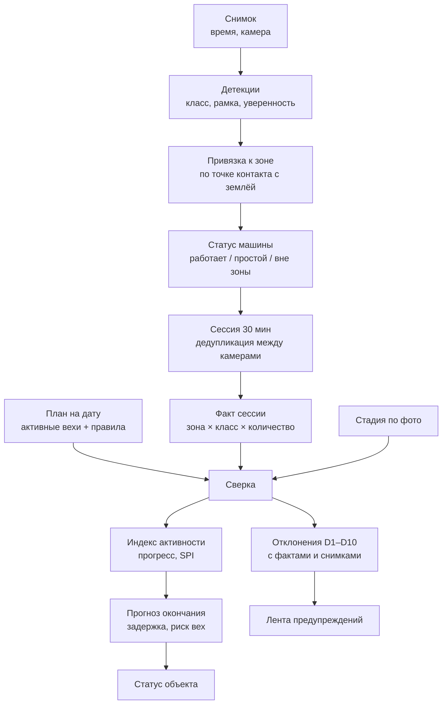

# Методика: от снимка к выводу «отставание N дней»

Это главный содержательный документ проекта. Заказчик оценивает прежде всего методику
сопоставления план-факт и объяснимость предупреждений, а не качество CV-модели.
Всё описанное здесь реализуется **чистыми функциями** в `analysis-service/src/core/`
и `site-service/src/core/` и покрывается unit-тестами.

---

## 1. Цепочка вывода



## 2. Базовые определения

| Термин | Определение |
| :--- | :--- |
| **Сессия** | Окно 30 минут (`SESSION_WINDOW_MINUTES`) по объекту. Все снимки всех камер, попавшие в окно. Единица наблюдения: техника считается по сессии, а не по кадру |
| **Рабочая сессия** | Сессия, целиком попадающая в рабочее время календаря объекта. Только такие участвуют в расчёте активности |
| **Зона** | Полигон на кадре камеры с типом (`PIT`, `BUILDING_FOOTPRINT`, `PERIMETER`, `ENTRY_GATE`, `STORAGE`, `DANGER`, `ROAD`) |
| **Веха (этап)** | Укрупнённый этап графика с плановыми датами, зоной и правилом ожидаемой техники |
| **Правило вехи** | `{required: {класс: минимум}, allowed: [...], signature: [...], min_sessions}` |
| **Сигнатура** | Сочетание техники, появление которого в нужной зоне фиксирует фактический старт вехи |
| **Индекс активности** | Доля рабочих сессий дня, в которых обязательный комплект присутствовал и работал, 0…1 |
| **Эффективный день** | Сумма индексов активности; «день, отработанный в полную силу» |

## 3. Привязка к зоне (F3)

Детекция относится к зоне **по нижней середине рамки** — это точка касания машины с землёй;
центр рамки для высокой техники (кран, бетононасос) даёт систематическую ошибку.

```
anchor = ((x1 + x2) / 2, y2)
zone   = первая активная зона камеры, в полигон которой попал anchor
```

Если `anchor` не попал ни в одну зону — `zone_id = null`, статус `OUT_OF_ZONE`.
Если зоны перекрываются — приоритет у зоны с меньшей площадью (более специфичной).

**Ограничение, которое честно фиксируем:** привязка ведётся в плоскости кадра, а не в
плоскости земли; при сильной перспективе возможна ошибка у границ зон. Смягчается разметкой
зон с запасом и правилом «решение по нескольким сессиям».

## 4. Статус техники: работает / простой / вне зоны (F4)

Порядок проверок в `site-service/src/core/equipment_state.py`:

1. `anchor` вне всех рабочих зон → **`OUT_OF_ZONE`**, причина «вне размеченных рабочих зон».
2. Есть ли признак работы:
   - **смещение между сессиями** — та же зона, тот же класс, ближайшая по IoU рамка из
     предыдущей сессии: смещение центра > `MOVE_THRESHOLD` (доля диагонали кадра) → работает;
   - **атрибуты позы** (если модель их даёт): опущенная стрела экскаватора, ковш у грунта,
     груз на крюке — → работает;
   - **контекст зоны**: миксер у бетононасоса в зоне бетонирования — → работает.
3. Признаков нет, но машина в активной зоне → **`IDLE`**.
4. Нет предыдущей сессии для сравнения → **`UNKNOWN`** (не штрафует и не засчитывает).

Каждый статус сопровождается `state_reason` — человекочитаемой строкой, которая позже
попадает в текст предупреждения: «экскаватор в зоне «Котлован», смещение между сессиями
0.004 от диагонали кадра — признаков работы нет».

**Ограничение:** по одному кадру «работает/простой» ненадёжен. Поэтому решение принимается
по серии сессий (`min_sessions`), а одиночный кадр никогда не порождает отклонение.

## 5. Сессия и дедупликация между камерами

Одна и та же машина видна с двух камер. Суммировать нельзя — будет двойной счёт.

Правило: **`count` по паре (зона, класс) = максимум по камерам, а не сумма.**

```
count(zone, class) = max_по_камерам( число детекций класса в зоне на кадрах этой камеры )
```

Для зон, помеченных `overlaps_with`, максимум берётся по всей группе перекрывающихся зон.

Это приближение: две разные машины одного класса, каждая видимая только своей камерой,
будут посчитаны как одна. Альтернатива (сопоставление по геометрии и внешнему виду)
не укладывается в сроки и требует калибровки камер. Ограничение зафиксировано
в документации и в UI (подсказка у счётчика).

## 6. Видимость зоны (F5)

По каждой сессии и зоне считается `coverage` — доля площади зоны, попавшая в пригодные кадры:

- кадр непригоден, если `quality.brightness < MIN_BRIGHTNESS`, `quality.blur > MAX_BLUR`
  или доля перекрытия зоны > `MAX_OCCLUSION`;
- ни одного кадра камеры, покрывающей зону, в сессии → `coverage = 0`.

| `coverage` | Статус | Последствие |
| :--- | :--- | :--- |
| ≥ 0.7 | `OK` | Зона участвует в выводах в полной мере |
| 0.3 … 0.7 | `PARTIAL` | Выводы делаются, `confidence` снижается на шаг |
| < 0.3 | `BLIND` | **Выводы по зоне не делаются.** Порождается D10 «вне контроля ИИ» |

Принципиально: невидимая зона **не считается пустой**. Отсутствие техники в слепой зоне
никогда не порождает D1 — вместо этого выдаётся «проверить вручную». Это прямое требование
заказчика и одновременно защита от ложных обвинений подрядчика.

## 7. Стадия объекта по снимку (F6)

Классификатор сцены (`OpenCLIP` zero-shot, при наличии разметки — линейная голова)
относит кадр к одной из стадий: `PIT`, `PILES`, `FOUNDATION`, `FRAME`, `FACADE`, `LANDSCAPING`.

- Промпты/метки — в конфигурации `vision-service`, не в коде.
- По сессии берётся метка с максимальной суммой уверенности по кадрам обзорных камер.
- Стадия используется двояко: как самостоятельный факт (D7) и как **ограничитель прогресса** —
  расчётный прогресс вехи не может обогнать видимую стадию (раздел 9).

Порядок стадий задан в справочнике; сравнение «раньше/позже» — по индексу в этом порядке.

## 8. Отклонения D1–D10

Каждое отклонение — это предикат над (активная веха по плану, факт сессии, видимость зоны).
Предикаты реализованы в `analysis-service/src/core/predicates.py`, их параметры — в таблице
`deviation_rule`, тексты — в `data/messages.ru.yaml`.

| Код | Отклонение | Условие | Базовая серьёзность | Эскалация |
| :--- | :--- | :--- | :--- | :--- |
| **D1** | Нет обязательной техники | Веха активна по плану; за `min_sessions` (по умолчанию 2) подряд рабочих сессий в зоне нет ни одной единицы из `required`; зона видима | HIGH при простое ≥ 1 рабочего дня, иначе MEDIUM | Растёт с числом дней |
| **D2** | Неполный комплект | Часть `required` присутствует, часть отсутствует или меньше минимума | MEDIUM | HIGH, если держится ≥ 3 дней |
| **D3** | Техника не по этапу | Класс не входит ни в `required`, ни в `allowed` ни одной активной вехи. Если входит в правило будущей вехи → формулировка «возможное опережение / нарушение последовательности» | MEDIUM | — |
| **D4** | Простой | Единица техники в статусе `IDLE` или `OUT_OF_ZONE` ≥ `N` сессий подряд (по умолчанию 3) | LOW | MEDIUM при ≥ 1 рабочего дня |
| **D5** | Не та зона | Техника в зоне, где по плану нет активных работ | MEDIUM | — |
| **D6** | Опасная зона | Техника или `person` в зоне типа `DANGER` (бровка котлована, зона действия крана) | HIGH | — |
| **D7** | Стадия не совпадает | Стадия по фото раньше плановой → отставание; позже → опережение. Требуется подтверждение ≥ 2 сессий | HIGH | — |
| **D8** | Этап затянулся | Сигнатура вехи наблюдается после `plan_end` | HIGH | — |
| **D9** | Не начат в срок | Сигнатура не появилась спустя `K` рабочих дней после `plan_start` (по умолчанию 3) | HIGH | — |
| **D10** | Зона вне контроля ИИ | `visibility.status = BLIND` в ≥ `min_sessions` сессиях подряд | INFO | — |

**Правила формирования ленты:**

1. Отклонение однозначно определяется ключом `(object_id, stage_id, zone_id, code)`.
   Повторное срабатывание обновляет `last_seen_at` и `occurrences`, а не создаёт дубль.
2. Условие перестало выполняться → статус `RESOLVED`, строка остаётся в истории.
3. Оператор может пометить отклонение `CONFIRMED` или `REJECTED`; `REJECTED` не всплывает
   повторно в пределах вехи и зоны, но сохраняется в `deviation_feedback`.
4. Отклонения никогда не строятся по слепым зонам и по сессиям вне рабочего времени.

## 9. Факт выполнения, прогресс и прогноз (F9)

### 9.1. Фактический старт вехи

Первая **рабочая** сессия, в которой в зоне вехи одновременно присутствуют все классы из
`signature`, и это держится `min_sessions` сессий подряд.

```
отклонение_старта = actual_start − plan_start   (в рабочих днях)
```

### 9.2. Индекс активности за день

```
activity_index(day) = sessions_working(day) / sessions_total(day)
```

где `sessions_total` — рабочие сессии дня с видимой зоной, `sessions_working` — из них те,
где обязательный комплект присутствовал **и** хотя бы одна единица была в статусе `WORKING`.

Сессии со слепой зоной исключаются из знаменателя (а не считаются нулём) и снижают
`confidence` факта.

### 9.3. Прогресс

```
effective_days = Σ activity_index(day)  по рабочим дням от actual_start
progress_raw   = effective_days / norm_duration_days
progress       = min(progress_raw, progress_cap_по_стадии)
```

`progress_cap_по_стадии` — ограничение сверху по видимой стадии объекта: если по фото
объект ещё в стадии «котлован», прогресс вехи «монолит надземной части» не может быть > 0.
Соответствие «стадия → максимальный прогресс вехи» задаётся в справочнике.

Смысл ограничения: техника может стоять и работать, но если здание визуально не выросло —
прогресс не засчитывается. Это защищает от завышенной оценки по одной лишь технике.

### 9.4. SPI (индекс выполнения графика)

```
planned_progress = доля рабочих дней плана, прошедших к сегодняшнему дню (0…1)
SPI = progress / planned_progress          (при planned_progress > 0)
```

| SPI | Трактовка |
| :--- | :--- |
| ≥ 1.05 | Опережение |
| 0.95 … 1.05 | В графике |
| 0.85 … 0.95 | Отставание, риск |
| < 0.85 | Существенное отставание |

### 9.5. Прогноз окончания

```
avg_activity = средний activity_index за 5 последних рабочих дней (минимум 3 дня данных)
remaining_days = (1 − progress) × norm_duration_days / max(avg_activity, MIN_ACTIVITY)
forecast_end   = сегодня + remaining_days рабочих дней (по календарю объекта)
delay_days     = forecast_end − plan_end (в рабочих днях)
```

`MIN_ACTIVITY` (по умолчанию 0.1) не даёт прогнозу уйти в бесконечность при полном простое;
в этом случае `confidence = LOW` и в тексте явно пишется «при сохранении текущего темпа».

### 9.6. Перенос на зависимые вехи

Сдвиг конца вехи распространяется по связям `predecessors` (FS/SS/FF + лаг) вперёд по графу.
Веха, у которой прогнозная дата выходит за `plan_end` и `total_float_days = 0`
(критический путь), попадает в `milestones_at_risk`.

### 9.7. Статус объекта

```
delay_days(объект) = максимальная задержка среди вех критического пути
```

| Условие | Статус |
| :--- | :--- |
| `|delay_days| ≤ 2` | `ON_TRACK` — в графике |
| `delay_days > 2` | `DELAY` — отставание |
| `delay_days < −2` | `AHEAD` — опережение |
| Данных недостаточно (< 3 рабочих дней наблюдений или > 50 % слепых зон) | `UNKNOWN` |

`UNKNOWN` — полноценный, а не аварийный статус. Система обязана уметь сказать
«я пока не знаю», а не выдавать уверенное число из двух снимков.

### 9.8. Уверенность вывода

| `confidence` | Когда |
| :--- | :--- |
| `HIGH` | ≥ 5 рабочих дней наблюдений, зоны видимы > 80 % сессий, стадия подтверждает прогресс |
| `MEDIUM` | ≥ 3 дней, зоны видимы > 50 % |
| `LOW` | Меньше данных, либо расчёт упёрся в `MIN_ACTIVITY` |

`confidence` показывается рядом с каждым прогнозом. Это то, что отличает инженерный
продукт от красивой демонстрации.

## 10. Объяснимость: что видит пользователь

Каждое отклонение хранит `facts` — все числа, на которых построен вывод, — и собирается
из шаблона. Пример D2:

```json
{
  "code": "D2", "severity": "MEDIUM", "status": "NEW",
  "title": "Неполный комплект техники: «Разработка котлована»",
  "message": "Этап «Разработка котлована» активен по плану с 15.10.2026. В зоне «Котлован» за последние 2 сессии: экскаватор 1 (работает), самосвал 0 при норме ≥ 2. Правило rl_pit (версия 2). Возможно снижение темпа: при сохранении текущей активности окончание этапа сдвигается на 04.12.2026 (+14 рабочих дней).",
  "facts": {
    "stage_name": "Разработка котлована",
    "plan_start": "2026-10-15", "plan_end": "2026-11-20",
    "zone_name": "Котлован",
    "sessions_checked": 2,
    "required": {"excavator": 1, "dump_truck": 2},
    "observed": {"excavator": 1, "dump_truck": 0},
    "missing": {"dump_truck": 2},
    "activity_index_5d": 0.55,
    "forecast_end": "2026-12-04", "delay_days": 14
  },
  "rule_ref": {"deviation_rule_id": "D2", "stage_rule_id": "rl_pit", "stage_rule_version": 2},
  "evidence": [{"image_id": "im_1", "detection_ids": ["dt_7"]}]
}
```

Эндпоинт `GET /api/v1/analysis/deviations/{id}/explain` возвращает дополнительно:
текст сработавшего правила, значения его параметров, перечень проверенных сессий
с их фактами и ссылки на аннотированные снимки. Это позволяет оператору за 10 секунд
понять, согласен он с системой или нет, — и нажать «подтвердить» либо «ложное».

**Ни одно предупреждение не имеет права появиться без `facts` и без `evidence`.**
Это проверяется тестом.

## 11. Роль LLM (F12)

LLM получает **только** структурированный контекст: статус объекта, вехи с SPI и прогнозом,
список отклонений с их ID и фактами. Задача — связный русский текст для руководителя.

Ограничения, зашитые в `report-service`:

1. В промпте нет свободных данных — только JSON-контекст и инструкция.
2. Модель обязана ссылаться на ID отклонений (`D2/rl_pit`, `dev_7b1f`).
3. После генерации текст проверяется: **каждое число из текста должно встречаться в контексте**.
   Не прошло — текст отбрасывается, выдаётся шаблонное резюме.
4. `LLM_ENABLED=false` → сразу шаблонное резюме. Демонстрация не должна зависеть от LLM.

## 12. Известные ограничения (фиксируем честно)

| Ограничение | Смягчение |
| :--- | :--- |
| «Работает/простой» по статичным кадрам ненадёжен | Решение по серии сессий, `state_reason` в каждом выводе, статус `UNKNOWN` при нехватке данных |
| Дедупликация между камерами приближённая | Максимум по камерам, пометка в UI, рекомендация по расстановке камер |
| Перспектива искажает привязку к зонам | Разметка зон с запасом, приоритет меньшей зоны, решение по серии |
| Нормы МРР даны для панельных домов и являются предельными | Коэффициенты (монолит ×1.1, стеснённость, сменность) и ручная правка графика |
| Внутренние работы технике не видны | Вне границ MVP, заявлено явно: система контролирует наружный контур |
| Нет реальных графиков реальных объектов | Синтетический график по МРР + ручная правка; это же подтвердил заказчик |
