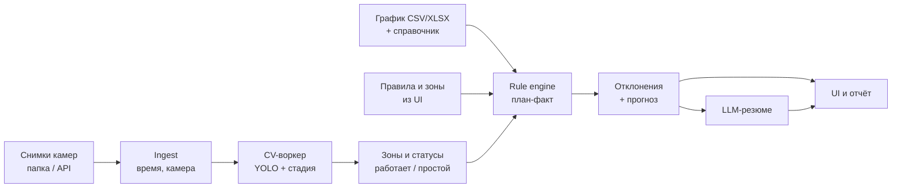

# ТЗ: Мониторинг строительной площадки по снимкам камер (ЛЦТ 2026, кейс 07)

2026-09-17 · @Someone

## 1. Что на самом деле хочет заказчик

Главный вывод: оценивают прежде всего **методику и бизнес-логику** (план-факт, отклонения, прогноз задержки), а не качество CV-модели. Ответ постановщика на вопрос о приоритете — однозначно «бизнес-логика»; решение должно стать модулем их системы, поэтому важны масштабируемость и API.

Итоговый вывод системы — **отставание, опережение или соответствие графику** по объекту, с объяснением и снимками-доказательствами.

| Тема | ТЗ / README | Уточнение на встрече (Q&A) |
| --- | --- | --- |
| Вход | Снимки с камер | Только отдельные изображения; видео и поток не обязательны. Камеры по периметру, 24/7, разумная частота — снимок раз в 20–30 мин |
| Метаданные | Не описаны | Дата, время, камера, объект, координаты **не гарантируются**; способ привязки к графику придумывает команда |
| График | CSV/XLSX, этапы по уровням | Дат в примере нет. Формат на входе — таблица как справочник + столбцы «начало» и «окончание». Даты: авто-расчёт и ручной ввод; редактирование интервалов в UI — «большой плюс» |
| Этап → техника | Правила задают участники | Техники во входном файле нет; связь строится внутри сервиса и редактируется в UI. Нормативов по количеству машин заказчик не даёт |
| Классы техники | 8 типов (самосвал, экскаватор, каток, кран-манипулятор, бетоносмеситель, бульдозер, грузовик, автокран) | Список не ограничен, можно расширять и группировать |
| Работа / простой | Не упомянуто | **Обязательно.** На статичном снимке — по нахождению техники в рабочей зоне |
| Аномалии | Нет нужной техники, лишняя техника | Плюс: техника не в той зоне, в опасной зоне, простой у въезда |
| Прогноз задержки | «Ранние предупреждения» | **Важно** прогнозировать задержку; допускается LLM поверх план-факта |
| Невидимая зона | — | Не анализировать; выводить предупреждение «зона вне контроля ИИ, проверить вручную» |
| Стадия по фото | — | Определять стадию по виду объекта (не только по технике) — «базовый шаг»; % готовности — опционально |
| Охват | Несколько этапов | Можно укрупнять этапы и ограничиться наружными работами. **Глубина важнее ширины** |
| Тест | Свой набор | Скрытого датасета нет. Эксперты смотрят ваши примеры: освещение, сезон, типы объектов, этапы |
| Результат | Интерфейс + предупреждения | Отчёт о ходе работ с графиками отставания/опережения |
| Не нужно | — | ПОС, детекция подвоза материалов, сообщения прорабов и любые текстовые каналы |
| Запуск | Прототип, доступный жюри | Исходный код, запуск у команды с демонстрацией; Docker желателен |

**Особенности справочника работ (xlsx).** Коды разделов частично испорчены Excel-ем и превратились в даты: 45667 = «10.1», 45698 = «10.2», 45728 = «12.3», 45759 = «12.4», 45789 = «12.5», 45820 = «12.6», 45850 = «12.7». Строки без кода — работы 4-го уровня внутри ближайшего кода. Галочка означает **обязательный** для типа объекта вид работ, но не запрещает его для других типов. В части строк последний столбец («Дороги») отсутствует. Парсер должен это восстанавливать.

**Критерии оценки (ТЗ, п. 8)** в порядке нашего фокуса: логика сопоставления и объяснимость предупреждений; полнота функций п. 2; архитектура (новые типы техники, камер и планов без переделки кода); качество кода и документации; качество распознавания на разнообразных примерах; скорость; UX; питч.

**Презентация:** слайды 7–11 шаблона обязательны и сохраняются в исходном дизайне. **Дедлайн: 29 сентября, 23:59 МСК.**

## 2. Цель, границы и допущения

**Цель прототипа:** по серии снимков с камер одного объекта определить, какие работы фактически ведутся, сравнить с календарным графиком, выдать объяснимые предупреждения и прогноз даты завершения этапа.

**В границах (MVP):**

- Один демонстрационный объект (жилой дом, монолит) + по возможности второй тип (дорога) для показа масштабируемости.
- Нулевой цикл и коробка, наружный контур — укрупнённые вехи из разделов 10 и 12.3–12.4, 12.5.1, 12.7 справочника (подробно в п. 5).
- 10–12 классов техники (п. 5), зоны площадки, статус «работает / простаивает / вне зоны».
- Ввод и правка графика, правил и зон через UI; импорт CSV/XLSX.
- Отчёт план-факт, прогноз задержки, LLM-резюме с опорой на факты.

**Вне границ:** внутренняя отделка и инженерия внутри здания (техникой не определяются), видео и поток, трекинг конкретных машин по номерам, подвоз материалов, ПОС/ППР как вход, текстовые отчёты подрядчиков.

**Допущения (фиксируем в документации):**

1. Время снимка берём из EXIF, затем из имени файла, затем задаёт пользователь при загрузке. Без времени снимок не участвует в план-факте.
2. Камера и объект задаются при загрузке (папка = камера) либо выбираются в UI.
3. Камеры стационарные: рабочие зоны размечаются один раз на эталонном кадре камеры (полигоны).
4. Одна «сессия наблюдения» = снимки всех камер объекта в окне 30 мин; состав техники считается по сессии, а не по кадру, чтобы не дублировать машины с разных камер (дедупликация приближённая — максимум по камере на класс, если зоны камер пересекаются).
5. Даты графика — синтетические, построенные по нормативам продолжительности (п. 8), с возможностью ручной правки.

## 3. Входные данные

| Источник | Формат | Что делаем |
| --- | --- | --- |
| Архив организаторов | ≤ 200 МБ, неразмеченные снимки/скриншоты | Ручная разметка 300–500 кадров (CVAT / Label Studio) для дообучения и как собственный тестовый набор |
| 5 открытых датасетов техники | Размеченные фото | Сводим классы к нашей таксономии (маппинг в конфиге), объединяем в YOLO-формат |
| Доп. датасеты | Любые открытые | Добор недостающих классов (башенный кран, бетононасос, буровая установка), ночь и зима |
| Справочник работ | XLSX (4 уровня) | Парсер с восстановлением кодов → дерево работ с флагами по типам объектов |
| Календарный график | CSV/XLSX: код, наименование, начало, окончание (+ опц. зона, % выполнения) | Импорт, валидация, правка в UI; генератор синтетического графика по нормативам |
| Разметка камер | JSON: камера → полигоны зон | Рисуется в UI на эталонном кадре |

**Собственный тестовый набор** (скрытого не будет, эксперты смотрят наш): день/ночь/сумерки, лето/зима/дождь, разные стадии, перекрытия машин, частично невидимые зоны. На нём показываем precision/recall по классам и матрицу ошибок — это закрывает критерий «устойчивость на разнообразных примерах».

**Демо-сценарий данных:** 2–3 «дня» объекта, собранные из снимков в хронологию (с проставленными временем и камерой), и эталонный график, в котором заложены 3–4 отклонения разного типа.

## 4. Функциональные требования

| ID | Функция | Критерий готовности | Приоритет |
| --- | --- | --- | --- |
| F1 | Загрузка снимков (пакет, папка, API), извлечение времени и камеры | Снимок сохранён с timestamp, camera\_id, object\_id | Must |
| F2 | Детекция и классификация техники | bbox + класс + confidence; mAP50 на своём тесте в документации | Must |
| F3 | Привязка к зонам | Каждая детекция отнесена к зоне по нижней точке bbox (точка контакта с землёй) | Must |
| F4 | Статус техники: работает / простой / вне рабочей зоны | Правило: в активной зоне этапа и (для экскаватора, крана) признаки работы — поза стрелы, ковш у грунта, груз на крюке; иначе простой. Для серии снимков — смещение bbox между сессиями | Must |
| F5 | Контроль видимости | Зона, закрытая более чем на X % или не попавшая в кадры сессии, помечается «вне контроля ИИ — проверить вручную» | Must |
| F6 | Классификация стадии по снимку | Сценная модель (CLIP zero-shot или дообученный классификатор): котлован / сваи / фундамент / каркас N этажей / фасад / благоустройство | Must |
| F7 | Сопоставление с графиком | Для сессии известны активные по плану этапы, ожидаемая и фактическая техника, факт-стадия | Must |
| F8 | Выявление отклонений (п. 5) | Каждое отклонение: тип, серьёзность, зона, этап, правило, снимки-доказательства с bbox | Must |
| F9 | Прогноз задержки | Оценка отставания в днях и прогнозная дата окончания этапа, риск срыва вехи | Must |
| F10 | Отчёт план-факт | Диаграмма Ганта план vs факт, загрузка техники по времени, лента предупреждений; экспорт PDF | Must |
| F11 | Редактирование графика, правил «этап → техника», зон | Изменение пересчитывает анализ без перезапуска | Should |
| F12 | LLM-резюме | Текстовый вывод по объекту строго по структурированным фактам, со ссылками на ID отклонений | Should |
| F13 | % готовности объекта по снимку | Оценка на основе стадии и числа этажей | Could |
| F14 | Опасные зоны | Техника в зоне действия крана / у бровки котлована → предупреждение безопасности | Could |
| F15 | REST API + Swagger | Все функции доступны через API для интеграции в систему заказчика | Must |

**Нефункциональные:** обработка одного снимка на CPU ≤ 1–2 с (YOLO n/s), на GPU ≤ 100 мс; предупреждение не позднее одной сессии (30 мин) после поступления снимков; запуск `docker compose up` одной командой; конфигурация классов, правил и зон — в данных, не в коде.

## 5. Методика: этап → техника, отклонения, прогноз

### 5.1. Таксономия техники

Базовые 8 классов ТЗ + добавляем 4, без которых нельзя различить этапы монолитного дома: **башенный кран, бетононасос (автобетононасос), буровая/сваебойная установка, погрузчик**. Для дорог — асфальтоукладчик и грейдер. Грузовик = всё грузовое, кроме самосвала и миксера. Маппинг классов внешних датасетов на таксономию хранится в конфиге.

### 5.2. Правила «веха → техника» (редактируются в UI)

У каждого правила три списка: **обязательная** техника (с минимальным числом), **допустимая** (не вызывает вопросов) и **сигнатура** — сочетание, по которому этап считается фактически начатым.

| Веха (коды справочника) | Обязательно | Допустимо | Сигнатура факта |
| --- | --- | --- | --- |
| Подготовка территории: снос, вырубка, мусор (10.4–10.8) | Экскаватор ≥1, самосвал ≥1 | Бульдозер, погрузчик, автокран | Экскаватор + самосвал в пятне застройки |
| Обустройство площадки (10.11) | Кран-манипулятор или грузовик | Автокран, самосвал, каток | Кран-манипулятор у периметра |
| Ограждение котлована, сваи (12.3.2, 12.3.5, 12.3.6, шпунт) | Буровая/сваебойная установка ≥1 | Автокран, миксер, бетононасос, экскаватор | Буровая установка по контуру |
| Разработка котлована (12.3.1, 12.3.7) | Экскаватор ≥1, самосвал ≥2 | Бульдозер, погрузчик | Экскаватор в котловане + самосвал |
| Основание: песок, щебень, бетонная подготовка | Самосвал ≥1, каток или бульдозер | Погрузчик, миксер | Каток на дне котлована |
| Монтаж башенного крана | Автокран ≥1 | Грузовик | Автокран + появление башенного крана |
| Фундаментная плита, монолит ниже 0 (12.3.4, 12.3.9) | Миксер ≥1, бетононасос ≥1 | Башенный кран, автокран, грузовик | Миксер + насос у котлована |
| Гидроизоляция, обратная засыпка (12.3.10, 12.3.7) | Экскаватор или погрузчик, самосвал | Каток | Засыпка пазух + самосвал |
| Надземный каркас (12.4.4, 12.4.28, 12.4.29) | Башенный кран ≥1 | Миксер, бетононасос, грузовик | Кран работает + рост этажности по фото |
| Стены, кровля, фасад (12.4.8, 12.4.11, 12.4.31) | Башенный кран или автокран/кран-манипулятор | Грузовик, автовышка | Стадия «фасад» по фото |
| Наружные сети (12.5.1) | Экскаватор ≥1 | Самосвал, кран-манипулятор, каток | Траншея + экскаватор вне пятна здания |
| Благоустройство (12.7) | Самосвал, каток | Асфальтоукладчик, погрузчик, бульдозер | Каток / асфальтоукладчик по периметру |
| Дороги: основание и покрытие (12.3.8, 12.4.12, 12.4.14) | Самосвал, каток, грейдер / асфальтоукладчик | Погрузчик | Асфальтоукладчик + каток |

Правило хранится как данные, а не код: `{stage_code, zone_type, required:{class:min}, allowed:[...], signature:[...], min_sessions}`.

### 5.3. Типы отклонений

| Код | Отклонение | Условие | Серьёзность |
| --- | --- | --- | --- |
| D1 | Нет обязательной техники | Этап активен по плану, в рабочее время ≥ 2 сессий подряд техники нет | Высокая, если ≥ 1 рабочего дня |
| D2 | Неполный комплект | Часть обязательного набора есть (экскаватор без самосвалов) → «возможно снижение темпа» | Средняя |
| D3 | Техника не по этапу | Класс не входит ни в одно активное правило. Если входит в правило будущего этапа → «возможное опережение / нарушение последовательности» | Средняя |
| D4 | Простой | Техника вне рабочей зоны или без признаков работы ≥ N сессий (пример: экскаватор у въезда) | Низкая → средняя |
| D5 | Не та зона | Техника в зоне, где по плану нет активных работ | Средняя |
| D6 | Опасная зона | Техника/люди у бровки котлована, в зоне действия крана | Высокая (безопасность) |
| D7 | Стадия не совпадает | Стадия по фото раньше плановой (отставание) или позже (опережение) | Высокая |
| D8 | Этап затянулся | Сигнатура этапа видна после планового окончания | Высокая |
| D9 | Не начат в срок | Сигнатура не появилась через K дней после планового старта | Высокая |
| D10 | Зона вне контроля ИИ | Зона не видна / закрыта | Информационное, «проверить вручную» |

Каждое предупреждение объясняется шаблоном: *«Этап X активен по плану с дд.мм. В зоне Z за последние N сессий: экскаватор 1 (работает), самосвалы 0 при норме ≥ 2. Правило R. Возможное снижение темпа. Снимки: …»*

### 5.4. Факт выполнения и прогноз задержки

1. **Фактический старт этапа** — первая сессия с сигнатурой этапа. Отклонение старта = факт − план.
2. **Индекс активности** этапа за день = доля сессий рабочего времени, где обязательный комплект присутствовал и работал (0…1). Сумма индексов = «эффективные дни».
3. **Прогресс** = эффективные дни / нормативная продолжительность; при наличии стадии по фото — берём её как ограничение (прогресс не может обогнать видимую стадию).
4. **SPI** = прогресс / плановый прогресс на сегодня (аналог earned schedule).
5. **Прогноз окончания** = сегодня + (1 − прогресс) × длительность / средний индекс активности за 5 последних рабочих дней.
6. **Задержка** = прогноз − плановое окончание; сдвиг переносится на зависимые этапы (последовательность из справочника) → риск срыва ключевых вех.
7. Статус объекта: «в графике» (|задержка| ≤ 2 дня), «отставание», «опережение».

LLM получает только эту структуру (этапы, SPI, отклонения) и пишет резюме со ссылками на ID; числа LLM не придумывает.

## 6. Архитектура, стек, модель данных

Снимок проходит детекцию, привязку к зонам и сессии; движок правил сравнивает сессию с активными этапами графика и пишет отклонения со ссылками на снимки.

| Компонент | Выбор | Почему |
| --- | --- | --- |
| Детектор | Ultralytics YOLO (v8/11, размер s), дообучение | Быстрый на CPU, простое дообучение, экспорт в ONNX |
| Классификатор стадии | OpenCLIP zero-shot → при наличии разметки линейная голова | Работает без большой разметки |
| Опасные зоны / люди | Тот же YOLO + класс person | Без отдельной модели |
| Backend | FastAPI + Pydantic, фоновая очередь (Celery/RQ или arq) | OpenAPI для интеграции |
| БД | PostgreSQL (+ PostGIS опционально для полигонов) | Реляционные связи план-факт |
| Хранилище снимков | MinIO (S3) или локальный том | Масштабирование на много камер |
| Frontend | React + Gantt (frappe-gantt) или Streamlit для скорости | Редактирование графика и зон |
| LLM | Локальная (Qwen 2.5 7B через Ollama) либо API; только резюме | Работает без внешнего доступа |
| Развёртывание | docker compose: api, worker, db, minio, ui | Запуск одной командой |

**Модель данных (основные таблицы):**

| Таблица | Ключевые поля |
| --- | --- |
| object | id, name, type (жильё, дороги…), address |
| camera | id, object\_id, name, reference\_frame, is\_active |
| zone | id, object\_id, camera\_id, type (котлован, пятно здания, въезд, складирование, опасная), polygon |
| work\_type | code, name, level, parent\_code, флаги по типам объектов (из справочника) |
| schedule\_item | id, object\_id, work\_code, milestone\_id, zone\_id, plan\_start, plan\_end, norm\_duration\_days, predecessors\[\] |
| equipment\_class | id, name, aliases (маппинг внешних датасетов) |
| stage\_rule | id, milestone\_id, zone\_type, required{class:min}, allowed\[\], signature\[\], min\_sessions |
| image | id, camera\_id, captured\_at, path, source, visibility\_score |
| session | id, object\_id, window\_start, window\_end |
| detection | id, image\_id, class\_id, bbox, conf, zone\_id, state (working / idle / out\_of\_zone) |
| stage\_observation | id, image\_id, stage\_label, conf, floors\_estimate |
| deviation | id, object\_id, session\_id, schedule\_item\_id, zone\_id, code (D1–D10), severity, message, rule\_id, evidence\_image\_ids\[\], status (новое / подтверждено / закрыто) |
| progress\_snapshot | schedule\_item\_id, date, activity\_index, progress, spi, forecast\_end, delay\_days |

Добавление нового класса техники, типа камеры или плана = новые строки в `equipment_class`, `camera`, `schedule_item` без правки кода — это прямой ответ на критерий «архитектура».

## 7. Интерфейс и демо-сценарий

**Экраны:**

1. **Дашборд объекта** — статус (в графике / отставание N дней), SPI, прогноз вех, счётчики отклонений по серьёзности, зоны «вне контроля ИИ».
2. **Гант план-факт** — плановые полосы, фактический старт, прогнозное окончание; правка дат перетаскиванием.
3. **Лента предупреждений** — карточка: текст, этап, зона, правило, снимки с bbox; кнопки «подтвердить / ложное».
4. **Просмотр камеры** — снимок с наложенными зонами и детекциями, статус каждой машины.
5. **Настройки** — импорт графика, генератор синтетического графика по нормативам, редактор правил «веха → техника», редактор зон.
6. **Отчёт** — PDF: план-факт, загрузка техники по дням, список отклонений, LLM-резюме.

**Сценарий демо (≈5 мин):** импорт графика жилого дома → загрузка «дня 1» (котлован: экскаватор есть, самосвалов нет → D2 «снижение темпа») → «день 2» (бетононасос при активном котловане → D3 «возможное опережение», стадия по фото подтверждает начало плиты) → «день 3» (экскаватор простаивает у въезда → D4; одна камера закрыта → D10) → Гант сдвигается, прогноз окончания и задержка пересчитаны → PDF-отчёт → правим правило в UI и показываем, что вывод меняется.

## 8. Откуда брать сроки работ

Главный источник для Москвы — **МРР-3.2.81-12** «Рекомендации по определению норм продолжительности строительства зданий и сооружений, строительство которых осуществляется с привлечением средств бюджета города Москвы» (Москомэкспертиза, приказ № 50 от 12.09.2012). Он даёт сроки в месяцах по типам объектов и, для жилья, с разбивкой по фазам — это готовый скелет синтетического графика. Федеральная база — СНиП 1.04.03-85\* и МДС 12-43.2008; детальная разбивка внутри фаз — через ГЭСН (там есть машино-часы, то есть ещё и обоснование «работа → техника»).

| Документ | Уровень | Что даёт нам | Где |
| --- | --- | --- | --- |
| [МРР-3.2.81-12](https://meganorm.ru/Data2/1/4293784/4293784462.htm) | Москва, бюджетные объекты | Сроки (мес.) для жилья, школ и ДОУ, здравоохранения, спорта, культуры, дорог, мостов, метро, сетей. Сроки — максимально допустимые | Разделы 5–9, табл. 1–24 |
| [СНиП 1.04.03-85\*](http://docs.cntd.ru/document/1200000622) | Федеральный | Общая методика и нормы; для объектов вне таблиц — расчёт от стоимости СМР или по аналогам | Часть I, прил. 3 |
| [МДС 12-43.2008](https://meganorm.ru/Data2/1/4293834/4293834534.htm) | Федеральный, методика | Срок = подготовительный период + подземная часть + надземная часть + отделка | Разделы 3–5 |
| [ФГИС ЦС: ФСНБ-2022, ГЭСН, КСР](https://fgiscs.minstroyrf.ru/frsn/standard/fsbc/machines) | Федеральный | Нормы затрат на единицу работ, включая машины и механизмы; открытые данные XML | ГЭСН01 «Земляные работы», ГЭСН06 «Бетонные и ж/б конструкции» и др. |
| [Правила 299-ПП](https://www.garant.ru/products/ipo/prime/doc/70936530/) | Москва | Требования к организации площадки, земляным работам, ограждениям; на него ссылается справочник (оснащение камерами) | Для раздела «рекомендации по камерам» |
| [АИП Москвы](https://stroi.mos.ru/adresnaya-investicionnaya-programma) | Москва | Реальные объекты и годы ввода — для правдоподобного демо-объекта | Перечни объектов АИП |

**Ключевые числа из МРР-3.2.81-12** (для генератора графика):

- Жилые дома, табл. 1: срок разбит на подготовительный период, подземную часть, надземную часть и отделку. Пример: 17–18 этажей, 10 000 м² квартир — 8,7 мес. = 1,0 + 1,5 + 4,7 + 1,5. Табличные значения — для крупнопанельных домов.
- Школы, ДОУ, здравоохранение: для монолита вместо панели — коэффициент 1,1.
- Сваи: +10 рабочих дней на каждые 100 свай на одну сваебойную установку при двух сменах; для домов до 4 секций коэффициент совмещения 0,5, свыше 4 — 0,3.
- Сменность: нормы рассчитаны на 2 смены для основных машин; все работы в 2 смены — ×0,9, в 3 смены — ×0,8; трёхсменная работа башенных кранов — ×0,67 к подземной и надземной частям.
- Промежуточные размеры — интерполяция; вне таблицы — экстраполяция: 0,3 % срока на 1 % изменения мощности, не дальше ×2 и ×0,5.
- Пристенный дренаж: +6 рабочих дней к подземной части (до 4 секций), +10 (свыше).
- Дороги, табл. 10: например, местная улица на 2 полосы, 1 км — 2,5 мес.; нормы исходят из потока с двумя и более асфальтоукладчиками.

**Как собираем синтетический график:**

1. Пользователь выбирает тип объекта и параметры (этажность, площадь, секции, число свай, сменность).
2. Генератор берёт фазы из МРР (интерполяция, коэффициенты) и раскладывает их на вехи п. 5.2 по долям. Доли — наше экспертное допущение, редактируются (например, подземная часть: котлован 35 %, основание 10 %, плита и стены 45 %, гидроизоляция и засыпка 10 %).
3. Для точности внутри фазы: длительность = объём × машино-часы по ГЭСН / (число машин × часов в смене × смен). Это заодно даёт нормативное число машин для правил D1–D2.
4. Даты строятся от даты начала с рабочим календарём; пользователь правит интервалы в Ганте.

**Чего нет в открытом доступе:** реальных графиков конкретных объектов с привязкой к снимкам — это подтвердил заказчик. Если нужен дополнительный реализм, реальные сроки жилых проектов (плановая дата ввода, ежемесячные фото хода строительства) публикуются застройщиками в ЕИСЖС (наш.дом.рф) — это по памяти, проверить перед использованием.

## 9. Сдача, план до 29.09, риски

**Артефакты финальной сдачи:**

- [ ] Открытый репозиторий: README, `docker-compose.yml`, скрипты обучения, конфиги правил, пример графика, демо-данные.
- [ ] Рабочий прототип (UI + Swagger), запуск у нас с демонстрацией.
- [ ] Презентация .pptx/.pdf по шаблону — слайды 7–11 без изменения дизайна; плюс архитектура, обоснование стека, скриншоты/видео, схема «снимок → этап», масштабирование, рекомендации по камерам.
- [ ] Документация .docx/.pdf: модель данных, код, условия и ограничения (датасеты, классы, настроенные этапы, метрики), установка и запуск.
- [ ] Промежуточная сдача (если требуется): ссылка на репозиторий + описание до 2 страниц.

**Рекомендации по камерам (для слайда):** обзорная камера на высоте 10–15 м (на мачте или башенном кране) с видом на всё пятно застройки; камеры на въезд/выезд — считать самосвалы и миксеры; зоны котлована и складирования должны попадать минимум в две камеры; фиксированное положение и эталонный кадр; ИК-подсветка для ночи; снимок раз в 20–30 минут с корректным временем в EXIF/имени файла; ID камеры в метаданных.

| Даты | Работа |
| --- | --- |
| 17–19.09 | Парсер справочника, схема БД, каркас API; сбор и сведение датасетов; разметка своих кадров; генератор графика по МРР |
| 20–23.09 | Обучение YOLO, классификатор стадии; зоны и статусы; движок правил D1–D10 |
| 24–26.09 | Прогноз задержки, UI (дашборд, Гант, лента, камеры, настройки), PDF-отчёт, LLM-резюме |
| 27.09 | Демо-сценарий, тестовый набор и метрики, Docker, заморозка кода |
| 28.09 | Презентация, документация, видео демо |
| 29.09 | Резерв; загрузка на платформу **до 20:00 МСК**, не впритык к 23:59 |

| Риск | Мера |
| --- | --- |
| Мало размеченных данных по башенным кранам и бетононасосам | Внешние датасеты + zero-shot детектор (Grounding DINO / YOLO-World) для авторазметки с ручной проверкой |
| Нет времени на снимках | Ввод времени при загрузке; демо собираем как хронологию сами |
| «Работает / простой» по одному кадру ненадёжен | Решение по нескольким сессиям + зоны; честно описать ограничение |
| Дублирование машин между камерами | Агрегация по сессии и зонам; ограничение в документации |
| Нормы МРР — для панельных домов и максимальные сроки | Коэффициенты и ручная правка графика; явно указать в допущениях |
| LLM выдумывает факты | Только структурированный вход, ссылки на ID, числа не генерирует |

## Источники

- [МРР-3.2.81-12, полный текст](https://meganorm.ru/Data2/1/4293784/4293784462.htm)
- [МРР-3.2.81-12 в перечне МРР (normacs)](https://normacs.net/Doclist/doc/10M0G.html)
- [СНиП 1.04.03-85\*, Часть I](http://docs.cntd.ru/document/1200000622)
- [МДС 12-43.2008](https://meganorm.ru/Data2/1/4293834/4293834534.htm)
- [ФГИС ЦС — справочник машин и механизмов](https://fgiscs.minstroyrf.ru/frsn/standard/fsbc/machines)
- [ФСНБ-2022 — актуальная редакция, 2026](https://gostcheck.ru/articles/chto-takoe-gesnr-gesn-fsnb)
- [Постановление Правительства Москвы № 299-ПП](https://www.garant.ru/products/ipo/prime/doc/70936530/)
- [АИП Москвы](https://stroi.mos.ru/adresnaya-investicionnaya-programma)
- Материалы проекта: ТЗ ДГП Москвы, README кейса 07, расшифровка встречи Q&A, «Сводный перечень строительных работ ЛТЦ».
