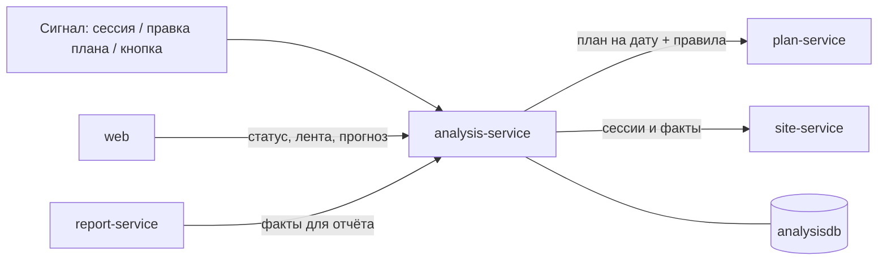

# analysis-service — сервис сверки план-факт

## 1. Назначение

Отвечает на главный вопрос системы: **идёт ли объект по графику, и если нет — почему
и насколько**. Сравнивает план (что должно происходить) с фактом (что видно на снимках),
выявляет отклонения D1–D10 с объяснением и доказательствами, считает прогресс, SPI
и прогноз даты завершения.

Сервис **не владеет первичными данными**: план и факт он читает по API. Его состояние —
только выводы, и оно полностью пересчитываемо с нуля. Это делает методику безопасной
для правок в любой момент, включая демонстрацию.

## 2. Место в системе



- **Вызывает:** `plan-service`, `site-service` (только чтение).
- **Вызывают:** `web`, `report-service`, `site-service` (сигнал пересчёта).

## 3. API

Префикс: `/api/v1/analysis`.

| Метод | Путь | Описание |
| :--- | :--- | :--- |
| `POST` | `/runs` | Запустить прогон сверки: `{object_id, from?, to?, triggered_by?}`. Идемпотентен |
| `GET` | `/runs/{id}` | Результат прогона: версии входных данных, статистика |
| `GET` | `/objects/{id}/status` | Сводный статус объекта для дашборда |
| `GET` | `/objects/{id}/progress` | Прогресс, SPI и прогноз по каждой вехе — данные для Ганта |
| `GET` | `/objects/{id}/forecast` | Прогноз вех, задержки, вехи в зоне риска |
| `GET` | `/deviations` | Лента: фильтры `object_id`, `code`, `severity`, `status`, `from`, `to` |
| `GET` | `/deviations/{id}` | Карточка отклонения |
| `GET` | `/deviations/{id}/explain` | **Полное объяснение:** правило, его параметры, проверенные сессии, факты, снимки |
| `PATCH` | `/deviations/{id}` | Вердикт оператора: `CONFIRMED` / `REJECTED` с комментарием |
| `GET` `PATCH` | `/deviation-rules` | Настройка порогов D1–D10 без правки кода |

### Пример: статус объекта

```json
{
  "object_id": "0f3a...", "computed_at": "2026-10-20T10:02:11Z",
  "status": "DELAY", "delay_days": 14, "spi": 0.63, "confidence": "MEDIUM",
  "stages": {"total": 12, "not_started": 8, "in_progress": 2, "done": 1, "late": 1},
  "deviations": {"HIGH": 1, "MEDIUM": 3, "LOW": 2, "INFO": 1},
  "blind_zones": 1,
  "milestones_at_risk": [
    {"stage_id": "st_slab", "name": "Фундаментная плита",
     "plan_end": "2026-11-20", "forecast_end": "2026-12-04", "delay_days": 14}
  ]
}
```

### Пример: отклонение

```json
{
  "id": "dev_7b1f", "code": "D2", "severity": "MEDIUM", "status": "NEW",
  "object_id": "0f3a...", "stage_id": "st_pit", "zone_id": "zn_pit",
  "title": "Неполный комплект техники: «Разработка котлована»",
  "message": "Этап «Разработка котлована» активен по плану с 15.10.2026. В зоне «Котлован» за последние 2 сессии: экскаватор 1 (работает), самосвал 0 при норме ≥ 2. Правило rl_pit (версия 2). Возможно снижение темпа.",
  "facts": {
    "sessions_checked": 2,
    "required": {"excavator": 1, "dump_truck": 2},
    "observed": {"excavator": 1, "dump_truck": 0},
    "missing": {"dump_truck": 2},
    "activity_index_5d": 0.55, "forecast_end": "2026-12-04", "delay_days": 14
  },
  "rule_ref": {"deviation_rule_id": "D2", "stage_rule_id": "rl_pit", "stage_rule_version": 2},
  "evidence": [{"image_id": "im_1", "detection_ids": ["dt_7"]}],
  "first_seen_at": "2026-10-20T09:31:00Z", "last_seen_at": "2026-10-20T10:01:00Z",
  "occurrences": 2
}
```

**Реализовано на сегодня:** каркас сервиса, `/health`, `/health/ready` и схема
`analysisdb` (миграция `0001`). Эндпоинтов и методики пока нет — это задачи C-03…C-05;
таблица `deviation_rule` создана, но пуста: пороги D1–D10 заполняются вместе
с предикатами, которые их читают.

### Коды ошибок

`OBJECT_NOT_FOUND`, `DEVIATION_NOT_FOUND`, `NO_PLAN_FOR_OBJECT`, `NO_FACTS_FOR_PERIOD`,
`ANALYSIS_ALREADY_RUNNING` (409), `PLAN_SERVICE_UNAVAILABLE`, `SITE_SERVICE_UNAVAILABLE`.

## 4. Как устроен прогон

```
POST /runs {object_id, from, to}
  ├─ plan-service:  вехи, активные в периоде, с правилами  → фиксируем plan_revision, rules_version
  ├─ site-service:  сессии периода и факты по каждой       → фиксируем zones_version, model_version
  ├─ core/matching.py   сопоставление сессии с активными вехами по зоне и правилу
  ├─ core/predicates.py проверка D1–D10 с параметрами из deviation_rule
  ├─ core/activity.py   индекс активности по дням, эффективные дни
  ├─ core/progress.py   прогресс с ограничением по видимой стадии, плановый прогресс, SPI
  ├─ core/forecast.py   прогноз окончания, задержка, перенос на зависимые вехи
  ├─ core/explain.py    сборка message из шаблона и facts
  └─ запись: deviation (UPSERT), stage_fact, daily_activity, object_status
```

Всё, что в `core/`, — **чистые функции**: на вход план и факты, на выход выводы.
Ни одного обращения к БД или сети. Это позволяет прогнать всю методику на фикстурах
за доли секунды и объяснить её построчно.

Идемпотентность: отклонение однозначно определяется ключом
`(object_id, stage_id, zone_id, code)` среди открытых. Повторный прогон обновляет
`last_seen_at` и `occurrences`; условие перестало выполняться → статус `RESOLVED`,
строка остаётся в истории.

## 5. Модель данных (`analysisdb`)

`analysis_run`, `deviation`, `deviation_rule`, `stage_fact`, `daily_activity`,
`object_status`, `deviation_feedback`.
Подробно — [docs/data-model.md, раздел 3](../../docs/data-model.md).
Методика целиком — [docs/methodology.md](../../docs/methodology.md).

## 6. Конфигурация

| Переменная | По умолчанию | Смысл |
| :--- | :--- | :--- |
| `ANALYSIS_DB_DSN` | — | Подключение к `analysisdb` |
| `PLAN_URL` / `SITE_URL` | внутренние адреса | Источники плана и факта |
| `UPSTREAM_TIMEOUT_S` | `10` | Таймаут чтения плана и фактов |
| `MIN_ACTIVITY` | `0.1` | Нижняя граница темпа в прогнозе |
| `ON_TRACK_TOLERANCE_DAYS` | `2` | Порог статуса «в графике» |
| `FORECAST_WINDOW_DAYS` | `5` | Окно усреднения активности |
| `MIN_DAYS_FOR_FORECAST` | `3` | Меньше данных → статус `UNKNOWN` |

Пороги самих правил D1–D10 живут в таблице `deviation_rule` и правятся через API и UI;
переменные окружения задают только значения при первичном заполнении.

## 7. Зависимости

PostgreSQL (`analysisdb`), `plan-service`, `site-service`.
При недоступности любого источника прогон завершается с `503` и понятным кодом —
частичные, «додуманные» выводы не создаются никогда.

## 8. Запуск и тесты

```bash
docker compose up -d analysis-service
make test s=analysis
```

Обязательное покрытие `src/core/` — это главный тестовый набор проекта:

- каждый предикат D1–D10: срабатывает / не срабатывает / граница;
- инвариант: ни одно отклонение не создаётся без `facts` и `evidence`;
- инвариант: по слепой зоне не создаётся ничего, кроме D10;
- инвариант: отклонения не создаются по сессиям вне рабочего времени;
- расчёт активности, прогресса, SPI, прогноза, включая деление на ноль и полный простой;
- идемпотентность прогона: повторный запуск не плодит дублей.

## 9. Допущения и ограничения

- Выводы строятся только по **рабочим сессиям с видимыми зонами**. Слепая зона никогда
  не трактуется как «техники нет».
- Прогноз линеен: предполагается сохранение среднего темпа последних рабочих дней.
  Сезонность, погода и поставки материалов не моделируются — и это заявлено в интерфейсе
  формулировкой «при сохранении текущего темпа».
- `UNKNOWN` — полноценный статус. При нехватке данных система обязана сказать
  «пока не знаю», а не выдать уверенное число.
- Прогресс ограничен сверху видимой стадией объекта: работающая техника без визуального
  роста здания не даёт прогресса.
