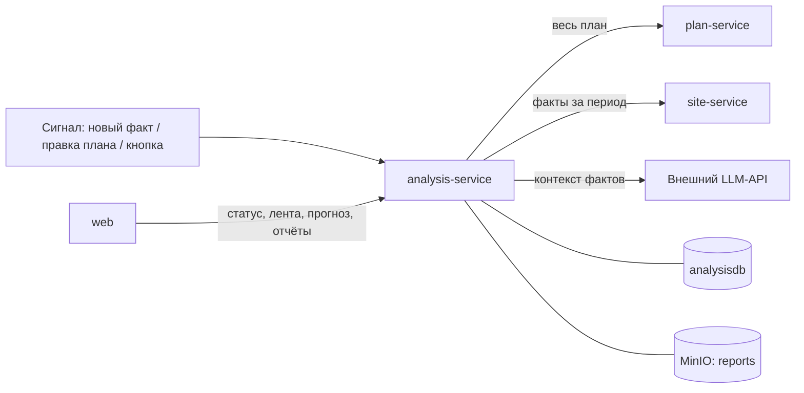

# analysis-service — сервис сверки план-факт

## 1. Назначение

Отвечает на главный вопрос системы: **идёт ли объект по графику, и если нет — почему
и насколько**. Сравнивает план (что должно происходить) с фактом (что видно на снимках) и
делает **все выводы системы**:
- рабочее ли время;
- работает ли техника или простаивает;
- отклонения D1–D10 с объяснением и доказательствами;
- прогресс, SPI и прогноз завершения;
- статус объекта.

Здесь же формируются PDF-отчёт и текстовое резюме.

Сервис **не владеет первичными данными**: план и факт он читает по API, каждый одним запросом.
Его состояние — только выводы, и оно целиком пересчитывается с нуля. Поэтому методику можно
править в любой момент, в том числе на демонстрации.

## 2. Место в системе



- **Вызывает:** `plan-service` и `site-service` (только чтение), внешний LLM (только текст).
- **Вызывают:** `web`; `site-service` и `plan-service` — сигналом «пересчитай».

## 3. API

Префикс: `/api/v1/analysis`. Контракт прогона —
[packages/contracts/interservice.md](../../packages/contracts/interservice.md), раздел 4.
Что уже реализовано, видно по [docs/board.md](../../docs/board.md).

| Метод | Путь | Описание |
| :--- | :--- | :--- |
| `POST` | `/runs` | Запустить прогон или подать сигнал: `{object_id, triggered_by?, as_of?}`; `?wait=true` — дождаться результата |
| `GET` | `/runs/{id}` | Результат прогона: `as_of`, версии входных данных, статистика |
| `GET` | `/objects/{id}/status` | Сводный статус объекта для дашборда |
| `GET` | `/objects/{id}/progress` | Прогресс, SPI и прогноз по каждой вехе — данные для Ганта |
| `GET` | `/objects/{id}/equipment` | Загрузка техники по дням и классам (F10) |
| `GET` | `/deviations` | Лента: фильтры `object_id`, `code`, `severity`, `status`, `stage_id`, `area`, `from`, `to` |
| `GET` | `/deviations/{id}` | Карточка отклонения |
| `GET` | `/deviations/{id}/explain` | **Полное объяснение:** правило и его параметры, проверенные сессии с фактами, ссылки на снимки |
| `PATCH` | `/deviations/{id}` | Вердикт оператора: `CONFIRMED` / `REJECTED` и комментарий |
| `GET` `PATCH` | `/deviation-rules` | Пороги D1–D10 без правки кода |
| `POST` | `/reports` | Сформировать PDF-отчёт: `{object_id, period_from, period_to}` |
| `GET` | `/reports` | Список отчётов объекта |
| `GET` | `/reports/{key}` | Presigned-ссылка на готовый файл |
| `POST` | `/summary` | Текстовое резюме по объекту (LLM или шаблон) без формирования файла |

### Пример: статус объекта

```json
{
  "object_id": "0f3a…", "computed_at": "2026-10-20T10:02:11Z", "as_of": "2026-10-20T10:00:00Z",
  "status": "DELAY", "delay_days": 12, "spi": 0.63, "confidence": "MEDIUM",
  "stages": {"total": 12, "not_started": 8, "in_progress": 2, "done": 1, "late": 1},
  "deviations": {"HIGH": 1, "MEDIUM": 3, "LOW": 2, "INFO": 1},
  "blind_areas": 1,
  "stages_at_risk": [
    {"stage_id": "7c1e…", "name": "Разработка котлована",
     "plan_end": "2026-11-20", "forecast_end": "2026-12-04", "delay_days": 12}
  ]
}
```

Пример отклонения с `facts` и `evidence` — [docs/methodology.md](../../docs/methodology.md), раздел 12.

### Коды ошибок

`OBJECT_NOT_FOUND`, `DEVIATION_NOT_FOUND`, `RUN_NOT_FOUND`, `INVALID_VERDICT`,
`PLAN_SERVICE_UNAVAILABLE`, `SITE_SERVICE_UNAVAILABLE`, `NO_DATA_FOR_PERIOD` (отчёт за период без
наблюдений), `RENDER_FAILED`. Недоступная LLM ошибкой не считается: резюме строится по шаблону.

## 4. Как устроен прогон

```
POST /runs {object_id, triggered_by, as_of?}
  ├─ прогон по объекту уже идёт → отметить rerun_requested, ответить coalesced: true
  ├─ plan-service: весь план                             → фиксируем plan_version
  ├─ site-service: факты [plan_start, as_of]             → фиксируем zones_version
  ├─ as_of по умолчанию = конец последней сессии с фактами
  ├─ core/calendar.py        рабочие дни и рабочие сессии по календарю объекта
  ├─ core/plan_on_date.py    активные вехи на дату, вехи в работе
  ├─ core/rules.py           группы required (any_of/min), транзитное окно, allowed, сигнатура
  ├─ core/equipment_state.py статус техники: WORKING / IDLE / OUT_OF_ZONE / UNKNOWN
  ├─ core/predicates.py      D1–D10 с параметрами из deviation_rule, реестр предикатов
  ├─ core/activity.py        фактический старт, индекс активности, эффективные дни
  ├─ core/forecast.py        прогресс с ограничением по стадии, SPI, прогноз, перенос по связям,
  │                          статус объекта, уверенность
  ├─ core/explain.py         текст из шаблона и facts
  ├─ запись: deviation (UPSERT по ключу), stage_fact, daily_activity, daily_equipment, object_status
  └─ rerun_requested → ещё один прогон
```

Всё, что в `core/`, — **чистые функции**: на вход план и факты, на выход выводы. Ни одного
обращения к БД или сети. Поэтому всю методику можно прогнать на фикстурах за доли секунды
и объяснить построчно.

Идемпотентность: открытое отклонение однозначно определяется ключом
`(object_id, stage_id, area, code, equipment_class)`. Повторный прогон обновляет `last_seen_at` и
`occurrences`. Если условие перестало выполняться, отклонение получает статус `RESOLVED`, а
строка остаётся в истории.

## 5. Отчёт и резюме (модуль `src/report/`)

Модуль появился на месте отдельного report-service
([ADR-0011](../../docs/decisions/0011-generator-and-reports-as-modules.md)). Сам он ничего не
считает: все числа берутся из выводов этого же сервиса.

**Состав PDF-отчёта:**
1. Титул: объект, период, дата формирования, статус и задержка.
2. Сводка: SPI, прогресс по фазам, вехи в зоне риска.
3. Диаграмма Ганта план-факт с фактическими стартами и прогнозными окончаниями.
4. График загрузки техники по дням и классам.
5. Таблица отклонений: код, серьёзность, веха, участок, текст, даты.
6. Снимки-доказательства по ключевым отклонениям с рамками, нарисованными в шаблоне.
7. Резюме (LLM или шаблон) с явной пометкой источника.
8. «Ограничения»: слепые участки за период, снимки без времени, уверенность выводов.

Восьмой раздел обязателен. Отчёт, умалчивающий о том, чего система не видела, —
недобросовестный отчёт, а заказчик — город.

**Технология:** Jinja2 → HTML → WeasyPrint. Графики — SVG, встроенные в HTML. Файл кладётся в
бакет `reports` по детерминированному ключу.

**Правила LLM** ([ADR-0008](../../docs/decisions/0008-llm-narrative-only.md)):
1. В промпт попадает **только** JSON-контекст: статус, вехи с SPI и прогнозом, отклонения с ID и
   `facts`. Никаких свободных данных и изображений.
2. Модель обязана ссылаться на ID отклонений.
3. После генерации текст проверяется: **каждое число из текста должно встречаться в контексте**.
   Не прошло — текст отбрасывается, выдаётся шаблонное резюме, `generated_by = TEMPLATE`.
4. `LLM_ENABLED=false`, таймаут или ошибка — сразу шаблон.
5. Промпт лежит в `prompts/summary.ru.md`, не в коде.

Шаблонное резюме — не заглушка, а полноценный текст: те же факты, собранные по шаблонам.
Поле `generated_by` (`LLM` / `TEMPLATE`) всегда показывается в интерфейсе.

## 6. Модель данных (`analysisdb`)

`analysis_run`, `deviation`, `deviation_rule`, `stage_fact`, `daily_activity`, `daily_equipment`,
`object_status`. Подробно — [docs/data-model.md, раздел 3](../../docs/data-model.md).
Методика целиком — [docs/methodology.md](../../docs/methodology.md).

Таблица `deviation_rule` при первом старте заполняется из `data/deviation_rules.yaml`:
предикат, серьёзность, параметры, шаблоны заголовка и текста для D1–D10. Дальше она
правится через API. В шаблонах подставляются поля `facts` отклонения, форматы
`{поле:date}`, `{поле:counts}`, `{поле:groups}`, `{поле:list}` описаны в шапке YAML.

## 7. Конфигурация

| Переменная | По умолчанию | Смысл |
| :--- | :--- | :--- |
| `ANALYSIS_DB_DSN` | — | Подключение к `analysisdb` |
| `PLAN_URL` / `SITE_URL` | внутренние адреса | Источники плана и факта |
| `UPSTREAM_TIMEOUT_S` | `10` | Таймаут чтения плана и фактов |
| `CONTRACTS_DIR` | `/contracts` | Каталог с `enums.yaml`: роли типов зон, порядок стадий |
| `TRANSIENT_WINDOW_SESSIONS` | `4` | Окно присутствия транзитной техники, в рабочих сессиях |
| `MIN_STAGE_CONF` | `0.5` | С какой уверенности стадия по фото считается уверенной |
| `MIN_ACTIVITY` | `0.1` | Нижняя граница темпа в прогнозе |
| `FORECAST_WINDOW_DAYS` | `5` | Окно усреднения активности |
| `MIN_DAYS_FOR_FORECAST` | `3` | Меньше дней наблюдений — прогноз не строится |
| `ON_TRACK_TOLERANCE_DAYS` | `2` | Порог статуса «в графике» |
| `S3_ENDPOINT`, `S3_PUBLIC_ENDPOINT`, `S3_BUCKET_REPORTS` | см. runbook | Хранилище отчётов |
| `LLM_ENABLED` | `true` | `false` → только шаблонные резюме |
| `LLM_PROVIDER` | `openai_compatible` | По умолчанию внешний API; `ollama` — закрытый контур |
| `LLM_BASE_URL`, `LLM_MODEL` | — | Адрес и модель провайдера |
| `LLM_API_KEY` | — | **Настоящий секрет.** Только в `.env`, никогда в git и в скриншотах |
| `LLM_TIMEOUT_S` | `30` | По истечении — шаблон |
| `REPORT_MAX_EVIDENCE_IMAGES` | `12` | Ограничение размера PDF |

Пороги D1–D10 живут в таблице `deviation_rule` и правятся через API и интерфейс.

## 8. Зависимости

PostgreSQL (`analysisdb`), `plan-service`, `site-service`, MinIO; LLM — по желанию.
Если план или факты недоступны, прогон завершается со статусом `FAILED` и понятным кодом.
Частичных, «додуманных» выводов не бывает никогда.

## 9. Запуск и тесты

```bash
docker compose up -d analysis-service
make test s=analysis                 # на Windows — см. docs/runbook.md, раздел 3
```

Обязательное покрытие `src/core/` — это главный тестовый набор проекта:

- каждый предикат D1–D10: срабатывает, не срабатывает, граничный случай;
- группы `any_of` и транзитное окно: самосвалы, видимые раз в 2 часа, не дают ложного D2;
- инвариант: ни одно отклонение не создаётся без `facts` и `evidence` (кроме D10 по неразмеченной вехе);
- инвариант: по слепому участку не создаётся ничего, кроме D10;
- инвариант: отклонения не создаются по сессиям вне рабочего времени;
- активность, прогресс, SPI, прогноз, включая деление на ноль, полный простой и `as_of` в прошлом;
- идемпотентность прогона: повторный запуск не плодит дублей;
- валидатор чисел LLM: пропускает корректный текст, отбрасывает выдуманное число.

Фикстуры — ответы двух контрактов из `packages/contracts/interservice.md`, разложенные на
демо-дни, лежат в `tests/fixtures/`.

## 10. Допущения и ограничения

- **Выводы строятся только по рабочим сессиям с видимыми участками.** Слепой участок никогда
  не трактуется как «техники нет».
- **Окно транзитной техники отмеряется по времени:** `TRANSIENT_WINDOW_SESSIONS` окон по
  30 минут назад от текущего, а не N записей списка. Поэтому ночной перерыв или пропуск
  снимков не переносит вчерашний самосвал в утреннюю сессию (`core/rules.py`).
- **Несколько участков одного типа складываются.** Если у объекта два котлована, единицы
  на них суммируются: это разные места площадки, а не разные камеры одного места.
  Класс, которого нет в `equipment_classes` плана, считается нетранзитным.
- **«Подряд» — по наблюдаемым сессиям.** Сессия, где участок вехи не виден, серию условия
  не рвёт и в неё не входит: «не видно» не значит ни «есть», ни «нет» (`core/predicates.py`).
- **Пустой участок доказывается снимком.** У D1 рамок нет, поэтому evidence — пригодные
  снимки сессии из `cameras[].image_ids`. Если site-service их не прислал, D1 не создаётся.
- **Прогноз линеен:** предполагается, что сохранится средний темп последних рабочих дней.
  Сезонность, погода и поставки материалов не моделируются. Интерфейс говорит об этом
  формулировкой «при сохранении текущего темпа».
- **`UNKNOWN` — полноценный статус.** При нехватке данных система обязана сказать «пока не знаю»,
  а не выдать уверенное число.
- **Прогресс ограничен сверху видимой стадией объекта.** Работающая техника без визуального
  продвижения по стадиям прогресса не даёт.
- **LLM внешняя, поэтому появляется зависимость от сети.** На показе это закрывается заранее
  сформированным отчётом и переключателем `LLM_ENABLED=false`. Прямой доступ к OpenAI и
  Anthropic из РФ без прокси не работает, провайдера нужно проверить с демо-машины.
