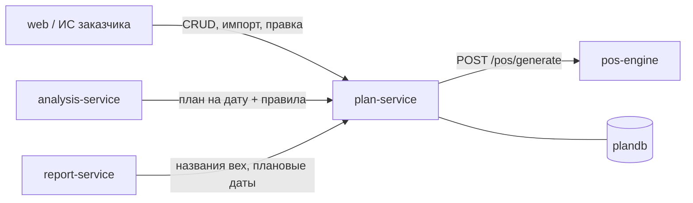

# plan-service — сервис плана

## 1. Назначение

Хранит **всё, что должно произойти на объекте**: сам объект, справочник строительных работ,
календарный график (вехи с плановыми датами и связями), правила «веха → техника» и
классы техники. Это источник истины для плановой части системы и единственное место,
где план можно изменить.

Сервис не знает ничего про снимки, камеры и распознавание.

## 2. Место в системе



- **Вызывает:** `pos-engine` (генерация нормативного графика).
- **Вызывают:** `web`, `analysis-service`, `report-service`.
- **Не вызывает:** `site-service`, `vision-service` — план не зависит от факта.

Ключевая мысль: **`pos-engine` даёт нормативный черновик, `plan-service` хранит
редактируемую истину.** После генерации оператор правит даты и правила, и повторная
генерация без `force=true` их не затирает.

## 3. API

Префикс: `/api/v1/plan`.

Раздел описывает **контракт целиком**, включая то, что ещё не написано. Сегодня отвечают
только `/objects` (создание, список, карточка, изменение, архивация) и `/health`;
остальное — задачи `A-03`…`A-08` в [docs/board.md](../../docs/board.md). Потребителям,
которым эндпоинт нужен раньше, — фикстуры по форме контракта, а не ожидание.

### Объекты

| Метод | Путь | Описание |
| :--- | :--- | :--- |
| `POST` | `/objects` | Создать объект (наименование, тип, адрес, дата начала, ТЭП) |
| `GET` | `/objects` | Список с фильтрами `status`, `object_type` |
| `GET` | `/objects/{id}` | Карточка объекта с ТЭП и текущей ревизией |
| `PATCH` | `/objects/{id}` | Изменить реквизиты или ТЭП |
| `DELETE` | `/objects/{id}` | Перевести в `ARCHIVED` (физически не удаляется) |

### План

| Метод | Путь | Описание |
| :--- | :--- | :--- |
| `POST` | `/objects/{id}/plan/generate` | Сгенерировать график через `pos-engine`; `force=true` перезаписывает ручные правки |
| `GET` | `/objects/{id}/plan` | Полный график: вехи, даты, связи, критический путь, матрица техники |
| `GET` | `/objects/{id}/stages` | Вехи; `?active_on=YYYY-MM-DD` — **активные на дату, с правилами** (ключевой контракт для `analysis-service`) |
| `PATCH` | `/stages/{id}` | Изменить даты, зону, длительность; создаёт новую ревизию плана |
| `POST` | `/objects/{id}/plan/import` | Импорт графика из CSV/XLSX |
| `GET` | `/objects/{id}/plan/export` | Выгрузка графика в XLSX |
| `GET` | `/objects/{id}/revisions` | История правок графика (аудит) |

### Правила и справочники

| Метод | Путь | Описание |
| :--- | :--- | :--- |
| `GET` `POST` | `/rules` | Правила «веха → техника»; фильтр по `stage_id` |
| `PATCH` `DELETE` | `/rules/{id}` | Правка правила; версия увеличивается |
| `GET` `POST` | `/equipment-classes` | Классы техники с алиасами датасетов |
| `PATCH` | `/equipment-classes/{code}` | Правка класса, включая деактивацию |
| `GET` | `/work-types` | Справочник работ; фильтры `object_type`, `level`, `parent_code` |
| `POST` | `/work-types/import` | Импорт справочника из XLSX с восстановлением кодов |
| `GET` `POST` | `/calendars` | Рабочие календари (выходные, праздники, рабочее время) |

### Пример: активные вехи на дату

```
GET /api/v1/plan/objects/0f3a.../stages?active_on=2026-10-20
```

```json
{
  "object_id": "0f3a...", "active_on": "2026-10-20",
  "plan_revision": 3, "rules_version": 2,
  "items": [{
    "id": "st_pit", "code": "12.3.1", "name": "Разработка котлована",
    "phase": "SUBSTRUCTURE", "zone_type": "PIT",
    "plan_start": "2026-10-15", "plan_end": "2026-11-20",
    "norm_duration_days": 36, "is_critical": true,
    "predecessors": [{"stage_id": "st_prep", "type": "FS", "lag_days": 0}],
    "rule": {
      "id": "rl_pit", "version": 2,
      "required": {"excavator": 1, "dump_truck": 2},
      "allowed": ["bulldozer", "loader"],
      "signature": ["excavator", "dump_truck"],
      "min_sessions": 2
    }
  }]
}
```

**Реализовано на сегодня:** объекты (`POST`, `GET` список, `GET` карточка, `PATCH`,
`DELETE` → архив), `/health`, `/health/ready`, клиент `pos-engine` и чистое ядро
рабочего календаря. Остальные эндпоинты таблиц выше — следующие задачи трека A;
схема БД под них уже создана миграцией `0001`, придумывать её заново не нужно.

### Коды ошибок

`OBJECT_NOT_FOUND`, `STAGE_NOT_FOUND`, `STAGE_RULE_NOT_FOUND`, `EQUIPMENT_CLASS_NOT_FOUND`,
`PLAN_ALREADY_GENERATED` (нужен `force`), `PLAN_IMPORT_INVALID` (с указанием строки файла),
`INVALID_DATE_RANGE`, `POS_ENGINE_UNAVAILABLE`.

## 4. Модель данных (`plandb`)

`object`, `work_type`, `equipment_class`, `stage`, `stage_rule`, `plan_revision`,
`work_calendar`. Поля и индексы — [docs/data-model.md, раздел 1](../../docs/data-model.md).

Особенности реализации:

- **Парсер справочника работ** восстанавливает коды, которые Excel превратил в даты
  (`45667` → `10.1`, `45698` → `10.2`, `45728` → `12.3`, `45759` → `12.4`, `45789` → `12.5`,
  `45820` → `12.6`, `45850` → `12.7`), относит строки без кода к 4-му уровню ближайшего кода
  сверху и достраивает отсутствующий столбец «Дороги». В `work_type.source` пишется
  файл, лист и номер строки — чтобы любую строку можно было проверить.
- **Ревизия плана** создаётся при каждой правке дат или правил: снимок в `plan_revision.snapshot`.
  Для бюджетного объекта это обязательный аудит.
- Правила создаются из матрицы техники `pos-engine` (роли `REQUIRED` / `ALLOWED` / `SIGNATURE`),
  далее живут своей жизнью.

## 5. Конфигурация

| Переменная | По умолчанию | Смысл |
| :--- | :--- | :--- |
| `PLAN_DB_DSN` | — | Строка подключения к `plandb` |
| `POS_URL` | `http://pos-engine:8000` | Адрес нормативного расчётчика |
| `POS_TIMEOUT_S` | `20` | Таймаут генерации графика |
| `DEFAULT_CALENDAR` | `moscow-6day` | Календарь по умолчанию для новых объектов |
| `API_KEY`, `LOG_LEVEL`, `RUN_MIGRATIONS` | см. [runbook](../../docs/runbook.md) | |

## 6. Зависимости

PostgreSQL (`plandb`), `pos-engine`. При недоступности `pos-engine` генерация графика
возвращает `503 POS_ENGINE_UNAVAILABLE`; импорт из CSV/XLSX продолжает работать.

## 7. Запуск и тесты

```bash
make up                                   # весь стек
docker compose up -d plan-service         # только этот сервис
make test s=plan                          # тесты
make logs s=plan f=1                      # логи
make migrate s=plan m="описание"          # новая миграция
```

Unit-тесты на `src/core/` запускаются без докера и без зависимостей сервиса:
`PYTHONPATH=. pytest tests/unit`. API-тесты требуют PostgreSQL и без него
пропускаются с понятным сообщением, а не падают.

Обязательное покрытие `src/core/`: парсер справочника (включая испорченные коды),
валидация графика (даты, связи, циклы), построение правил из матрицы техники,
расчёт рабочих дней по календарю.

## 8. Допущения и ограничения

- Даты графика синтетические: нормативы МРР даны для панельных домов и являются
  **предельно допустимыми**, поэтому применяются коэффициенты (монолит, стеснённость,
  сменность) и предполагается ручная правка. Это заявлено в интерфейсе.
- Связи между вехами берутся из шаблона WBS `pos-engine`; произвольное сетевое
  планирование (ручное добавление связей) в MVP не поддерживается.
- Один объект — один активный график. Сценарии «вариантов графика» не реализуются.
