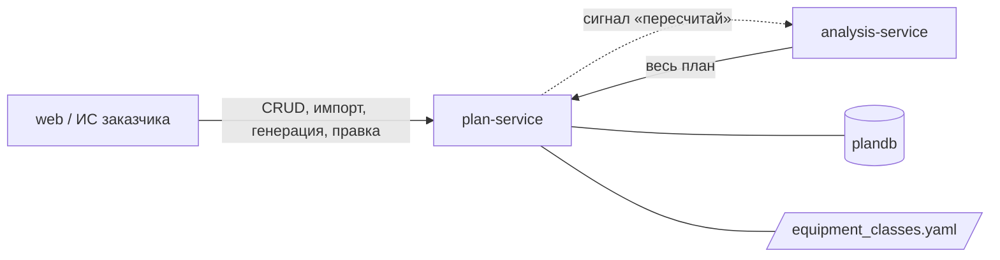

# plan-service — сервис плана

## 1. Назначение

Хранит **всё, что должно произойти на объекте**: сам объект, справочник строительных работ,
календарный график (вехи с плановыми датами и связями), правила «веха → техника» и рабочий
календарь. Это источник истины для плановой части системы и единственное место, где план
можно изменить. График сюда попадает импортом из файла или генератором по нормативам МРР.

Сервис не знает ничего про снимки, камеры и распознавание.

## 2. Место в системе



- **Вызывает:** `analysis-service` — только сигнал `POST /api/v1/analysis/runs` после правки
  вех, правил или календаря.
- **Вызывают:** `web`, `analysis-service` (контракт «весь план»).
- **Не вызывает:** `site-service`, `vision-service` — план не зависит от факта.

## 3. API

Префикс: `/api/v1/plan`. Межсервисный контракт «весь план» —
[packages/contracts/interservice.md](../../packages/contracts/interservice.md), раздел 1.
Что уже реализовано, видно по [docs/board.md](../../docs/board.md).

### Объекты

| Метод | Путь | Описание |
| :--- | :--- | :--- |
| `POST` | `/objects` | Создать объект: наименование, тип, адрес, дата начала, параметры для генератора |
| `GET` | `/objects` | Список с фильтрами `status`, `object_type` |
| `GET` | `/objects/{id}` | Карточка объекта |
| `PATCH` | `/objects/{id}` | Изменить реквизиты или параметры |
| `DELETE` | `/objects/{id}` | Перевести в `ARCHIVED` (физически не удаляется) |

### График

| Метод | Путь | Описание |
| :--- | :--- | :--- |
| `GET` | `/objects/{id}/plan` | **Весь план** — межсервисный контракт: вехи, связи, правила, календарь, классы техники |
| `POST` | `/objects/{id}/plan/import` | Импорт графика из CSV/XLSX: код, наименование, начало, окончание (+ необязательно зона, связи) |
| `POST` | `/objects/{id}/plan/generate` | Сгенерировать график по МРР из типа объекта и параметров; `force=true` перезаписывает ручные правки |
| `GET` | `/objects/{id}/stages` | Вехи объекта по `seq`, в общем формате страницы |
| `PATCH` | `/stages/{id}` | Изменить даты, тип участка (только роль `WORK`), нормативную длительность, `visual_stage` (`null` снимает); `plan_version` растёт, уходит сигнал «пересчитай» |

### Правила и справочники

| Метод | Путь | Описание |
| :--- | :--- | :--- |
| `GET` `POST` | `/rules` | Правила «веха → техника» в форме `stages[].rule` контракта «весь план»; фильтры `stage_id`, `object_id`. У вехи не больше одного правила |
| `GET` `PATCH` `DELETE` | `/rules/{id}` | Правило; правка (списки и сигнатура заменяются целиком) и удаление поднимают версию правила и `plan_version`, шлют сигнал «пересчитай» |

Коды классов в `required`, `allowed` и `signature.equipment` сверяются с
`equipment_classes.yaml`, повтор класса в одном списке — опечатка (`core/stage_rules.py`).
`X-Actor` (имя в URL-кодировке) попадает в журнал правок: в лог `stage_rule.*`.
`GET /objects/{id}/stages` и `PATCH /stages/{id}` отдают веху вместе с её правилом (`rule`).
| `GET` | `/equipment-classes` | Классы техники из `equipment_classes.yaml` (только чтение), в порядке файла; фильтры `group`, `transient` |
| `GET` | `/work-types` | Справочник работ; фильтры `level`, `parent_code` |
| `POST` | `/work-types/import` | Импорт справочника из XLSX с восстановлением кодов |
| `GET` `POST` | `/calendars` | Рабочие календари: выходные, праздники, рабочие часы (`HH:MM`, местное время) |
| `GET` `PATCH` | `/calendars/{id}` | Календарь; правка (кроме названия) поднимает `plan_version` всех объектов на нём и шлёт им сигнал. Код не меняется |

Новый объект получает календарь `DEFAULT_CALENDAR` (поле `calendar_id` карточки объекта).

### Коды ошибок

`OBJECT_NOT_FOUND`, `STAGE_NOT_FOUND`, `STAGE_RULE_NOT_FOUND`, `UNKNOWN_EQUIPMENT_CLASS`
(код класса не найден в `equipment_classes.yaml`), `PLAN_ALREADY_EXISTS` (генерация без `force`
поверх ручных правок), `PLAN_IMPORT_INVALID` (с номером строки файла), `INVALID_DATE_RANGE`,
`PLAN_CYCLE` (цикл в связях вех), `NORMS_NOT_AVAILABLE` (для типа объекта нет норм — используйте импорт),
`STAGE_RULE_ALREADY_EXISTS` (второе правило у вехи), `STAGE_RULE_INVALID` (класс повторяется
в группе, `allowed` или сигнатуре), `INVALID_ZONE_TYPE` (веха на участке не с ролью `WORK`),
`CALENDAR_NOT_FOUND`,
`CALENDAR_ALREADY_EXISTS` (повтор кода), `CALENDAR_INVALID` (неизвестный часовой пояс,
выходные вне 1…7 или все семь дней, конец рабочих часов не позже начала).

## 4. Модель данных (`plandb`)

`object`, `work_type`, `work_calendar`, `stage`, `stage_rule`. Поля и индексы —
[docs/data-model.md, раздел 1](../../docs/data-model.md). Классов техники в базе нет: они
читаются из `equipment_classes.yaml` при старте ([ADR-0014](../../docs/decisions/0014-equipment-classes-file.md)).

### Парсер справочника работ

Модуль `core/reference_import.py` разбирает XLSX «Сводный перечень строительных работ ЛТЦ»
(файл — `data/reference/`, его устройство — [data/README.md](../../data/README.md)):
- восстанавливает коды, которые Excel превратил в даты: дата `d.m.2025` → код `d.m`
  (19 кодов: `10.1`…`10.12`, `12.1`…`12.7`); число `12` → `12`; точку в конце кода отбрасывает;
- относит строки без кода к 4-му уровню ближайшего кода сверху;
- читает отметку обязательности `˅` по девяти столбцам типов объектов, от «Жильё» до «Дороги».

В `work_type.source` пишутся файл, лист и номер строки: любую строку можно проверить по
первоисточнику.

### Генератор графика

Модуль `core/schedule_generator.py` — чистая функция, реализующая ТЗ, п. 8 ([ADR-0011](../../docs/decisions/0011-generator-and-reports-as-modules.md)).
Его задача — дать правдоподобный черновик графика, к которому можно привязывать снимки.

1. **Вход.** Тип объекта, параметры (`tep`: этажность, площадь, секции, сваи, сменность) и
   дата начала.
2. **Фазы по МРР.** Длительности фаз (подготовительный период, подземная часть, надземная часть,
   отделка) берутся из `data/mrr_norms.json`: интерполяция по таблице и коэффициенты
   (монолит, сменность).
3. **Раскладка на вехи.** Фазы раскладываются на вехи по долям из `data/wbs_templates.json`.
   Доли — наше экспертное допущение и редактируются в файле.
4. **Даты и критический путь.** Даты строятся от даты начала по рабочему календарю, связи
   между вехами берутся из шаблона, по ним считается критический путь (`core/cpm.py`).
5. **Правила вех.** Каждая веха получает правило «веха → техника» из шаблона. Шаблоны
   повторяют таблицу ТЗ, п. 5.2, включая группы «любой из».

Правила данных генератора:
- **Редакция норм.** Используется **последняя редакция МРР-3.2.81**.
- **Источник каждого числа.** У каждого числа в `mrr_norms.json` есть ссылка на пункт и
  таблицу документа (поле `source`). Числа без ссылки не используются (AGENTS.md, правило 7).
- **Если норм нет.** Для типа объекта без норм генератор отвечает `NORMS_NOT_AVAILABLE`, и
  график импортируется из файла.
- **Чего нет в генераторе.** Подбора марок машин, расчёта машино-часов и московских регламентов
  (299-ПП, закон № 42) нет: заказчик назвал ПОС ненужным.

### Версия плана

`object.plan_version` растёт при любой правке вех, правил или календаря — одним `UPDATE`
в той же транзакции, что и правка (`services/plan_version.py`). После фиксации транзакции
сервис шлёт `POST /api/v1/analysis/runs` с `triggered_by: PLAN_CHANGED` по каждому объекту не
в архиве: сигнал до фиксации заставил бы analysis считать старый план под новым номером.
Сигнал — одна попытка с таймаутом `SIGNAL_TIMEOUT_S`, ошибка только пишется в лог
(`analysis.signal_failed`). Отдельной истории правок нет. Кто подтвердил отклонение,
фиксируется в analysis-service.

### Календарь `moscow-6day`

Заводится миграциями: часовой пояс `Europe/Moscow`, выходной — воскресенье (`[7]`), рабочие
часы 07:00–23:00. Праздники (миграция `0002`) — нерабочие праздничные дни по **ТК РФ, ст. 112,
ч. 1** (ред. Федерального закона от 23.04.2012 № 35-ФЗ) на 2026–2028 годы: 1–8 января,
23 февраля, 8 марта, 1 и 9 мая, 12 июня, 4 ноября.

## 5. Конфигурация

| Переменная | По умолчанию | Смысл |
| :--- | :--- | :--- |
| `PLAN_DB_DSN` | — | Строка подключения к `plandb` |
| `ANALYSIS_URL` | `http://analysis-service:8000` | Куда слать сигнал «пересчитай» |
| `SIGNAL_TIMEOUT_S` | `2.0` | Таймаут сигнала; повторов нет (interservice.md, раздел 4) |
| `CONTRACTS_DIR` | `/contracts` | Каталог с `equipment_classes.yaml` и `enums.yaml` |
| `DEFAULT_CALENDAR` | `moscow-6day` | Календарь по умолчанию для новых объектов |
| `API_KEY`, `LOG_LEVEL`, `RUN_MIGRATIONS` | см. [runbook](../../docs/runbook.md) | |

## 6. Зависимости

PostgreSQL (`plandb`), файлы `packages/contracts/*.yaml`. `analysis-service` не обязателен:
если сигнал не дошёл, правка всё равно сохраняется, а пересчёт произойдёт при следующем прогоне.

## 7. Запуск и тесты

```bash
docker compose up -d plan-service         # только этот сервис
make test s=plan                          # тесты (на Windows — см. docs/runbook.md, раздел 3)
make migrate s=plan m="описание"          # новая миграция
```

Unit-тесты на `src/core/` запускаются без докера и без зависимостей:
`PYTHONPATH=. pytest tests/unit`. API-тесты требуют PostgreSQL (`TEST_DB_DSN`); без базы они
пропускаются с понятным сообщением, а не падают. Миграционный тест откатывает схему до нуля,
поэтому `TEST_DB_DSN` смотрит на отдельную базу: на стенде это `plandb_test` (владелец
`plan_user`), в CI — база контейнера `postgres`. Справочные файлы тесты берут из
`packages/contracts`, если не задан `CONTRACTS_DIR`.

Обязательное покрытие `src/core/`:
- парсер справочника, включая испорченные коды и строки без кода;
- проверка графика: даты, связи, циклы;
- критический путь;
- генератор на эталонном объекте;
- проверка кодов классов в правилах;
- расчёт рабочих дней по календарю.

## 8. Допущения и ограничения

- **Даты графика синтетические.** Нормативы МРР даны для панельных домов и являются
  **предельно допустимыми**, поэтому применяются коэффициенты и ручная правка. Это заявлено
  в интерфейсе.
- **Связи между вехами** берутся из шаблона генератора или из файла импорта. Добавлять связи
  в интерфейсе в MVP нельзя.
- **Один объект — один активный график.** Сценарии «вариантов графика» не реализуются.
- **Классы техники в интерфейсе только для чтения.** Новый класс добавляется в
  `equipment_classes.yaml`.
- **Справочные файлы читаются один раз при старте** (`src/reference.py`) и проверяются
  (`core/reference.py`): код в `lower_snake_case`, без повторов, группа из `equipment_group`,
  `transient` — логическое значение. Испорченный файл не даёт сервису стартовать: лучше
  упасть при запуске, чем молча работать с пустым справочником.
- **Праздники — только с источником.** Переносы выходных (ТК РФ, ст. 112, ч. 2, и
  постановления Правительства РФ) и праздники после 2028 года не заведены: документа в
  `data/reference/` нет. Их добавляет оператор через `PATCH /calendars/{id}` (список
  `holidays` заменяется целиком).
- **Правка дат вехи не пересчитывает критический путь**, пока нет `core/cpm.py` (T19):
  `is_critical` и `total_float_days` остаются от последнего расчёта.
- **Перечисления в схемах API — из `enums.yaml`.** Типы `Literal` строятся при старте, копий
  списков в коде нет (AGENTS.md, раздел 7); Swagger показывает допустимые значения. Новое
  значение — строка в `enums.yaml` и перезапуск.
