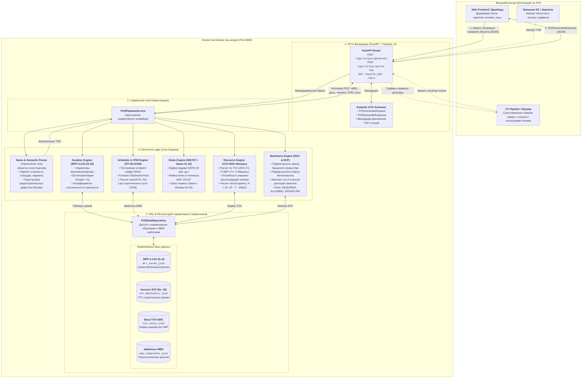

# POS Engine — Модуль генерации календарных графиков (WBS) и расчета строительной техники (ПОС)

> **Кейс 07 ЛЦТ 2026:** «Мониторинг строительной площадки по снимкам камер»  
> **Роль модуля:** Автоматизированное преобразование текстового наименования объекта капитального строительства в нормативно выверенный календарно-сетевой график работ (WBS), расчет сроков строительства и потребности в строительной технике на каждом этапе.
> **Формат поставки:** Автономный микросервис в Docker-контейнере. Взаимодействие с внешним миром — **исключительно по REST API (JSON)**.

---

## 0. Место в системе

`pos-engine` — один из семи сервисов монорепозитория «СтройКонтроль»
(см. [корневой README](../../README.md) и [docs/architecture.md](../../docs/architecture.md)).
Его роль — **нормативные знания без состояния**: он не хранит ничего и ничего не помнит.

- **Вызывает его только `plan-service`**, эндпоинтом `POST /api/v1/pos/generate`,
  при создании или перегенерации графика объекта.
- **Результат — нормативный черновик.** `plan-service` сохраняет вехи и матрицу техники
  в свою базу, после чего оператор правит их в интерфейсе. Повторная генерация без
  `force=true` ручные правки не затирает.
- **Матрица техники становится правилами «веха → техника»:** роли `REQUIRED`, `ALLOWED`
  и `SIGNATURE` превращаются в строки `stage_rule`, по которым `analysis-service`
  выявляет отклонения D1–D3 и фиксирует фактический старт этапа.
- Сервис не обращается к БД, к MinIO и к другим сервисам. Масштабируется репликами.
- Добавление нового типа объекта (школа, мост, инженерные сети) — это новый шаблон WBS
  в `data/wbs_templates.json` и нормы в `data/mrr_norms.json`, **без правки кода**.

Правила API, коды ошибок и стиль кода — общие для всего репозитория:
[docs/api-guidelines.md](../../docs/api-guidelines.md), [AGENTS.md](../../AGENTS.md).
Ниже — собственная документация сервиса.

---

## 1. Схема архитектуры контейнера



---

## 2. Назначение и бизнес-логика модуля

Микросервис **pos-engine** закрывает ключевую потребность системы мониторинга стройплощадки:
1. **Отсутствие ручной подготовки графиков:** Пользователю (или смежному сервису) достаточно передать текстовое название объекта (например, *«Строительство монолитного жилого дома 17 этажей с подземной автостоянкой, г. Москва»*).
2. **Семантическое распознавание ТЭП:** Встроенный `ObjectNameParser` автоматически распознает тип объекта (`RESIDENTIAL_MONOLITH`, `RESIDENTIAL_PANEL`, `PUBLIC_BUILDING`, `ROAD`), этажность, площадь, строительный объем, потребность в свайном основании и наличие подземного паркинга/котлована. Если какие-то ТЭП не указаны, сервис применяет градостроительные стандарты г. Москвы.
3. **Официальная нормативная база г. Москвы:**
   - **МРР-3.2.81.02-18 / МРР-3.2.81-12 (Москомэкспертиза):** 2D-интерполяция сроков по сетке [Этажи × Площадь] с поправками на стесненность ($K = 1.15$) и сменность ($K = 0.9$ для 2 смен, $0.8$ для 3 смен).
   - **СП 48.13330.2019 «Организация строительства»:** Расчет сетевого графика методом критического пути (CPM) с определением полного ($TF$) и свободного ($FF$) резервов времени.
   - **ТСН-2001 Москвы (Гл. 3 СМР, Гл. 2 Машины) и ГЭСН-2022:** Расчет машино-часов и требуемого числа машин $N = \lceil V / (P \cdot T) \rceil$.
   - **ФГИС ЦС КСР (Классификатор строительных ресурсов, Книга 02 «Механизмы»):** Подбор конкретных марок машин по требуемой высоте подъема крюка ($H_{\text{кр}}$), вылету стрелы и объему ковша.
   - **Постановление 299-ПП:** Нормативный буфер 14 рабочих дней на ордер ОАТИ, пост мойки колес, учет грунта через АИС ОССиГ.
   - **Закон г. Москвы № 42 (Закон о тишине):** Ограничение шумных работ в ночные часы (23:00–07:00).
4. **Готовая основа для компьютерного зрения (CV):** Каждая строительная веха обогащается:
   - **Зоной стройплощадки** (`BUILDING_FOOTPRINT`, `PIT`, `PERIMETER`, `ENTRY_GATE`).
   - **Классификацией техники по ролям:**
     - `REQUIRED`: ведущая техника, отсутствие которой означает срыв темпа (отклонение **D1 / D2** по ТЗ).
     - `ALLOWED`: допустимая вспомогательная техника.
     - `SIGNATURE`: сигнатурная техника, появление которой на снимках камер фиксирует фактический старт этапа.

---

## 3. Спецификация API взаимодействия

Контейнер взаимодействует с внешними системами **исключительно по протоколу HTTP REST API**.  
Интерактивная документация Swagger UI доступна по адресу: `http://localhost:8000/docs`.

### Сводная таблица эндпоинтов

| Метод | Эндпоинт | Описание |
| :--- | :--- | :--- |
| `POST` | `/api/v1/pos/generate` | **Основной метод:** преобразование названия объекта в полный график WBS и матрицу строительной техники. |
| `POST` | `/api/v1/pos/parse-tep` | **Предпросмотр ТЭП:** быстрый семантический разбор наименования без генерации полного сетевого графика. |
| `GET` | `/api/v1/pos/templates` | Список доступных шаблонов WBS (монолитное жилье, панельное жилье, школы/сады, автодороги). |
| `GET` | `/api/v1/pos/machinery-catalog` | Каталог техники КСР с ТТХ и моделями (башенные краны, бетононасосы, экскаваторы и др.). |
| `GET` | `/health` | Проверка жизнеспособности контейнера (Docker / Kubernetes Healthcheck). |

---

## 4. Описание входного объекта (Request)

### Схема `POSGenerateRequest`

| Поле | Тип | Обязательное | Описание / Пример |
| :--- | :--- | :---: | :--- |
| `object_name` | `string` | **Да** | Текстовое наименование объекта. *Пример: `"Строительство монолитного жилого дома 17 этажей с подземной автостоянкой, г. Москва"`*. |
| `start_date` | `string (date)` | Нет | Плановая дата начала СМР в формате `YYYY-MM-DD`. Если не передана — текущий день. |
| `tep_overrides` | `object` | Нет | Объект явного переопределения ТЭП (если требуется скорректировать распознанные значения). |
| `tep_overrides.floors` | `integer` | Нет | Количество надземных этажей ($1 \dots 100$). |
| `tep_overrides.total_area_sqm` | `float` | Нет | Общая площадь объекта ($м^2$). |
| `tep_overrides.footprint_area_sqm`| `float` | Нет | Площадь пятна застройки ($м^2$). |
| `tep_overrides.sections_count` | `integer` | Нет | Количество секций / подъездов ($1 \dots 20$). |
| `tep_overrides.has_underground_parking` | `boolean` | Нет | Наличие подземного паркинга / глубокого котлована. |
| `tep_overrides.piles_count` | `integer` | Нет | Количество свай фундамента. |
| `tep_overrides.shifts_count` | `integer` | Нет | Сменность работы ($1, 2$ или $3$). По умолчанию $2$. |
| `tep_overrides.constraint_factor` | `float` | Нет | Коэффициент стесненности условий застройки ($1.0 \dots 1.5$). По умолчанию $1.15$. |
| `options` | `object` | Нет | Параметры расчета и нормативные флаги. |
| `options.apply_oati_buffer` | `boolean` | Нет | Учитывать буфер 14 раб. дней на ордер ОАТИ по 299-ПП (по умолчанию `true`). |
| `options.apply_law42_silence_restrictions`| `boolean`| Нет | Применять ограничения по Закону о тишине № 42 (по умолчанию `true`). |
| `options.include_signature_rules` | `boolean` | Нет | Генерировать сигнатурные правила техники для CV (по умолчанию `true`). |
| `options.target_object_type` | `string` | Нет | Принудительный тип объекта (`RESIDENTIAL_MONOLITH`, `RESIDENTIAL_PANEL`, `PUBLIC_BUILDING`, `ROAD`). |

### Пример входного JSON-запроса (Минимальный)

```json
{
  "object_name": "Строительство монолитного жилого дома 17 этажей с подземной автостоянкой, г. Москва"
}
```

### Пример входного JSON-запроса (Расширенный)

```json
{
  "object_name": "Строительство монолитного жилого дома 17 этажей с подземной автостоянкой, площадь 12000 кв.м",
  "start_date": "2026-10-01",
  "tep_overrides": {
    "floors": 17,
    "total_area_sqm": 12000.0,
    "sections_count": 2,
    "has_underground_parking": true,
    "piles_count": 0,
    "shifts_count": 2,
    "constraint_factor": 1.15
  },
  "options": {
    "apply_oati_buffer": true,
    "apply_law42_silence_restrictions": true,
    "include_signature_rules": true
  }
}
```

---

## 5. Описание выходного объекта (Response)

### Схема `POSGenerateResponse`

Выходной JSON содержит 6 логических блоков:

1. **`object_name`** (`string`): Исходное наименование объекта.
2. **`tep`** (`ResolvedTEP`): Полный набор примененных технико-экономических показателей объекта:
   - `object_type`: Классифицированный тип объекта (`RESIDENTIAL_MONOLITH` и др.).
   - `floors`, `building_height_m`: Этажность и расчетная высота здания.
   - `total_area_sqm`, `footprint_area_sqm`: Общая площадь и площадь пятна застройки.
   - `sections_count`: Количество секций (определяет число башенных кранов).
   - `estimated_concrete_volume_m3`: Расчетный объем монолитного бетона.
   - `estimated_pit_volume_m3`: Расчетный объем грунта котлована.
   - `piles_count`, `shifts_count`, `constraint_factor`: Сваи, сменность, стесненность.
3. **`summary`** (`ScheduleSummaryDTO`): Сводные показатели проекта:
   - `total_duration_months`: Нормативная продолжительность в месяцах по МРР.
   - `total_duration_calendar_days`: Общая продолжительность в календарных днях.
   - `project_start_date` / `project_finish_date`: Даты старта и сдачи объекта.
   - `critical_path_duration_days`: Длина критического пути.
   - `total_stages_count`: Число вех WBS.
   - `peak_machinery_units`: Максимальное одновременное количество техники.
4. **`cpm_path`** (`array of string`): Упорядоченный список идентификаторов этапов, образующих критический путь (СП 48.13330).
5. **`stages`** (`array of StagePlanDTO`): Декомпозиция работ сетевого графика:
   - `id`, `code`, `name`: Идентификатор, код по классификатору (10.4, 12.3.1, 12.4.4) и название этапа.
   - `phase`: Фаза (`PREPARATORY`, `SUBSTRUCTURE`, `SUPERSTRUCTURE`, `ENVELOPE_ROOF`, `NETWORKS`, `LANDSCAPING`).
   - `duration_days`: Длительность этапа в днях.
   - `start_date`, `end_date`: Календарные даты начала и окончания.
   - `dependencies`: Зависимости (предшественник, тип связи `FS`/`SS`/`FF`, лаг `lag_days`).
   - `is_critical`: Признак критического пути (`true` / `false`).
   - `total_float_days`, `free_float_days`: Полный и свободный резервы времени.
   - `zone_type`: Зона стройплощадки для камер (`BUILDING_FOOTPRINT`, `PIT`, `PERIMETER`, `ENTRY_GATE`).
   - `equipment`: Матрица потребности в строительной технике:
     - `equipment_class`: Класс машины (из 12 классов детекции: `tower_crane`, `excavator`, `dump_truck`, `concrete_pump`, `concrete_mixer` и др.).
     - `ksr_code`: Официальный код КСР (например, `02.01.01-035`).
     - `name`: Название с моделью и параметрами.
     - `quantity`: Расчетное количество единиц техники.
     - `role`: Роль техники (`REQUIRED` — ведущая, `ALLOWED` — вспомогательная, `SIGNATURE` — признак старта для CV).
     - `specifications`: Технические характеристики ($H_{\text{кр}}$, вылет стрелы, объем ковша).
     - `normative_machinery_hours`: Нормативные машино-часы по ТСН-2001.
     - `shifts_per_day`: Сменность.
     - `working_hours_window`: Разрешенное окно работы по Закону о тишине № 42.
   - `regulatory_basis`: Нормативные ссылки (МРР-3.2.81, ТСН-2001, СП 48.13330).
6. **`applied_regulations`** (`array of string`): Примененные московские регламенты (ОАТИ 299-ПП, Закон № 42, АИС ОССиГ).
7. **`generated_at`** (`string ISO 8601`): Метка времени генерации.

### Пример выходного JSON-ответа (Фрагмент)

```json
{
  "object_name": "Строительство монолитного жилого дома 17 этажей с подземной автостоянкой, г. Москва",
  "tep": {
    "object_type": "RESIDENTIAL_MONOLITH",
    "floors": 17,
    "building_height_m": 60.1,
    "total_area_sqm": 12240.0,
    "footprint_area_sqm": 828.0,
    "sections_count": 2,
    "estimated_concrete_volume_m3": 4284.0,
    "estimated_pit_volume_m3": 6210.0,
    "piles_count": 0,
    "shifts_count": 2,
    "constraint_factor": 1.15
  },
  "summary": {
    "total_duration_months": 10.7,
    "total_duration_calendar_days": 325,
    "project_start_date": "2026-10-01",
    "project_finish_date": "2027-08-21",
    "critical_path_duration_days": 325,
    "total_stages_count": 12,
    "peak_machinery_units": 9
  },
  "cpm_path": [
    "stage_10_prep",
    "stage_12_pit_excavation",
    "stage_12_pit_bedding",
    "stage_12_foundation_slab",
    "stage_12_superstructure"
  ],
  "stages": [
    {
      "id": "stage_10_prep",
      "code": "10.4-10.8",
      "name": "Подготовительный период: расчистка территории, снос, ограждение площадки",
      "phase": "PREPARATORY",
      "duration_days": 20,
      "start_date": "2026-10-01",
      "end_date": "2026-10-20",
      "dependencies": [],
      "is_critical": true,
      "early_start_day": 0,
      "early_finish_day": 20,
      "late_start_day": 0,
      "late_finish_day": 20,
      "total_float_days": 0,
      "free_float_days": 0,
      "zone_type": "PERIMETER",
      "equipment": [
        {
          "equipment_class": "excavator",
          "ksr_code": "02.04.01-025",
          "name": "Экскаватор гусеничный/колесный CAT 320 (ковш 1.2 м3)",
          "quantity": 1,
          "role": "REQUIRED",
          "matched_model": "CAT 320 (ковш 1.2 м3)",
          "specifications": {
            "dig_depth_requirement_m": 4.5,
            "bucket_volume_m3": 1.2
          },
          "normative_machinery_hours": 110.4,
          "shifts_per_day": 2,
          "working_hours_window": "08:00-21:00"
        },
        {
          "equipment_class": "dump_truck",
          "ksr_code": "02.11.01-015",
          "name": "Самосвал КАМАЗ-65115 (15 т)",
          "quantity": 2,
          "role": "REQUIRED",
          "matched_model": "КАМАЗ-65115 (15 т)",
          "specifications": {},
          "normative_machinery_hours": 1293.8,
          "shifts_per_day": 2,
          "working_hours_window": "08:00-21:00"
        },
        {
          "equipment_class": "excavator",
          "ksr_code": "02.04.01-025",
          "name": "Экскаватор гусеничный/колесный CAT 320 (ковш 1.2 м3)",
          "quantity": 1,
          "role": "SIGNATURE",
          "matched_model": "CAT 320 (ковш 1.2 м3)",
          "specifications": {
            "dig_depth_requirement_m": 4.5,
            "bucket_volume_m3": 1.2
          },
          "normative_machinery_hours": 0.0,
          "shifts_per_day": 2,
          "working_hours_window": "08:00-21:00"
        }
      ],
      "regulatory_basis": [
        "МРР-3.2.81.02-18 Москомэкспертизы",
        "ТСН-2001.3 / ТСН-2001.2",
        "СП 48.13330.2019"
      ]
    },
    {
      "id": "stage_12_superstructure",
      "code": "12.4.4",
      "name": "Возведение монолитного железобетонного каркаса надземной части (типовые этажи)",
      "phase": "SUPERSTRUCTURE",
      "duration_days": 230,
      "start_date": "2027-01-04",
      "end_date": "2027-08-21",
      "dependencies": [
        {
          "predecessor_id": "stage_12_foundation_slab",
          "type": "FS",
          "lag_days": 0
        }
      ],
      "is_critical": true,
      "early_start_day": 95,
      "early_finish_day": 325,
      "late_start_day": 95,
      "late_finish_day": 325,
      "total_float_days": 0,
      "free_float_days": 0,
      "zone_type": "BUILDING_FOOTPRINT",
      "equipment": [
        {
          "equipment_class": "tower_crane",
          "ksr_code": "02.01.01-035",
          "name": "Башенный кран КБ-503 (Hкр ≥ 67.1 м)",
          "quantity": 1,
          "role": "REQUIRED",
          "matched_model": "КБ-503",
          "specifications": {
            "required_hook_height_m": 67.1,
            "building_height_m": 60.1,
            "capacity_tons": 10.0,
            "max_hook_height_m": 75.0,
            "jib_length_m": 50.0
          },
          "normative_machinery_hours": 3680.0,
          "shifts_per_day": 2,
          "working_hours_window": "07:00-23:00"
        },
        {
          "equipment_class": "concrete_pump",
          "ksr_code": "02.12.01-005",
          "name": "Автобетононасос АБН 32 (Putzmeister) (стрела 32.0 м)",
          "quantity": 1,
          "role": "REQUIRED",
          "matched_model": "АБН 32 (Putzmeister)",
          "specifications": {
            "required_reach_m": 30.1,
            "reach_m": 32.0,
            "output_m3_per_hour": 120
          },
          "normative_machinery_hours": 190.4,
          "shifts_per_day": 2,
          "working_hours_window": "07:00-23:00"
        },
        {
          "equipment_class": "concrete_mixer",
          "ksr_code": "02.12.02-008",
          "name": "Автобетоносмеситель (миксер) АБС-7 (КАМАЗ 7м3)",
          "quantity": 3,
          "role": "REQUIRED",
          "matched_model": "АБС-7 (КАМАЗ 7м3)",
          "specifications": {},
          "normative_machinery_hours": 952.0,
          "shifts_per_day": 2,
          "working_hours_window": "07:00-23:00"
        }
      ],
      "regulatory_basis": [
        "МРР-3.2.81.02-18 Москомэкспертизы",
        "ТСН-2001.3 / ТСН-2001.2",
        "СП 48.13330.2019"
      ]
    }
  ],
  "applied_regulations": [
    "МРР-3.2.81.02-18 (Москомэкспертиза): Нормы продолжительности строительства и 2D-интерполяция [Этажи × Площадь]",
    "СП 48.13330.2019: Сетевое планирование методом критического пути (CPM)",
    "ТСН-2001 Москвы (Гл. 3 СМР, Гл. 2 Машины) и ФГИС ЦС КСР (Книга 02): Нормативы потребности в строительной технике",
    "299-ПП г. Москвы: Оформление ордера ОАТИ (нормативный буфер 14 раб. дней перед земляными работами)",
    "299-ПП г. Москвы: Обязательное оборудование пункта мойки колес с замкнутым циклом водооборота",
    "Закон г. Москвы № 42: График тишины (запрет шумовых работ 23:00-07:00, спецрежим для свай и выемки грунта)",
    "Распоряжение ДСВ г. Москвы: Обязательный учет вывоза грунта через электронные разрешения АИС ОССиГ"
  ],
  "generated_at": "2026-09-17T21:44:48.718012"
}
```

---

## 6. Структура файлов и папок модуля

```text
pos-engine/
├── Dockerfile                      # Оптимизированный multi-stage Dockerfile (Python 3.12-slim)
├── docker-compose.yml              # Манифест запуска контейнера с healthcheck и монтированием томов
├── requirements.txt                # Зависимости сервиса (FastAPI, Pydantic, NetworkX, Uvicorn)
├── pyproject.toml                  # Конфигурация сборки пакета и настроек Pytest
├── .dockerignore                   # Исключения для чистой и быстрой сборки Docker-образа
├── .env.example                    # Шаблон переменных окружения
├── README.md                       # Архитектура, спецификация API и документация модуля
│
├── data/                           # Нормативные справочники и калибровочные данные
│   ├── mrr_norms.json              # Сборник МРР-3.2.81.02-18 / 12 (сетка сроков, фазы, коэффициенты)
│   ├── ksr_machinery.json          # Каталог КСР (Книга 02): ТТХ башенных кранов, насосов, экскаваторов
│   ├── tsn_rates.json              # Нормы выработки и машино-часов ТСН-2001 (Гл. 3 и Гл. 2)
│   └── wbs_templates.json          # Технологические шаблоны WBS, связи FS/SS/Lag, зоны и правила техники
│
├── src/                            # Исходный код сервиса
│   ├── __init__.py
│   ├── main.py                     # Точка входа FastAPI приложения (CORS, healthcheck, роуты)
│   ├── config.py                   # Pydantic Settings конфигурация сервиса
│   │
│   ├── api/                        # Слой API
│   │   ├── __init__.py
│   │   ├── routes.py               # Контроллеры маршрутов (/generate, /parse-tep, /templates)
│   │   └── schemas/                # Pydantic схемы данных (Data Transfer Objects)
│   │       ├── __init__.py
│   │       ├── common.py           # Общие Enums (ObjectType, ConstructionPhase, EquipmentClass, ZoneType)
│   │       ├── request.py          # Входная схема POSGenerateRequest и TEPOverrides
│   │       └── response.py         # Выходная схема POSGenerateResponse, StagePlanDTO, StageEquipmentDTO
│   │
│   ├── core/                       # Модули расчетного ядра (Расчетная бизнес-логика)
│   │   ├── __init__.py
│   │   ├── name_parser.py          # ObjectNameParser: семантический разбор наименования в ТЭП
│   │   ├── duration_engine.py      # DurationEngine: 2D-интерполяция сроков по МРР-3.2.81
│   │   ├── cpm_engine.py           # CPMEngine: сетевой планировщик DAG, CPM, резервы (СП 48.13330)
│   │   ├── resource_engine.py      # ResourceEngine: расчет машино-часов и единиц техники (ТСН-2001)
│   │   ├── machinery_engine.py     # MachineryEngine: подбор моделей КСР, высоты крюка, стрел и ролей
│   │   └── rules_engine.py         # RulesEngine: регламенты Москвы (299-ПП, Закон 42, АИС ОССиГ)
│   │
│   ├── dal/                        # Data Access Layer
│   │   ├── __init__.py
│   │   └── repository.py           # POSDataRepository: доступ к нормативным справочникам
│   │
│   └── services/                   # Сервисный оркестрационный слой
│       ├── __init__.py
│       └── pos_service.py          # POSPipelineService: оркестратор конвейера генерации ПОС
│
└── tests/                          # Набор автоматических тестов
    ├── __init__.py
    └── test_pos_generation.py      # Тесты парсера, сетевого графика, подбора техники и API эндпоинтов
```

---

## 7. Инструкция по сборке, запуску и тестированию

### 1. Запуск в Docker (Рекомендуемый способ)

Сборка и запуск изолированного контейнера:
```bash
cd pos-engine
docker compose up -d --build
```
Проверка состояния контейнера:
```bash
docker compose ps
curl http://localhost:8000/health
```
Ожидаемый ответ:
```json
{
  "status": "healthy",
  "service": "pos-engine",
  "version": "0.1.0",
  "data_loaded": true
}
```

### 2. Локальный запуск для разработки

```bash
cd pos-engine

# Создание и активация виртуального окружения
python3 -m venv .venv
source .venv/bin/activate

# Установка зависимостей
pip install -r requirements.txt

# Запуск сервера разработки
uvicorn src.main:app --host 0.0.0.0 --port 8000 --reload
```

После запуска:
- Документация Swagger UI: `http://localhost:8000/docs`
- Документация ReDoc: `http://localhost:8000/redoc`

### 3. Запуск автоматических тестов

```bash
cd pos-engine
PYTHONPATH=. .venv/bin/pytest -v tests/
```

Все тесты покрывают:
- Распознавание типов зданий и извлечение ТЭП из текста.
- Нормативный расчет продолжительности и 2D-интерполяцию.
- Расчет критического пути (CPM) и резервов времени.
- Подбор техники по каталогу КСР с проверкой высоты подъема крюка башенного крана.
- Полную цепочку генерации через FastAPI HTTP эндпоинты.

---

## 8. Примеры вызова через cURL

### Генерация календарного графика и потребности в технике по названию:

```bash
curl -X POST "http://localhost:8000/api/v1/pos/generate" \
  -H "Content-Type: application/json" \
  -d '{
    "object_name": "Строительство монолитного жилого дома 17 этажей с подземной автостоянкой, г. Москва",
    "start_date": "2026-10-01"
  }'
```

### Быстрый предпросмотр распознанных ТЭП:

```bash
curl -X POST "http://localhost:8000/api/v1/pos/parse-tep" \
  -H "Content-Type: application/json" \
  -d '{
    "object_name": "Строительство дошкольной образовательной организации на 220 мест"
  }'
```
