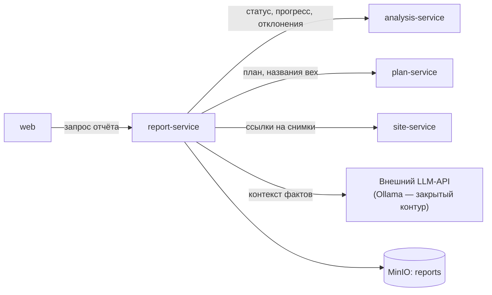

# report-service — сервис отчётов и резюме

## 1. Назначение

Превращает выводы системы в документы для человека: PDF-отчёт о ходе работ
(план-факт, загрузка техники, лента отклонений) и текстовое резюме по объекту,
написанное LLM **строго по готовым фактам**.

Сервис не считает ничего сам: все числа приходят из `analysis-service` и `plan-service`.
Его задача — верстать и формулировать.

## 2. Место в системе



- **Вызывает:** `analysis-service`, `plan-service`, `site-service`, LLM.
- **Вызывают:** `web`.
- **Состояния нет:** готовый файл кладётся в MinIO по детерминированному ключу,
  список отчётов — это листинг бакета.

## 3. API

Префикс: `/api/v1/report`.

| Метод | Путь | Описание |
| :--- | :--- | :--- |
| `POST` | `/reports` | Сформировать отчёт: `{object_id, period_from, period_to, format}`; `format` = `PDF` / `XLSX` |
| `GET` | `/reports` | Список сформированных отчётов объекта |
| `GET` | `/reports/{key}` | Presigned-ссылка на готовый файл |
| `POST` | `/summary` | Текстовое резюме по объекту (LLM или шаблон), без формирования файла |

### Пример ответа `/summary`

```json
{
  "object_id": "0f3a...",
  "period": {"from": "2026-10-14", "to": "2026-10-20"},
  "generated_by": "LLM",
  "text": "Объект отстаёт от графика на 14 рабочих дней. Основная причина — неполный комплект техники на разработке котлована (dev_7b1f, D2): с 18.10 в зоне «Котлован» работает один экскаватор при отсутствии самосвалов, норма — не менее двух. С 19.10 зафиксирован простой экскаватора у въезда (dev_9c02, D4). Зона «Складирование» не просматривается камерами с 19.10 (dev_3a11, D10) — требуется ручная проверка. При сохранении текущего темпа котлован будет завершён 04.12 вместо 20.11, что сдвигает начало фундаментной плиты.",
  "cited_deviations": ["dev_7b1f", "dev_9c02", "dev_3a11"],
  "validation": {"numbers_checked": 9, "numbers_ok": 9}
}
```

Поле `generated_by` — `LLM` или `TEMPLATE`. Оно всегда показывается в интерфейсе:
пользователь должен знать, машина это написала или шаблон.

### Коды ошибок

`OBJECT_NOT_FOUND`, `NO_DATA_FOR_PERIOD`, `RENDER_FAILED`, `LLM_UNAVAILABLE`
(не является ошибкой запроса — приводит к шаблонному резюме).

## 4. Состав PDF-отчёта

1. Титул: объект, адрес, период, дата формирования, статус и задержка.
2. Сводка: SPI, прогресс по фазам, вехи в зоне риска.
3. Диаграмма Ганта план-факт с фактическими стартами и прогнозными окончаниями.
4. График загрузки техники по дням и классам.
5. Таблица отклонений: код, серьёзность, веха, зона, текст, даты.
6. Снимки-доказательства по ключевым отклонениям (с рамками).
7. Резюме (LLM или шаблон) с явной пометкой источника.
8. Раздел «Ограничения»: слепые зоны за период, снимки без времени, уверенность выводов.

Восьмой раздел обязателен. Отчёт, умалчивающий о том, чего система не видела, —
недобросовестный отчёт, а заказчик — город.

**Технология:** Jinja2 → HTML → WeasyPrint. Браузер не нужен, контейнер лёгкий,
вёрстка правится как обычный шаблон. Графики — SVG, встроенные в HTML.

## 5. Работа с LLM

Ограничения зашиты в код и проверяются тестами
([ADR-0008](../../docs/decisions/0008-llm-narrative-only.md)):

1. В промпт попадает **только** структурированный JSON-контекст: статус, вехи с SPI
   и прогнозом, отклонения с ID и `facts`. Никаких свободных данных, никаких изображений.
2. Модель обязана ссылаться на ID отклонений.
3. После генерации — проверка: **каждое число из текста должно встречаться в контексте**.
   Не прошло — текст отбрасывается, выдаётся шаблонное резюме, `generated_by = TEMPLATE`.
4. `LLM_ENABLED=false`, таймаут или ошибка → сразу шаблон. Демонстрация от LLM не зависит.
5. Промпты — в `prompts/summary.ru.md`, не в коде.
6. Наружу уходит только контекст фактов: названия вех, даты, числа, коды отклонений.
   Ни снимков, ни персональных данных. Смена провайдера или переход на локальную модель —
   это переменные окружения, а не правка кода.

Шаблонное резюме — не заглушка, а полноценный текст: те же факты, собранные правилами
из `data/messages.ru.yaml`. Разница только в гладкости формулировок.

## 6. Конфигурация

| Переменная | По умолчанию | Смысл |
| :--- | :--- | :--- |
| `ANALYSIS_URL`, `PLAN_URL`, `SITE_URL` | внутренние адреса | Источники данных |
| `S3_BUCKET_REPORTS` | `reports` | Бакет для готовых файлов |
| `LLM_ENABLED` | `true` | `false` → только шаблонные резюме |
| `LLM_PROVIDER` | `openai_compatible` | По умолчанию внешний API; `ollama` — закрытый контур |
| `LLM_BASE_URL` | — | Адрес провайдера |
| `LLM_API_KEY` | — | **Настоящий секрет.** Только в `.env`, никогда в git и не в скриншотах Swagger |
| `LLM_MODEL` | — | Имя модели у провайдера |
| `LLM_TIMEOUT_S` | `30` | По истечении — шаблон |
| `LLM_TEMPERATURE` | `0.1` | Ниже — предсказуемее |
| `REPORT_MAX_EVIDENCE_IMAGES` | `12` | Ограничение размера PDF |

## 7. Зависимости

`analysis-service`, `plan-service`, `site-service`, MinIO; LLM — опционально.
Собственной базы нет.

## 8. Запуск и тесты

```bash
docker compose up -d report-service            # внешний LLM-API по умолчанию
docker compose --profile llm up -d ollama      # только для закрытого контура
make report o=<object_id>
make test s=report
```

Покрытие: сборка контекста фактов (полнота, отсутствие лишнего), валидатор чисел
в тексте LLM (пропускает корректный текст, отбрасывает выдуманное число),
шаблонное резюме при `LLM_ENABLED=false`, рендеринг PDF на демо-данных без падения.

## 9. Допущения и ограничения

- Валидация чисел — эвристика по числовым токенам: она может отбросить корректный текст
  с округлением. Это безопасный отказ: пользователь получит шаблонное резюме.
- Отчёт формируется синхронно; на демо-объёмах это секунды. При росте объёма
  формирование переносится в очередь — контракт (`POST /reports` → ключ) уже это допускает.
- Языки: только русский. Локализация не планируется.
- LLM внешняя, то есть появляется зависимость от сети. На показе это закрывается двумя
  способами: отчёт формируется заранее и лежит в MinIO по детерминированному ключу,
  а `LLM_ENABLED=false` мгновенно переводит резюме на шаблон. Прямой доступ к OpenAI
  и Anthropic из РФ без прокси не работает — провайдера нужно проверить с той машины,
  на которой будет демонстрация.
