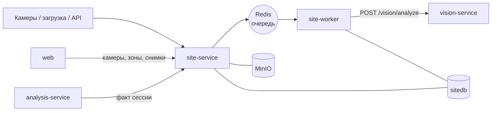

# site-service — сервис площадки (факт)

## 1. Назначение

Хранит **всё, что реально происходит на площадке**: камеры, рабочие зоны, снимки, сессии
наблюдения, детекции техники, статусы машин и видимость зон. Оркеструет конвейер
распознавания и отдаёт агрегированный факт по сессии.

Сервис не знает ни про график, ни про отклонения: он отвечает на вопрос «что видно»,
а не «хорошо это или плохо».

## 2. Место в системе



- **Вызывает:** `vision-service` (из воркера). Опционально шлёт сигнал пересчёта
  в `analysis-service` после агрегации сессии.
- **Вызывают:** `web`, `analysis-service`, внешние источники снимков.

Сервис разворачивается двумя процессами из одного образа: API (`uvicorn src.main:app`)
и воркер (`arq src.worker.WorkerSettings`). Воркеров может быть сколько угодно.

## 3. API

Префикс: `/api/v1/site`.

### Камеры и зоны

| Метод | Путь | Описание |
| :--- | :--- | :--- |
| `GET` `POST` | `/cameras` | Камеры объекта; `code` совпадает с именем папки при пакетной загрузке |
| `PATCH` `DELETE` | `/cameras/{id}` | Правка, деактивация |
| `POST` | `/cameras/{id}/reference-frame` | Загрузить эталонный кадр для разметки зон |
| `GET` `POST` | `/zones` | Зоны; фильтр по `camera_id`, `object_id` |
| `PATCH` `DELETE` | `/zones/{id}` | Правка полигона или типа; версия зон увеличивается |
| `POST` | `/zones/reapply` | **Пересчитать привязку существующих детекций к зонам** без повторного распознавания |

### Снимки

| Метод | Путь | Описание |
| :--- | :--- | :--- |
| `POST` | `/images` | Пакетная загрузка (multipart, до 200 файлов). Частичный успех `202` |
| `POST` | `/images/import` | Импорт из смонтированной папки: подпапка = код камеры |
| `GET` | `/images` | Список с фильтрами `object_id`, `camera_id`, `from`, `to`, `status` |
| `GET` | `/images/{id}` | Метаданные + presigned-ссылка + детекции |
| `GET` | `/images/{id}/annotated` | Кадр с нарисованными рамками и зонами (генерируется по запросу, кэшируется) |
| `PATCH` | `/images/{id}` | Указать время съёмки вручную для снимков в статусе `NEEDS_TIME` |
| `POST` | `/images/reanalyze` | Повторное распознавание (после смены модели или порога) |

### Сессии

| Метод | Путь | Описание |
| :--- | :--- | :--- |
| `GET` | `/sessions` | Сессии объекта за период |
| `GET` | `/sessions/{id}` | Состав сессии: снимки, камеры, статус |
| `GET` | `/sessions/{id}/facts` | **Агрегированный факт: зона × класс × количество + видимость + стадия.** Ключевой контракт для `analysis-service` |
| `POST` | `/sessions/{id}/close` | Принудительно закрыть и агрегировать сессию |

Пример ответа `/sessions/{id}/facts` — [api-guidelines.md, п. 11.2](../../docs/api-guidelines.md).

### Коды ошибок

`CAMERA_NOT_FOUND`, `ZONE_NOT_FOUND`, `IMAGE_NOT_FOUND`, `IMAGE_ALREADY_EXISTS` (409, с ID
существующего), `NO_TIMESTAMP`, `UNSUPPORTED_MEDIA_TYPE`, `IMAGE_TOO_LARGE`,
`SESSION_NOT_CLOSED`, `VISION_UNAVAILABLE`, `STORAGE_UNAVAILABLE`.

## 4. Конвейер обработки

```
POST /images
  ├─ определение времени: EXIF → имя файла → значение из формы → статус NEEDS_TIME
  ├─ определение камеры: поле формы → подпапка → выбор в UI
  ├─ дедупликация по sha256 в пределах объекта
  ├─ сохранение оригинала в MinIO, превью
  ├─ запись image (status=PENDING), привязка к сессии по окну
  └─ постановка задачи analyze_image в очередь

analyze_image(image_id)
  ├─ загрузка снимка из MinIO
  ├─ POST /api/v1/vision/analyze → детекции + стадия + качество кадра
  ├─ привязка каждой детекции к зоне по точке контакта (нижняя середина рамки)
  ├─ определение статуса: WORKING / IDLE / OUT_OF_ZONE / UNKNOWN + state_reason
  ├─ расчёт видимости зон по качеству кадра и покрытию
  └─ image.status = ANALYZED

aggregate_session(session_id)   # по закрытии окна + SESSION_CLOSE_GRACE_MINUTES
  ├─ дедупликация между камерами: максимум по камере, не сумма
  ├─ запись session_fact (зона × класс × количество, работает/простаивает, evidence)
  ├─ запись zone_visibility
  └─ сигнал пересчёта в analysis-service
```

Источник истины по задаче — `image.status` в БД, а не очередь: потеря Redis требует
перезапуска обработки, но не теряет данные.

## 5. Модель данных (`sitedb`)

`camera`, `zone`, `image`, `session`, `detection`, `stage_observation`, `zone_visibility`,
`session_fact`. Подробно — [docs/data-model.md, раздел 2](../../docs/data-model.md).

Ключевые решения:

- полигоны зон — **нормированные координаты 0…1** от размера кадра, не зависят от разрешения
  ([ADR-0006](../../docs/decisions/0006-zones-in-image-space.md));
- рамки детекций тоже нормированы — один формат на весь конвейер;
- `session_fact` — материализованный агрегат, пересчитывается при правке зон;
- `model_version` хранится у каждой детекции: вывод воспроизводим.

## 6. Конфигурация

| Переменная | По умолчанию | Смысл |
| :--- | :--- | :--- |
| `SITE_DB_DSN` | — | Подключение к `sitedb` |
| `VISION_URL` / `VISION_TIMEOUT_S` | `http://vision-service:8000` / `30` | CV-сервис |
| `REDIS_URL` | `redis://redis:6379/0` | Очередь задач |
| `S3_*` | см. [runbook](../../docs/runbook.md) | Хранилище снимков |
| `SESSION_WINDOW_MINUTES` | `30` | Длина окна сессии |
| `SESSION_CLOSE_GRACE_MINUTES` | `10` | Ожидание опоздавших снимков |
| `MAX_IMAGE_MB` | `20` | Предел размера файла |
| `WORKER_CONCURRENCY` | `4` | Параллелизм воркера |
| `MOVE_THRESHOLD` | `0.01` | Смещение (доля диагонали кадра), считающееся признаком работы |
| `MIN_BRIGHTNESS` / `MAX_BLUR` / `MAX_OCCLUSION` | `0.15` / `0.6` / `0.5` | Пригодность кадра |
| `ANALYSIS_URL` | `http://analysis-service:8000` | Куда слать сигнал пересчёта |

## 7. Зависимости

PostgreSQL (`sitedb`), MinIO, Redis, `vision-service`.
При недоступности CV снимки копятся в статусе `PENDING` и обрабатываются позже —
загрузка не блокируется.

## 8. Запуск и тесты

```bash
docker compose up -d site-service site-worker
make test s=site
make logs s=site-worker f=1
```

Обязательное покрытие `src/core/`: разбор времени из EXIF и имени файла (включая
нестандартные форматы), привязка точки к полигону (граница, перекрытие зон, вне всех зон),
определение статуса техники (все четыре исхода), дедупликация между камерами,
расчёт видимости зоны (`OK` / `PARTIAL` / `BLIND`).

## 9. Допущения и ограничения

- **Камеры стационарные.** Зоны размечаются один раз на эталонном кадре; сдвиг камеры
  требует переразметки. Это соответствует рекомендациям по камерам из ТЗ.
- **В MVP ручной разметки нет.** Камера заводится автоматически при импорте папки
  (подпапка = код камеры), эталонным кадром становится первый снимок этой камеры,
  зоны приходят из `data/seed/cameras.json`. Интерфейс их только отрисовывает;
  редактор полигонов — приоритет Could ([apps/web](../../apps/web/README.md)).
- **Дедупликация между камерами приближённая:** максимум по камере на класс в зоне.
  Две разные машины одного класса, каждая видимая только своей камерой, будут посчитаны
  как одна. Точное сопоставление требует калибровки камер — вынесено в развитие.
- **Привязка к зонам ведётся в плоскости кадра**, перспектива даёт ошибку у границ зон.
  Смягчается разметкой с запасом и решением по серии сессий.
- **Снимок без времени не участвует в план-факте** — статус `NEEDS_TIME` до ручного ввода.
- «Работает/простой» по одиночному кадру ненадёжен; решение принимается по нескольким
  сессиям, одиночный кадр никогда не порождает отклонение.
