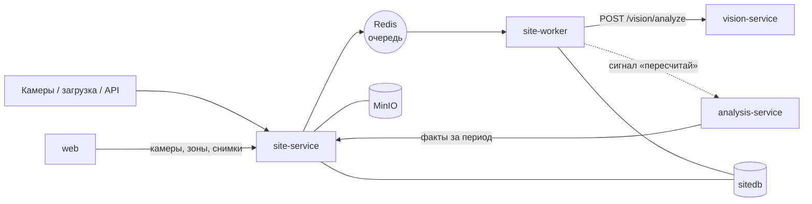

# site-service — сервис площадки (факт)

## 1. Назначение

Хранит **всё, что реально видно на площадке**: камеры, зоны, снимки, окна наблюдения,
детекции техники, видимость участков. Управляет конвейером распознавания и отдаёт факты
за период.

Сервис не знает ни про график, ни про рабочее время, ни про отклонения. Он отвечает на вопрос
«что видно», а не «хорошо это или плохо». Например: «экскаватор на участке «Котлован», с прошлого
окна не сдвигался». Решение «это простой» принимает analysis-service
([ADR-0012](../../docs/decisions/0012-facts-without-judgement.md)).

## 2. Место в системе



- **Вызывает:** `vision-service` (из воркера); сигнал `POST /api/v1/analysis/runs` после
  пересчёта факта окна.
- **Вызывают:** `web`, `analysis-service` (контракт «факты за период»), внешние источники снимков.

Сервис разворачивается двумя процессами из одного образа: API (`uvicorn src.main:app`)
и воркер (`arq src.worker.WorkerSettings`). Воркеров может быть сколько угодно.

## 3. API

Префикс: `/api/v1/site`. Межсервисный контракт «факты за период» —
[packages/contracts/interservice.md](../../packages/contracts/interservice.md), раздел 2.
Что уже реализовано, видно по [docs/board.md](../../docs/board.md).

### Камеры и зоны

| Метод | Путь | Описание |
| :--- | :--- | :--- |
| `GET` `POST` | `/cameras` | Камеры; фильтры `object_id`, `is_active`. `code` совпадает с именем папки при пакетной загрузке и в объекте не повторяется; название по умолчанию — код |
| `GET` `PATCH` `DELETE` | `/cameras/{id}` | Камера; правка названия, эталонного кадра (`reference_image_id` — снимок этой камеры), параметров установки; деактивация вместе с её зонами. Код не меняется |
| `GET` `POST` | `/zones` | Зоны: тип, название участка, полигон 0…1; фильтры `object_id`, `camera_id`, `include_inactive`. Название по умолчанию — `zone_type_name` из `enums.yaml`. В ответе — ключ участка `area` |
| `GET` `PATCH` `DELETE` | `/zones/{id}` | Зона; правка полигона, типа или названия; деактивация. Версия растёт, только если что-то поменялось |
| `POST` | `/zones/import` | Загрузить камеры и зоны объекта: формат `data/seed/cameras.json` плюс `object_id`. Камеры сверяются по коду, зоны камеры — по подписи участка; повторный импорт того же файла ничего не меняет. Ответ — счётчики и участки объекта |
| `GET` | `/objects/{id}/areas` | Участки объекта: ключ, роль типа, камеры и зоны, на которых он размечен; `zones_version` |
| `POST` | `/zones/reapply` | Заново отнести детекции к зонам и пересчитать факты окон — без повторного распознавания |

### Снимки

| Метод | Путь | Описание |
| :--- | :--- | :--- |
| `POST` | `/images` | Пакетная загрузка (multipart, до 200 файлов). Частичный успех `202` |
| `POST` | `/images/import` | Импорт из смонтированной папки: подпапка = код камеры |
| `GET` | `/images` | Список с фильтрами `object_id`, `camera_id`, `from`, `to`, `status` |
| `GET` | `/images/{id}` | Метаданные, presigned-ссылка для браузера и детекции с рамками |
| `PATCH` | `/images/{id}` | Указать время съёмки вручную для снимков в статусе `NEEDS_TIME` |
| `POST` | `/images/reanalyze` | Повторное распознавание снимков объекта (после смены модели или порога) |

### Факты и окна

| Метод | Путь | Описание |
| :--- | :--- | :--- |
| `GET` | `/objects/{id}/facts?from=&to=` | **Факты за период** — межсервисный контракт: окна, участки × классы, видимость, стадия по фото |
| `GET` | `/sessions` | Окна объекта за период: сколько снимков и камер |
| `GET` | `/sessions/{id}` | Состав окна: снимки, камеры, пригодность кадров |

### Коды ошибок

`CAMERA_NOT_FOUND`, `CAMERA_ALREADY_EXISTS` (повтор кода камеры в объекте), `ZONE_NOT_FOUND`,
`IMAGE_NOT_FOUND` (в том числе эталонный кадр — не снимок этой камеры), `IMAGE_ALREADY_EXISTS` (в пакете —
строка в `rejected` с ID существующего снимка), `UNSUPPORTED_MEDIA_TYPE`, `IMAGE_TOO_LARGE`,
`INVALID_POLYGON` (при импорте — `details.errors` с путём `cameras[i].zones[j].polygon` по
всему файлу), `INVALID_PERIOD`, `VISION_UNAVAILABLE`, `STORAGE_UNAVAILABLE`.

## 4. Конвейер обработки

```
POST /images
  ├─ время: EXIF → имя файла → поле формы → иначе статус NEEDS_TIME (снимок не теряется)
  ├─ камера: поле формы → подпапка; новая камера заводится автоматически
  ├─ дедупликация по sha256 в пределах объекта
  ├─ оригинал в MinIO (images/{object}/{camera}/{date}/{image}.jpg)
  ├─ image (status=PENDING), привязка к окну сессии (30 мин, по :00 и :30)
  └─ задача analyze_image в очередь

analyze_image(image_id)                           # core/ — чистые функции, кроме вызова vision
  ├─ POST /api/v1/vision/analyze {image_url}  → рамки, стадия по фото, качество кадра
  ├─ пригодность кадра по MIN_BRIGHTNESS / MAX_BLUR → image.usable
  ├─ для каждой рамки: anchor, основная зона, опасные зоны           (core/zones.py)
  ├─ смещение относительно прошлого окна той же камеры              (core/movement.py)
  ├─ пересчёт факта окна целиком: участки × классы, максимум по камерам,
  │  неподвижность, видимость участков, стадия по фото за окно        (core/aggregation.py)
  ├─ image.status = ANALYZED
  └─ сигнал POST /api/v1/analysis/runs {FACTS_UPDATED}

reapply_zones(object_id)    # после правки зон
  └─ заново отнести детекции к зонам → пересчитать факты затронутых окон → сигнал
```

- **Источник истины — `image.status` в БД**, а не очередь. Потеря Redis требует перезапуска
  обработки, но не теряет данные.
- **Таймера закрытия окна нет.** Поздний снимок просто пересчитывает своё окно заново.

Правила счёта (максимум по камерам, неподвижность, видимость) —
[docs/methodology.md](../../docs/methodology.md), разделы 3–4.

## 5. Модель данных (`sitedb`)

`camera`, `zone`, `image`, `session`, `detection`, `stage_observation`, `area_visibility`,
`session_fact`. Подробно — [docs/data-model.md, раздел 2](../../docs/data-model.md).

Ключевые решения:

- **Нормированные координаты.** Полигоны зон и рамки детекций хранятся в долях 0…1 от размера
  кадра и не зависят от разрешения камеры ([ADR-0006](../../docs/decisions/0006-zones-in-image-space.md)).
- **Участки по подписи.** Участок — все зоны объекта с одинаковыми типом и названием, ключ
  `ТИП:Название`. Камеры связаны только общей подписью ([ADR-0013](../../docs/decisions/0013-zones-and-areas.md)).
- **Материализованный факт.** `session_fact` и `area_visibility` пересчитываются при каждом
  новом снимке окна и при правке зон.
- **Воспроизводимость.** У каждой детекции хранится `model_version`, поэтому вывод можно
  воспроизвести.

## 6. Конфигурация

| Переменная | По умолчанию | Смысл |
| :--- | :--- | :--- |
| `SITE_DB_DSN` | — | Подключение к `sitedb` |
| `VISION_URL` / `VISION_TIMEOUT_S` | `http://vision-service:8000` / `30` | CV-сервис |
| `ANALYSIS_URL` | `http://analysis-service:8000` | Куда слать сигнал «пересчитай» |
| `REDIS_URL` | `redis://redis:6379/0` | Очередь задач |
| `S3_ENDPOINT` | `http://minio:9000` | MinIO внутри сети: загрузка файлов и ссылки для vision |
| `S3_PUBLIC_ENDPOINT` | `http://localhost:9000` | Адрес MinIO, доступный браузеру: на него подписываются ссылки для интерфейса |
| `S3_*` | см. [runbook](../../docs/runbook.md) | Ключи, бакеты, срок жизни ссылок |
| `CONTRACTS_DIR` | `/contracts` | Каталог с `enums.yaml` |
| `SESSION_WINDOW_MINUTES` | `30` | Длина окна сессии; должна делить сутки нацело |
| `CAMERA_TIMEZONE` | `Europe/Moscow` | Пояс часов камер: время из EXIF без смещения, из имени файла и из поля формы без смещения считается местным для этого пояса |
| `MAX_IMAGE_MB` | `20` | Предел размера файла |
| `WORKER_CONCURRENCY` | `4` | Параллелизм воркера |
| `MOVE_THRESHOLD` | `0.01` | Смещение центра рамки (доля диагонали кадра), начиная с которого единица считается сдвинувшейся |
| `MIN_BRIGHTNESS` / `MAX_BLUR` | `0.15` / `0.6` | Пригодность кадра |

## 7. Зависимости

PostgreSQL (`sitedb`), MinIO, Redis, `vision-service`. Если распознавание недоступно, снимки
копятся в статусе `PENDING` и обрабатываются позже, а загрузка не блокируется. Если недоступен
`analysis-service`, сигнал теряется без вреда.

## 8. Запуск и тесты

```bash
docker compose up -d site-service site-worker
make test s=site                     # на Windows — см. docs/runbook.md, раздел 3
make logs s=site-worker f=1
```

Обязательное покрытие `src/core/`:
- разбор времени из EXIF и имени файла, включая нестандартные форматы;
- точка в полигоне: граница, перекрытие зон, опасная зона поверх рабочей, вне всех зон;
- смещение между окнами, включая отсутствие прошлого окна;
- факт окна: максимум по камерам, непригодный кадр, видимость `OK` / `PARTIAL` / `BLIND`.

## 9. Допущения и ограничения

- **Камеры неподвижны.** Зоны размечаются один раз на эталонном кадре, сдвиг камеры требует
  переразметки. Это соответствует рекомендациям по камерам из ТЗ.
- **В MVP зоны приходят из файла.** Камера заводится автоматически при импорте папки
  (подпапка = код камеры), эталонным кадром становится первый снимок этой камеры, а зоны
  загружаются из `data/seed/cameras.json` ([data/README.md](../../data/README.md)). Интерфейс их
  отрисовывает; редактор полигонов — приоритет Could.
- **Дедупликация между камерами приближённая:** берётся максимум по камерам участка. Две разные
  машины одного класса, каждая видимая только своей камерой, считаются одной.
- **Привязка к зонам ведётся в плоскости кадра**, и перспектива даёт ошибку у границ зон.
  Ошибка смягчается разметкой с запасом. Точка контакта на границе полигона считается внутри
  зоны; из перекрывающихся зон одной площади выбирается меньшая по ключу участка — выбор не
  зависит от порядка строк в базе (`core/zones.py`).
- **Полигон проверяется при сохранении:** не меньше трёх вершин, координаты 0…1 (пиксели —
  ошибка `INVALID_POLYGON`), без самопересечений и не на одной прямой.
- **Типы зон, их роли и названия — из `enums.yaml`** (`core/reference.py`): опасной считается
  зона с ролью `SAFETY`, а не тип, записанный в коде.
- **Объект не проверяется в plan-service.** `object_id` камеры — внешняя ссылка по значению:
  site-service не вызывает plan (раздел 2), поэтому опечатка в `object_id` заводит камеры
  «ничьего» объекта. Их видно в `GET /cameras?object_id=`.
- **Эталонный кадр из `cameras.json` пока не читается:** поле `reference_image` принимается,
  но эталонным кадром становится первый загруженный снимок камеры (раздел 4) или снимок,
  указанный в `PATCH /cameras/{id}`.
- **Деактивация камеры деактивирует её зоны** с ростом версии: участки объекта и
  `zones_version` меняются так же, как при удалении зон по одной.
- **Снимок без времени не участвует в план-факте:** статус `NEEDS_TIME` держится до ручного ввода.
- **Время снимка** (`core/timestamp.py`): EXIF `DateTimeOriginal` (или `DateTime`) → дата и
  время в имени файла (`20261020_090000`, `IMG_20261020_090000`, `2026-10-20_09-00-00` и
  подобные; подпапка — это камера, а не время) → поле формы (ISO-8601). Берётся первое
  правдоподобное: не раньше 2000 года и не позже суток от текущего момента — сброшенные
  часы камеры не должны ставить снимок в 1980 год. `OffsetTimeOriginal` из EXIF и смещение в
  поле формы главнее `CAMERA_TIMEZONE`.
- **Формат кадра — по содержимому** (`core/image_meta.py`, Pillow): JPEG, PNG, WebP; иначе
  `UNSUPPORTED_MEDIA_TYPE`, даже если расширение `.jpg`.
- **Неподвижность — не трекинг.** Рамка сопоставляется с ближайшей рамкой того же класса
  прошлого окна. Этого достаточно для вывода «ничего не сдвинулось», но не для учёта
  конкретных машин.
