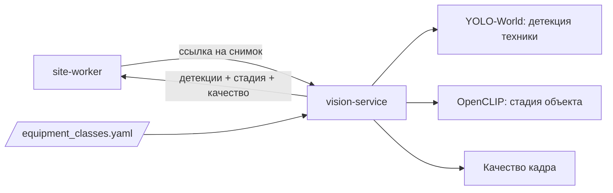

# vision-service — сервис компьютерного зрения

## 1. Назначение

Единственное место в системе, где происходит распознавание. На вход — изображение, на выход —
детекции строительной техники, стадия объекта по внешнему виду и оценка качества кадра.

Сервис **не знает ничего о предметной области**: ни про объекты, ни про зоны, ни про график.
Он не ходит в базу и не хранит состояние. Это чистая функция «картинка → факты о картинке»,
которую можно масштабировать репликами и заменить другой моделью без последствий для остальной
системы.

## 2. Место в системе



Единственный потребитель — `site-worker`. Сервис не вызывает никого.

## 3. API

Префикс: `/api/v1/vision`. Контракт — [packages/contracts/interservice.md](../../packages/contracts/interservice.md),
раздел 3. Что уже реализовано, видно по [docs/board.md](../../docs/board.md).

| Метод | Путь | Описание |
| :--- | :--- | :--- |
| `POST` | `/analyze` | Детекция, стадия и качество за один вызов. JSON `{"image_url": ...}` или `multipart` с полем `file` |
| `GET` | `/model` | Что загружено: детектор, классификатор, устройство, версия классов, список классов |

Координаты рамок **нормированы 0…1**. Это тот же формат, что у полигонов зон, поэтому
привязка к зонам не зависит от разрешения камеры.

### Коды ошибок

`UNSUPPORTED_MEDIA_TYPE`, `IMAGE_DECODE_FAILED`, `IMAGE_TOO_LARGE`, `MODEL_NOT_LOADED`,
`INFERENCE_FAILED`.

## 4. Модели

| Задача | Модель по умолчанию | Обоснование |
| :--- | :--- | :--- |
| Детекция техники | **YOLO-World** (`yolov8s-worldv2`) — open-vocabulary, классы задаются текстовыми промптами | Работает без обучения: в COCO нет ни экскаватора, ни крана, ни миксера, а разметка сотен кадров дороже, чем обучение |
| Стадия объекта | OpenCLIP zero-shot; при наличии разметки — линейная голова поверх эмбеддингов | Работает без большой разметки |
| Люди в опасной зоне | Тот же детектор, класс `person` | Отдельная модель не нужна |
| Качество кадра | Классические метрики: средняя яркость, размытость по дисперсии Лапласа | Без модели, мгновенно |

- **Классы детектора — это данные.** Промпты берутся из `equipment_classes.yaml`, файл
  смонтирован в `CONTRACTS_DIR` ([ADR-0014](../../docs/decisions/0014-equipment-classes-file.md)).
  Добавить класс — значит добавить запись в файл и перезапустить сервис, без переобучения и
  без правки кода. Английские промпты работают заметно лучше русских.
- **Метки стадий и их промпты для CLIP** лежат в `data/stage_prompts.yaml`. Набор меток
  совпадает с `stage_label` в `enums.yaml`.
- **Дообученная модель — улучшение, а не требование.** Модель по умолчанию работает из коробки.
  Если останется время, применяется гибрид из [`ml/`](../../ml/README.md): авторазметка →
  ручная проверка → дообучение YOLO11s. Готовые веса подставляются переменной
  `VISION_DET_WEIGHTS`, код при этом не меняется.

## 5. Конфигурация

| Переменная | По умолчанию | Смысл |
| :--- | :--- | :--- |
| `VISION_DEVICE` | `cuda` | `cuda` на демо-стенде, `cpu` — запасной путь |
| `VISION_DET_WEIGHTS` | `/models/yolov8s-worldv2.pt` | Веса детектора; путь к дообученным подставляется сюда же |
| `VISION_DET_CONF` | `0.35` | Порог уверенности |
| `VISION_DET_IOU` | `0.5` | Порог NMS |
| `VISION_DET_IMGSZ` | `1280` | Размер входа; главный рычаг «скорость против качества» |
| `VISION_STAGE_MODEL` | `openclip-vit-b32` | Классификатор стадии |
| `VISION_STAGE_ENABLED` | `true` | Можно выключить для ускорения |
| `VISION_MAX_MB` | `20` | Предел размера изображения |
| `CONTRACTS_DIR` | `/contracts` | Каталог с `equipment_classes.yaml` |

Смена модели — это смена переменных окружения, а не кода.

## 6. Зависимости

Других сервисов и БД нет. Нужны файлы весов (`make models` → `data/models/`, монтируются в
`/models`) и `equipment_classes.yaml`. `/health/ready` отвечает `ok` только после загрузки
моделей в память.

## 7. Запуск и тесты

```bash
make models                              # скачать веса
docker compose up -d vision-service
curl -F file=@sample.jpg -H "X-API-Key: $API_KEY" http://localhost:8004/api/v1/vision/analyze
make test s=vision                       # на Windows — см. docs/runbook.md, раздел 3
```

Покрытие:
- постобработка: нормировка координат, фильтр по уверенности, классы из файла;
- метрики качества кадра;
- поведение при битом файле и недоступной ссылке.

Сама модель в тестах подменяется заглушкой. Качество модели проверяется не unit-тестами, а
метриками на собственном тестовом наборе — [ml/README.md](../../ml/README.md).

## 8. Производительность

Целевой стенд — ноутбук с RTX 3060 Laptop 6 ГБ (Ryzen 5 5600H, 32 ГБ), Windows 10, Docker Desktop
на WSL2. Видеокарта отдана под распознавание целиком: LLM в неё не загружается.

| Конфигурация | Требование ТЗ | Измерено |
| :--- | :--- | :--- |
| GPU, YOLO-World `s`, вход 1280 | ≤ 100 мс на снимок | не измерено |
| CPU, вход 960 | ≤ 1–2 с на снимок | не измерено |

Таблица заполняется замером, а не ожиданиями (задача в [docs/board.md](../../docs/board.md)).
Если требование не выполняется, это пишется как есть вместе с принятым компромиссом (меньший
вход, модель `n`).

**GPU в Docker на Windows.** Docker Desktop с бэкендом WSL2 пробрасывает видеокарту сам: нужен
только свежий драйвер NVIDIA для Windows, а `nvidia-container-toolkit` отдельно не ставится.
Проверка: `docker run --rm --gpus all nvidia/cuda:12.4.1-base-ubuntu22.04 nvidia-smi`. Если
контейнер карту не видит, сервис молча уходит на CPU. Поэтому `GET /model` показывает фактическое
устройство.

**Цена GPU-сборки.** Образ с PyTorch и CUDA весит несколько гигабайт и собирается долго. Поэтому
на демо-стенде образ скачивается (`make pull`), а не собирается. ONNX Runtime дал бы образ
легче, но у open-vocabulary детектора при экспорте в ONNX список классов запекается внутрь, и
правило «добавление класса — правка данных» без переэкспорта перестаёт работать.

## 9. Допущения и ограничения

- **Модель по умолчанию — zero-shot.** Качество ниже, чем у дообученной, особенно на катке,
  грейдере и бетононасосе. Промпты подбираются вручную. Метрики измеряются и публикуются
  как есть, без приукрашивания.
- **Ночь и зима.** Качество на ночных и зимних кадрах ниже дневного, оно измеряется отдельной
  подвыборкой.
- **`truck` против `dump_truck`.** Класс `truck` — это «всё грузовое, кроме самосвала и миксера».
  Их путаница — известное слабое место, оно отражено в матрице ошибок.
- **Только классы, не экземпляры.** Сервис не различает конкретные машины (номера, экземпляры).
  Это прямо вне границ ТЗ.
- **Годность кадра решает site.** vision только измеряет качество кадра, а порог годности —
  правило площадки, его применяет site-service.
