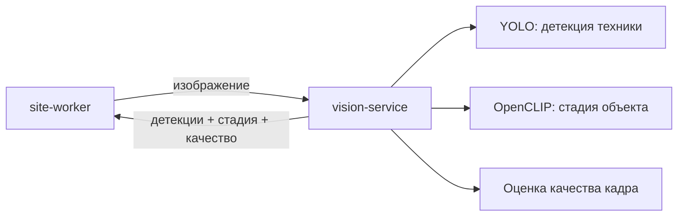

# vision-service — сервис компьютерного зрения

## 1. Назначение

Единственное место в системе, где происходит распознавание. На вход — изображение,
на выход — детекции строительной техники, стадия объекта по внешнему виду и оценка
качества кадра.

Сервис **не знает ничего о предметной области**: ни про объекты, ни про зоны, ни про
график. Он не ходит в базу и не хранит состояние. Это чистая функция «картинка → факты
о картинке», которую можно масштабировать репликами и заменить другой моделью без
последствий для остальной системы.

## 2. Место в системе



Единственный потребитель — `site-worker`. Сервис не вызывает никого.

## 3. API

Префикс: `/api/v1/vision`.

| Метод | Путь | Описание |
| :--- | :--- | :--- |
| `POST` | `/analyze` | **Основной метод:** детекция + стадия + качество за один вызов |
| `POST` | `/detect` | Только детекция техники |
| `POST` | `/stage` | Только классификация стадии |
| `GET` | `/model` | Какая модель загружена: имя, версия, классы, метрики, устройство |

Вход — `multipart/form-data` (поле `file`) либо JSON `{"image_url": "..."}` с
presigned-ссылкой. Второй вариант предпочтителен: изображение не гоняется через два HTTP-хопа.

**Реализовано на сегодня:** каркас сервиса, `/health`, `/health/ready`. Распознавания
пока нет — модели, маппинг классов и эндпоинты таблицы выше приходят задачей B-04,
вместе с ними образ получает CUDA-слой и веса. До тех пор `/health/ready` отвечает
`ok` сразу: проверять нечего, зависимостей у сервиса нет.

### Пример ответа `/analyze`

```json
{
  "model": {"detector": "yolo11s-lct-v3", "stage": "openclip-vit-b32", "device": "cpu"},
  "image": {"width": 1920, "height": 1080},
  "detections": [
    {"equipment_class": "excavator", "bbox": [0.41, 0.52, 0.49, 0.63], "conf": 0.91,
     "attrs": {"boom_lowered": true}},
    {"equipment_class": "dump_truck", "bbox": [0.12, 0.55, 0.23, 0.64], "conf": 0.78, "attrs": {}}
  ],
  "stage": {"label": "PIT", "conf": 0.78, "floors_estimate": 0,
            "scores": {"PIT": 0.78, "FOUNDATION": 0.11, "FRAME": 0.05}},
  "quality": {"brightness": 0.42, "blur": 0.08, "occlusion": 0.05},
  "inference_ms": 840
}
```

Координаты рамок **нормированы 0…1** — тот же формат, что и полигоны зон,
поэтому привязка не зависит от разрешения камеры.

Поле `attrs` необязательное: если модель умеет различать признаки работы (опущенная
стрела, ковш у грунта, груз на крюке), они попадают сюда и используются `site-service`
для определения статуса. Отсутствие `attrs` не ломает конвейер — сработает определение
по смещению между сессиями.

### Коды ошибок

`UNSUPPORTED_MEDIA_TYPE`, `IMAGE_TOO_LARGE`, `IMAGE_DECODE_FAILED`, `MODEL_NOT_LOADED`,
`INFERENCE_FAILED`.

## 4. Модели

| Задача | Модель по умолчанию | Обоснование |
| :--- | :--- | :--- |
| Детекция техники | **YOLO-World** (`yolov8s-worldv2`) — open-vocabulary, классы задаются текстовыми промптами | Работает без обучения: в COCO нет ни экскаватора, ни крана, ни миксера, а размечать 400 кадров дороже, чем обучать |
| Стадия объекта | OpenCLIP zero-shot; при наличии разметки — линейная голова поверх эмбеддингов | Работает без большой разметки |
| Люди в опасной зоне | Тот же детектор, класс `person` | Отдельная модель не нужна |
| Качество кадра | Классические метрики: яркость, дисперсия Лапласа, доля засветки/затемнения | Без модели, мгновенно |

**Список классов детектора — это данные.** Промпты берутся из поля `aliases` справочника
классов техники (`plan-service`) и лежат в `data/class_map.yaml`. Добавление класса остаётся
правкой справочника, без переобучения и без правки кода. Английские промпты работают заметно
лучше русских: `"road roller"`, `"concrete mixer truck"`, `"concrete pump truck"`, `"pile driver"`.

**Дообученная модель — улучшение, а не требование.** Дефолт работает из коробки;
если остаётся время, применяется гибрид из [`ml/`](../../ml/README.md): авторазметка архива
open-vocabulary детектором → ручная проверка рамок → дообучение YOLO11s. Готовые веса
подставляются переменной `VISION_DET_WEIGHTS`, код при этом не меняется.

## 5. Конфигурация

| Переменная | По умолчанию | Смысл |
| :--- | :--- | :--- |
| `VISION_DEVICE` | `cuda` | `cuda` на демо-стенде, `cpu` — запасной путь |
| `VISION_DET_WEIGHTS` | `/models/yolov8s-worldv2.pt` | Веса детектора; путь к дообученным подставляется сюда же |
| `VISION_DET_CONF` | `0.35` | Порог уверенности |
| `VISION_DET_IOU` | `0.5` | Порог NMS |
| `VISION_DET_IMGSZ` | `1280` | Размер входа; главный рычаг «скорость против качества». На GPU можно поднять до 1536 — помогает с мелкой техникой в глубине кадра |
| `VISION_STAGE_MODEL` | `openclip-vit-b32` | Классификатор стадии |
| `VISION_STAGE_ENABLED` | `true` | Можно выключить для ускорения |
| `VISION_BATCH_SIZE` | `4` | Батч при пакетной обработке |
| `VISION_MAX_MB` | `20` | Предел размера изображения |

Смена модели — это смена переменных окружения, а не кода.

## 6. Зависимости

Нет. Сервис не обращается ни к БД, ни к другим сервисам. Нужны только файлы весов.
`/health/ready` возвращает `ok` только после успешной загрузки моделей в память.

## 7. Запуск и тесты

```bash
make models                              # скачать веса
docker compose up -d vision-service
curl -F file=@sample.jpg http://localhost:8004/api/v1/vision/analyze
make test s=vision
```

Покрытие: постобработка (NMS, фильтр по уверенности, нормировка координат),
маппинг меток датасета на таксономию, расчёт метрик качества кадра, поведение при
битом файле. Само качество модели проверяется не unit-тестами, а метриками
на собственном тестовом наборе — [ml/README.md](../../ml/README.md).

## 8. Производительность

Целевой стенд — ноутбук с RTX 3060 Laptop 6 ГБ (Ryzen 5 5600H, 32 ГБ). Карта отдана
под CV целиком: LLM в неё не загружается ([report-service](../report-service/README.md)).

| Конфигурация | Время на снимок |
| :--- | :--- |
| GPU, YOLO `s`, вход 1280 | 8–15 мс |
| GPU, open-vocabulary, вход 1280 | 30–200 мс в зависимости от модели |
| CPU, YOLO `s`, вход 960 | 0.5–2 с |
| CPU, вход 1280 | заметно медленнее, для демонстрации не рекомендуется |

Потребление видеопамяти: детектор 1.2–2 ГБ, классификатор стадии ~0.6 ГБ, то есть
обе модели резидентны с запасом. Весь демо-набор в 70 снимков обрабатывается за секунды —
это снимает целый класс рисков на показе.

Рычаги ускорения по убыванию эффекта: размер входа, размер модели, батч, отключение
классификации стадии для кадров с камер въезда.

**Цена GPU-сборки.** Образ с PyTorch + CUDA весит 6–8 ГБ и собирается долго — это разовая
плата, о которой нужно знать заранее. На машине развёртывания обязателен
`nvidia-container-toolkit`, иначе контейнер карту не увидит и молча уйдёт на CPU.
Альтернатива — ONNX Runtime GPU, образ около 2 ГБ, но у open-vocabulary детектора
при экспорте в ONNX список классов запекается внутрь, и правило «добавление класса —
правка данных» перестаёт работать без переэкспорта.

## 9. Допущения и ограничения

- Модель по умолчанию — zero-shot: качество ниже, чем у дообученной, особенно на «каток»,
  «грейдер» и «бетононасос». Промпты подбираются вручную. Метрики измеряются и публикуются
  как есть, без приукрашивания.
- Качество на ночных и зимних кадрах ниже дневного — измеряется отдельной подвыборкой.
- Класс `truck` — это «всё грузовое, кроме самосвала и миксера»; путаница
  `truck` / `dump_truck` — известное слабое место, отражённое в матрице ошибок.
- Стадия определяется по обзорным кадрам; кадр с камеры въезда для этого непригоден
  и отбрасывается по качеству.
- Сервис не различает конкретные машины (номера, экземпляры) — только классы.
  Это прямо вне границ ТЗ.
